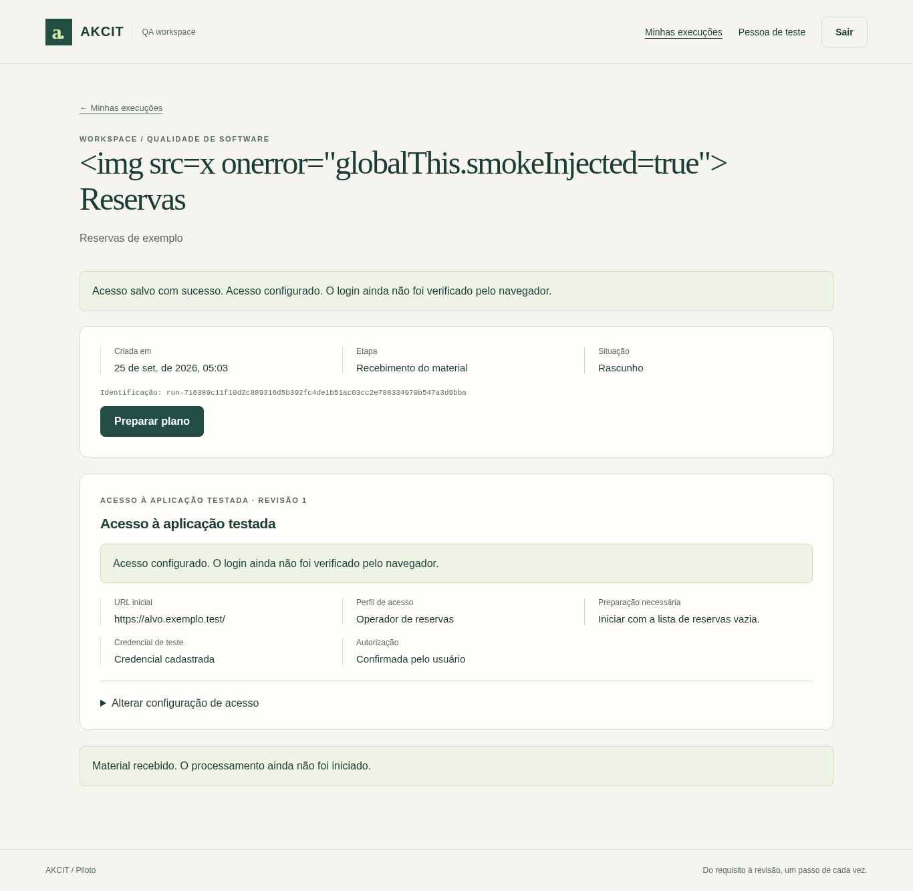

# T8.1 — Evidências da configuração de acesso privado ao alvo

## Commit

Branch: `feat/target-access`  
Base: `develop` (`000969b`)  
PR: Aberto para `develop` com o título *"feat: configurar acesso privado ao alvo da execução (T8.1)"* e descrição referenciando T8 via *"Refs #11"*.

## Ambiente

- Node.js 24.21.0; Chromium 153.0.8010.52; Debian 12 (imagem Docker runtime `akcit-qa:ci`).
- Execução isolada em container com as restrições operacionais e do CI:
  - 1 vCPU, 2 GiB de memória, `--shm-size=512m`
  - `--cap-drop=ALL --security-opt=no-new-privileges --read-only`
  - Diretórios temporários em `tmpfs` (`/tmp:rw`, `/home/node:rw`, `/data:rw`)
  - Sem inferência de LLM paga; chamadas de modelo com respostas controladas e determinísticas para testes.

## Comandos de verificação

### Verificação local da base

```bash
npm run check
npm test
npm run build
python3 -m unittest discover -s deploy -p 'test_*.py'
```

### Construção da imagem Docker e execução dos smokes

```bash
# Build da imagem final de produção/runtime
docker build --target runtime -t akcit-qa:ci .

# Smoke da jornada web completa no Chromium real (inclui T8.1)
mkdir -p artifacts/web
chmod 777 artifacts/web
docker run --rm --cpus=1 --memory=2g --shm-size=512m \
  --cap-drop=ALL --security-opt=no-new-privileges --read-only \
  --tmpfs /tmp:rw,size=512m,mode=1777 \
  --tmpfs /home/node:rw,size=128m,uid=1000,gid=1000,mode=0700 \
  --tmpfs /data:rw,size=128m,uid=1000,gid=1000,mode=0700 \
  -e SMOKE_ARTIFACT_DIR=/evidence -v "$PWD/artifacts/web:/evidence" \
  akcit-qa:ci node scripts/smoke-web.mjs

# Smoke do alvo controlado de reservas (T7)
mkdir -p artifacts/target
chmod 777 artifacts/target
docker run --rm --cpus=1 --memory=2g --shm-size=512m \
  --cap-drop=ALL --security-opt=no-new-privileges --read-only \
  --tmpfs /tmp:rw,size=512m,mode=1777 \
  --tmpfs /home/node:rw,size=128m,uid=1000,gid=1000,mode=0700 \
  --tmpfs /data:rw,size=128m,uid=1000,gid=1000,mode=0700 \
  -e SMOKE_ARTIFACT_DIR=/evidence -v "$PWD/artifacts/target:/evidence" \
  akcit-qa:ci node scripts/smoke-target.mjs

# Smoke de runtime (Pi, Chromium, cursor, vídeo)
docker run --rm --cpus=1 --memory=2g --shm-size=512m \
  --cap-drop=ALL --security-opt=no-new-privileges --read-only \
  --tmpfs /tmp:rw,size=512m,mode=1777 \
  --tmpfs /home/node:rw,size=128m,uid=1000,gid=1000,mode=0700 \
  --tmpfs /data:rw,size=128m,uid=1000,gid=1000,mode=0700 \
  akcit-qa:ci node scripts/smoke-runtime.mjs
```

## Resultados observados

Validação executada em 25/09/2026:

1. **`npm run check`:** sem erros de tipagem TypeScript.
2. **`npm test`:** **166 testes aprovados** (0 falhas).
   - Suíte `test/target-access.test.ts` cobre integralmente os critérios CA-01 a CA-08:
     - CA-01 e CA-04: cadastro inicial de acesso, consulta segura da projeção pública e sobrevivência a reinício.
     - Atualização de perfil e preparo sem reenviar senha preserva a credencial original.
     - Substituição explícita de credencial gera nova referência opaca `credentialRef`.
     - CA-03: isolamento entre contas e validações HTTP obrigatórias (`Origin`, `X-Expected-User-Id`, `Cookie`).
     - CA-02: validação e recusa de destino não autorizado por `TARGET_ALLOWED_ORIGINS`, URLs com query/fragmento/credenciais e campos obrigatórios.
     - CA-05: controle de revisão concorrente (`expectedAccessRevision` divergente retorna `409 / STALE_VERSION`).
     - CA-06: preservação integral de plano, casos, aprovações e imutabilidade de `startUrl` após o início da preparação.
     - CA-08: compatibilidade com registros legados (revisão inicial 0 e campos nulos).
3. **Smoke web no container (`scripts/smoke-web.mjs`):** **35/35 verificações aprovadas** em 29 segundos:
   - Verificação de status pendente antes da configuração.
   - Recusa de destino não pertencente a `TARGET_ALLOWED_ORIGINS` com limpeza imediata do campo de senha.
   - Resposta de rede perdida sem reenvio automático da credencial.
   - Conflito de revisão (`STALE_VERSION`) exibindo aviso e botão para consulta do registro atualizado.
   - Salvamento bem-sucedido com projeção pública:
     - URL inicial: `https://alvo.exemplo.test/`
     - Perfil de acesso: `Operador de reservas`
     - Preparação necessária: `Iniciar com a lista de reservas vazia.`
     - Credencial de teste: `Credencial cadastrada`
     - Autorização: `Confirmada pelo usuário`
     - Notificação: *"Acesso configurado. O login ainda não foi verificado pelo navegador."*
   - Verificação no storage: senha e usuário não existem em `sessionStorage` ou `localStorage`.
   - Recarregamento da página mantém o resumo persistido sem senha.
   - Atualização de perfil e preparo sem substituição de senha preserva a credencial salva e incrementa a revisão para 2.
4. **Smoke do alvo controlado T7 (`scripts/smoke-target.mjs`):** 15/15 verificações aprovadas.
5. **Smoke de runtime (`scripts/smoke-runtime.mjs`):** 7/7 verificações aprovadas.
6. **Testes de deploy (`python3 -m unittest ...`):** 6 testes aprovados.

## Evidência visual

A captura abaixo foi gerada durante a execução real do smoke web pelo Chromium dentro do container, demonstrando o resumo salvo com os campos secretos limpos:



## Limitações do card T8.1

- **Sem verificação do login:** este card restringe-se a coletar, validar e armazenar com segurança o acesso ao alvo. Não realiza requisições HTTP ao alvo nem inicia o navegador para conferir o login. Essa autenticação pertence à etapa seguinte (executor visual em T8).
- **Sem mapeamento ou execução:** salvar o acesso não altera estados de execução, não agenda trabalhos de navegação e não chama modelos de IA.
- **Tipo de credencial:** suporta unicamente usuário e senha (sem OAuth, cookies de sessão importados ou MFA).
- **Formatos de URL:** aceita apenas protocolos HTTP/HTTPS autorizados pela equipe, sem query string nem fragmento.
