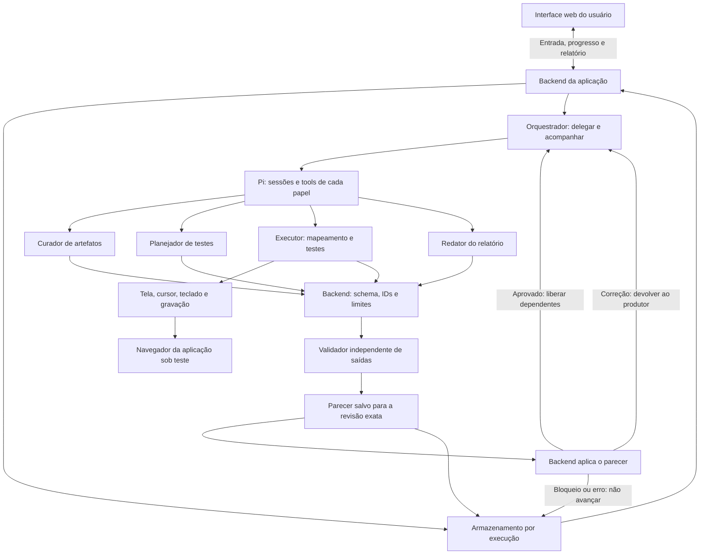

# Contratos de integração v0

Proposta compartilhada entre as quatro frentes. Os nomes abaixo são a base para a
implementação, ainda não são endpoints disponíveis. O responsável pelo backend
deve transformá-los em tipos e validação de entrada, usando o mesmo exemplo da interface.

## Fluxo e responsabilidades

O Pi é uma dependência do backend. O usuário acessa o site da equipe; o executor
controla outro navegador, dentro do ambiente de execução. Existem seis papéis:
`orchestrator`, `artifact-curator`, `test-designer`, `test-executor`, `report-writer`
e `output-validator`. O executor faz o mapeamento e os testes em tarefas separadas.

O orquestrador delega tarefas e acompanha sua ordem. O `output-validator`, em uma
sessão própria, julga a qualidade de cada saída: curadoria, mapa, plano, resultados
da execução e relatório. O orquestrador não substitui esse parecer, não aprova por
conta própria e não altera resultados para conseguir avançar.

O backend continua responsável pelas verificações determinísticas: campos,
esquema, IDs, referências, transições e limites. Ele persiste os dados e aplica as
regras de avanço. Um JSON inválido não chega à próxima etapa porque um modelo o
considerou aceitável. Essa checagem estrutural não substitui a revisão do validador.

## Objetos compartilhados

IDs são estáveis dentro da execução. Referências cruzadas devem existir. Usar UTC
nos registros e horário local na interface. Campos adicionais precisam ser acordados
com quem os consome; não esconder regras novas em texto livre. A tabela mostra quem
produz e usa cada objeto; todas as entregas passam pelo validador antes do consumo
por uma etapa dependente.

| Objeto | Campos essenciais | Produz → consome |
| --- | --- | --- |
| Entrada (`input`) | `startUrl`, `credentialRef`, `objective`, `artifactIds` | Interface/API → orquestração |
| Artefato (`artifact`) | `id`, `name`, `version`, `text`; arquivo original preservado pelo backend | Ingestão → curadoria |
| Origem (`source`) | `artifactId`, `locator`, `quote` | Curadoria → planejamento/relatório |
| Requisito (`requirement`) | `id`, `statement`, `rules`, `sources` | Curadoria → explorador/planejador |
| Regra (`rule`) | `id`, `statement`, `sources` | Curadoria → planejador |
| Questão (`question`) | `id`, `description`, `requirementIds`, `blocking`, `sources` | Curadoria → orquestração/interface |
| Mapa (`navigation`) | `screens`, `transitions`, `paths` | Explorador → planejador/executor |
| Caso (`testCase`) | `id`, `requirementIds`, `ruleIds`, `preconditions`, `setup`, `pathId`, `data`, `techniques`, `expected`, `sources` | Planejador → executor/relatório |
| Tentativa (`attempt`) | `id`, `status`, `verdict`, `setupObservation`, `events`, `observed`, `evidenceIds`, `evidenceGaps`, `reason` | Executor → armazenamento/relatório |
| Resultado (`result`) | `caseId`, `verdict`, `attempts`, `reason` | Executor → relatório |
| Evidência (`evidence`) | `id`, `caseId`, `attemptId`, `kind`, `capture`, `assetId`, intervalo do vídeo quando aplicável | Captura → relatório |
| Relatório (`report`) | `summary`, `limitations`, referências a casos/resultados/evidências | Redação → validador → interface |
| Saída versionada (`output`) | `id`, `phase`, `producer`, `revision`, `dependsOn`, `payload` | Produtor → backend/validador |
| Parecer (`validation`) | `id`, `outputId`, `outputRevision`, `validator`, `status`, `findings`, `reason` | Validador → backend/orquestração/interface |

`credentialRef` é um identificador privado que o backend resolve. Não contém senha,
token ou cookie. A interface de configuração pode enviar o segredo ao backend por
um canal autorizado; respostas, logs, artefatos de curadoria e exemplos não o expõem.
O executor recebe somente o acesso necessário. Gravar os vídeos dos casos depois
da autenticação, evitando capturar o preenchimento de segredos.

Uma `source.locator` pode indicar página e seção de PDF ou linhas de texto.
`source.quote` preserva o trecho literal. O backend mantém a versão original para
que um revisor confira a interpretação. Extração vazia ou documento sem texto exige
uma mensagem clara; não produzir uma normalização fictícia.

Cada tela tem `id`, `name` e uma descrição observável (`recognition`). Cada transição
tem `id`, `from`, `action` e `to`. Um caminho tem `id`, `startScreenId` e uma lista
ordenada `transitionIds`. A URL observada pode ajudar a identificar a tela, mas
não substitui o percurso. O mapa cobre as telas relevantes ao escopo, com orçamento
de ações e tempo. Limitações de exploração aparecem no relatório.

`techniques` explica a classe ou o limite e os valores escolhidos. Para AVL, guardar
qual regra define o limite e qual domínio permite o passo adotado. Em um inteiro,
1 abaixo de 10 é 9; em moeda ou data essa escolha depende do requisito. Não usar
AVL em todo campo sem justificativa.

`testCase.setup` descreve a preparação/restauração acordada para o alvo. Antes de
cada tentativa, conferir as pré-condições e registrar em `setupObservation` se a
preparação ocorreu. Um caso anterior pode ter alterado os dados. Se não for possível
estabelecer o estado necessário, bloquear o caso. O procedimento de reset é apoio
do ambiente, executado fora das ações do agente que avaliam o comportamento do app.

## Validação independente e revisão das saídas

Toda entrega de um especialista vira um registro em `run.outputs`. Cada registro é
imutável; uma correção mantém o `id` e cria outra `revision`, inteira e iniciada em 1.
A chave é o par `(id, revision)`. `producer` identifica o papel que produziu a saída.
`phase` usa `curation`, `mapping`, `planning`, `execution` ou `report`.

`payload` contém os dados da etapa: curadoria entrega `requirements` e `questions`;
mapeamento entrega `navigation`; planejamento entrega `testCases`; execução entrega
`results` e `evidence`; redação entrega `report`. Os campos de consulta na raiz da
execução podem ser projeções desses dados. Eles nunca substituem o snapshot ao qual
o parecer se refere. A API deve permitir distinguir conteúdo provisório de aprovado.

`dependsOn` lista pares `{outputId, revision}` dos snapshots anteriores usados pelo
produtor. A curadoria usa a cópia original dos artefatos e tem lista vazia. Os demais
produtores recebem apenas as revisões aprovadas de que precisam. O validador recebe:

- a cópia original da entrada e dos artefatos, sem segredos;
- a revisão exata da saída a conferir e seus pareceres anteriores;
- as saídas anteriores aprovadas identificadas em `dependsOn`;
- acesso somente de leitura às observações e evidências pertinentes.

O validador confere preservação de significado na curadoria, percurso observado no
mapa, rastreabilidade e técnicas no plano, suporte do veredito pelas evidências na
execução e fidelidade do relatório aos resultados. Ele não reescreve `payload`, não
controla o cursor e não modifica a aplicação testada. Quando precisar de reprodução
ou nova evidência, registra a necessidade no parecer; o orquestrador encaminha a
tarefa ao executor. O executor produz a nova tentativa ou revisão, preservando a anterior.

Cada avaliação gera um registro imutável em `run.validations`:

| Campo | Significado |
| --- | --- |
| `id` | Identificador único do parecer |
| `outputId`, `outputRevision` | Saída e revisão exatas avaliadas |
| `validator` | Sempre `output-validator` |
| `status` | `approved`, `changes_requested`, `blocked` ou `error` |
| `findings` | Lista de `{code, message, location}`; `location` identifica o campo ou item do payload, quando aplicável |
| `reason` | Justificativa curta baseada nos critérios e nas evidências |

`findings` pode ser vazia em uma aprovação. Correção, bloqueio e erro exigem uma razão
concreta e ao menos um achado; a instrução deve permitir que o produtor saiba o que
rever. `location` é um caminho legível, como `testCases[case-2].expected`; pode ser
`null` quando a falha afeta a avaliação inteira.

| `validation.status` | Comportamento obrigatório |
| --- | --- |
| `approved` | Libera essa revisão para as etapas dependentes |
| `changes_requested` | Devolve os achados ao produtor; ele cria nova revisão, que precisa de novo parecer |
| `blocked` | Impedimento impede aceitar a saída; interrompe suas etapas dependentes e expõe a razão |
| `error` | Avaliação falhou, expirou ou retornou parecer inválido; não aprova nem libera dependentes |

A ausência de parecer válido significa **pendente**, nunca aprovação implícita.
Em falha técnica do validador, o backend registra `error`, sem inventar um julgamento
do agente. Um parecer estruturalmente inválido também não libera a saída. O backend
pode repetir a avaliação dentro do limite definido. Cada revisão aceita no máximo um
parecer de qualidade válido (`approved`, `changes_requested` ou `blocked`); uma nova
avaliação de qualidade após esse parecer exige nova revisão. Isso evita pareceres
contraditórios para o mesmo snapshot. As tentativas técnicas com `error` permanecem
registradas, mas não impedem uma repetição bem-sucedida dentro do limite.

`run.validationPolicy` registra `maxValidationRevisions`, `maxValidatorAttempts` e
`timeoutMs`, definidos na configuração do backend. `maxValidationRevisions` limita o
número total de revisões de cada saída, incluindo a primeira; `maxValidatorAttempts`
inclui a primeira chamada e limita tentativas técnicas por revisão; `timeoutMs` limita
cada chamada. Os três valores são inteiros positivos. Tudo também respeita o orçamento
total da execução. Esgotar revisões ou tentativas interrompe o fluxo dependente com
motivo explícito; não autoriza o orquestrador a aprovar a saída.

A aprovação vale somente para a revisão avaliada e para as dependências registradas.
Se uma dependência for corrigida, uma saída produzida com a revisão anterior não pode
ser reaproveitada automaticamente: é necessário gerar e validar uma nova revisão da
saída dependente. O backend confere essas referências antes de liberar a próxima etapa.

O próprio parecer recebe checagem estrutural pelo backend. Ele não passa por outro
validador nem é validado recursivamente pelo mesmo agente. Erro, timeout e bloqueio
ficam visíveis no progresso e nos registros da execução.

**Aprovar uma saída não significa aprovar o comportamento da aplicação.** Um resultado
`failed` com expectativa rastreável e evidência suficiente deve receber parecer
`approved`: o defeito foi documentado corretamente. Da mesma forma, um resultado
`blocked` ou `inconclusive` pode ser aceito se sua classificação e justificativa forem
adequadas. O validador não muda diretamente nenhum desses vereditos.

## Estado da execução e veredito do caso

`run.status`: `queued`, `running`, `completed`, `interrupted`, `error`.
`run.phase`: `intake`, `curation`, `mapping`, `planning`, `execution`, `report`, `done`.
Durante a avaliação, `run.phase` continua indicando a etapa da saída revisada.
Uma execução `completed` exige o relatório aprovado e pode conter casos reprovados,
bloqueados ou inconclusivos; o estado informa que o processamento e a revisão do
relatório terminaram. Bloqueio de validação ou revisões esgotadas interrompem o fluxo;
falha técnica sem recuperação leva a `error`. O backend preserva o material disponível
e mostra o motivo. Um relatório provisório não é apresentado como relatório aprovado.

Uma interrupção não impede produzir um relatório **parcial**. O executor primeiro
entrega a saída parcial, com casos `not_run`, `blocked` ou `inconclusive` quando couber;
essa saída e o relatório ainda precisam de aprovação independente. O relatório parcial
usa somente snapshots aprovados e os registros técnicos do backend sobre a interrupção.
Se uma saída não puder ser aprovada, o relatório pode explicar que aquela etapa ficou
sem conclusão validada, mas não pode apresentar seu conteúdo rejeitado como achado.
O estado da execução continua `interrupted` ou `error`; publicar o relatório parcial
não transforma a execução em `completed`. O progresso técnico fica acessível na
interface mesmo quando nenhuma conclusão pode ser publicada.

| `result.verdict` | Texto ao usuário | Condição |
| --- | --- | --- |
| `not_run` | Não executado | Não houve tentativa nem impedimento específico identificado antes do encerramento |
| `passed` | Aprovado | Observação suficiente atende à expectativa rastreável |
| `failed` | Reprovado | Observação suficiente contradiz a expectativa rastreável |
| `blocked` | Bloqueado | Pré-condição, acesso ou dúvida impeditiva não resolvida impediu a execução; pode não haver tentativa |
| `inconclusive` | Inconclusivo | Houve tentativa, mas falta informação para sustentar o veredito |

`attempt.status`: `completed`, `blocked`, `error`, `interrupted`. Uma tentativa com
`completed` pode revelar um defeito do aplicativo; `error` descreve falha da tentativa,
não prova defeito. Guardar a razão e o que se conseguiu observar. Se o vídeo faltar,
registrar `evidenceGaps`; só emitir aprovação/reprovação quando outras evidências
forem suficientes para sustentar a conclusão. Na demonstração, vídeo é obrigatório
para os casos executados que atendem ao critério de pronto.

Eventos têm `at`, `action` e `observation`. Vídeos usam `kind: "video"`,
`capture: "original" | "reproduction"`, `startMs` e `endMs` referentes ao arquivo
identificado por `assetId`. Um corte salvo em arquivo separado começa em zero.
A reprodução ganha outra tentativa e aponta para a tentativa original por
`reproducesAttemptId`. O relatório não substitui silenciosamente a evidência anterior.

Cada tentativa guarda seu `verdict` e a razão. Se uma tentativa mostra uma violação
com evidência suficiente, manter `failed` no resultado consolidado mesmo que uma
reprodução posterior passe; explicar em `result.reason` que o comportamento variou.
Sem violação sustentada, aplicar os critérios da tabela ao conjunto de observações
e explicar divergências. Não adotar a última tentativa como verdade por padrão.

## API mínima proposta

| Operação | Contrato |
| --- | --- |
| `POST /api/runs` | Recebe entrada e cria `runId`; captura uma cópia das entradas utilizadas |
| `GET /api/runs/:id` | Retorna estado, fase, saídas/revisões, pareceres, questões, plano, resultados e relatório disponíveis, distinguindo conteúdo provisório e aprovado |
| `GET /api/runs/:id/evidence/:assetId` | Entrega mídia pertencente à execução, com o controle de acesso do app |

O envio de arquivos e de acesso privado pode fazer parte do formulário inicial.
Frontend e backend definem juntos a codificação desse envio na tarefa T1; os
objetos internos acima permanecem iguais. Polling simples é suficiente para progresso.
O backend deve recusar uma segunda execução ativa de forma explícita na base D-02.

Não prometer retomada automática no meio de um caso. Em reinício, marcar a execução
ativa como interrompida e preservar o que já foi salvo. A equipe pode iniciar uma nova
execução. Salvar transições e tentativas evita depender do histórico interno do Pi.

## Exemplo e verificação

O [artefato sintético](exemplos/artefato-demo.md) e o
[JSON compartilhado](exemplos/execucao-demo.json) ilustram os objetos. O envelope
`fixture: true` é exclusivo do exemplo. A interface deve identificá-lo como simulação;
o backend de execução não deve aceitá-lo como resultado real.

O exemplo ilustra uma saída do executor devolvida por falta de evidência, seguida
de uma revisão que registra a incerteza e de um relatório parcial aprovado. Os cinco
vereditos aparecem no histórico, mas conclusões rejeitadas não entram no relatório.
Os limites de revisão do JSON são ilustrativos, não valores definidos pela equipe.
O conjunto de casos não pretende cobrir todas as entradas possíveis da aplicação;
não há binários de mídia nem execução real.
Ao implementar, validar campos obrigatórios, enumerações, IDs, referências, limites
de etapas e transições de estado. Saída inválida do modelo exige correção limitada
ou erro explícito; não encaminhar dados quebrados ao próximo especialista. Conferir
também que nenhum conteúdo pendente, bloqueado, reprovado na validação ou referente
a dependência desatualizada chega a uma etapa dependente. O exemplo sintético não
comprova execução nem validação real de agente.
