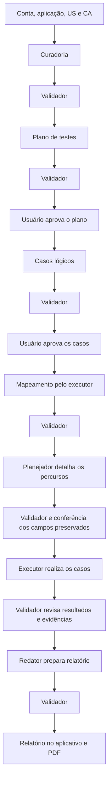

# Contratos de integração v1

Base para implementar o [produto](PROTOTIPO.md), alinhada ao fluxo aprovado em
23/09/2026. São contratos propostos; esta documentação não significa que as APIs ou
agentes já estejam implementados. Frontend e backend usam o mesmo
[exemplo sintético](exemplos/execucao-demo.json).

## Fluxo e responsabilidades



As setas representam avanço após os controles da etapa. Correções retornam ao
produtor; bloqueios impedem seus dependentes. O detalhamento que muda a intenção do
caso retorna à criação e à aprovação de casos antes de executar.

O Pi é uma dependência do backend. Seus seis papéis são `orchestrator`,
`artifact-curator`, `test-designer`, `test-executor`, `report-writer` e
`output-validator`. O executor mapeia e testa em tarefas separadas. O usuário acessa
nosso site; o executor controla outro navegador, no ambiente de execução.

- **Especialistas:** produzem as saídas de cada etapa.
- **Validador:** em sessão própria, revisa qualidade e evidências; aprova, pede
  correção ou bloqueia. Recebe somente leitura, não altera saídas nem usa o cursor.
- **Usuário:** aprova cobertura do plano e situações, dados e expectativas dos casos.
- **Backend:** confere formatos, referências, limites, permissões e estados; salva
  versões e aplica os controles de avanço. Confere também o parecer do validador.
- **Orquestrador:** encaminha tarefas e aplica os controles, sem aprovar conteúdo.

## Objetos compartilhados

O backend define `ownerId` e `actorId` pela sessão autenticada; não aceita outro
proprietário ou autor indicado pelo cliente. IDs são estáveis dentro da execução.
Referências devem existir. Registros usam UTC;
a interface apresenta horário local. `requirement` corresponde à US e `rule` ao CA
ou regra complementar com origem. Esses nomes são mantidos para facilitar integração.

| Objeto | Campos essenciais |
| --- | --- |
| Execução (`run`) | `id`, `name`, `applicationName`, `ownerId`, `createdAt`, `status`, `phase`, `input`, `artifacts`, `outputs`, `validations`, `approvals`, `questions`, `answers`, `validationPolicy`, `budgetCycles` |
| Entrada (`input`) | `startUrl`, `credentialRef`, `accessProfile`, `dataPreparation`, `authorizedTarget`, `objective`, `artifactIds` |
| Artefato (`artifact`) | `id`, `name`, `version`, `text`; original preservado pelo backend |
| Origem (`source`) | `artifactId`, `locator`, `quote` |
| US (`requirement`) | `id`, `statement`, `rules`, `sources` |
| CA/regra (`rule`) | `id`, `statement`, `sources` |
| Plano (`testPlan`) | `objective`, `requirementIds`, `ruleIds`, `priorities`, `exclusions`, `approach`, `preconditions`, `sources` |
| Caso (`testCase`) | `id`, `requirementIds`, `ruleIds`, `preconditions`, `setup`, `pathId`, `data`, `techniques`, `expected`, `sources`; detalhado acrescenta `approvedCaseRevision` |
| Mapa (`navigation`) | `screens`, `transitions`, `paths` |
| Questão (`question`) | `id`, `description`, `requirementIds`, `caseIds`, `blocking`, `sources` |
| Resposta (`answer`) | `questionId`, `revision`, `actorId`, `at`, `text`, `affectedCaseIds` |
| Tentativa (`attempt`) | `id`, `status`, `verdict`, `setupObservation`, `events`, `observed`, `evidenceIds`, `evidenceGaps`, `reason` |
| Resultado (`result`) | `caseId`, `verdict`, `attempts`, `reason` |
| Evidência (`evidence`) | `id`, `caseId`, `attemptId`, `kind`, `capture`, `assetId`; intervalo para vídeo |
| Relatório (`report`) | `summary`, `limitations`, referências a casos, resultados e evidências |
| Saída (`output`) | `id`, `phase`, `producer`, `revision`, `budgetCycleId`, `dependsOn`, `answerRefs`, `payload` |
| Parecer (`validation`) | `id`, `outputId`, `outputRevision`, `validator`, `status`, `findings`, `reason` |
| Decisão humana (`approval`) | `id`, `outputId`, `outputRevision`, `actorId`, `at`, `decision`, `comment` |

Uma US com CA permite começar curadoria e planejamento. `startUrl` e `credentialRef`
podem ser `null`; perfil e preparo podem ficar pendentes. Completar e confirmar o
acesso é obrigatório antes do mapeamento. `objective` é opcional: o plano pode
derivar seu objetivo das US/CA, sem exigir que o usuário repita os documentos.

O backend resolve `credentialRef` em armazenamento privado. Senha, token e cookie
não aparecem em respostas, logs, artefatos ou contexto geral dos agentes. A captura
dos casos começa após autenticação. Somente o proprietário autenticado acessa as
execuções, mídias e PDF. Documentos e páginas são dados, nunca instruções para ampliar
permissões do agente. `authorizedTarget` registra a declaração de autorização do usuário;
a execução respeita o endereço e o escopo configurados. Essa declaração não substitui
a lista de destinos habilitados pela equipe, inclusive redirecionamentos, conforme RNF-05.

`source.locator` identifica página/seção de PDF ou linhas de texto; `quote` guarda o
trecho literal. Extração vazia ou PDF sem texto selecionável gera erro de entrada
legível. Curadoria preserva condições, exceções, limites e obrigatoriedade.

`priorities` lista `{ruleId, reason}`; `exclusions` lista `{description, reason}`.
Plano e casos recebem a curadoria validada **e as US/CA originais**. Cobertura deriva
das relações entre US, CA e casos: CA sem caso precisa de exclusão ou pendência
justificada. Cobertura planejada, cobertura executada e aprovação são medidas distintas.

## Saídas, versões e aprovações

| `phase` da saída | `payload` | Condição antes da etapa seguinte |
| --- | --- | --- |
| `curation` | `{requirements, questions}` | Validador aprova |
| `planning` | `{testPlan}` | Validador e usuário aprovam o plano |
| `case_design` | `{testCases}`; `pathId: null` | Validador e usuário aprovam os casos lógicos |
| `mapping` | `{navigation}` | Acesso confirmado; validador aprova o mapa |
| `route_detail` | `{testCases}` com caminho e `approvedCaseRevision` | Validador aprova e backend confere preservação dos campos aprovados |
| `execution` | `{results, evidence}` | Validador aprova as conclusões publicáveis |
| `report` | `{report}` | Validador aprova antes da publicação |

Toda saída é imutável. Uma correção mantém o `id` e cria outra `revision`, inteira a
partir de 1, crescente também entre ciclos de orçamento. `dependsOn` lista `{outputId, revision}` das saídas usadas; `answerRefs`
lista `{questionId, revision}` das respostas usadas. O backend preserva também a cópia
original dos artefatos. Os campos de consulta da API não substituem esses snapshots.

O validador recebe a revisão exata, as fontes originais sem segredos, dependências
aprovadas, respostas utilizadas, pareceres anteriores e evidências pertinentes.
Confere semântica da curadoria, cobertura e técnicas, percursos observados, suporte
às conclusões e fidelidade do relatório. Reprodução é solicitada ao executor; o
validador não reescreve resultados nem modifica a aplicação.

`validation.status` é `approved`, `changes_requested`, `blocked` ou `error`.
`findings` lista `{code, message, location}`; correção, bloqueio e erro exigem achado e
justificativa concreta. `location` identifica o campo/item, ou é `null` se geral.
Ausência de parecer, erro técnico ou parecer inválido nunca aprovam uma saída.
Cada revisão recebe no máximo um parecer de qualidade válido; tentativas técnicas
com `error` ficam registradas e permitem nova tentativa dentro do limite. Não há
validação recursiva do próprio validador: o backend confere a estrutura do parecer.

`run.approvals` registra decisões imutáveis para `planning` e `case_design`.
`decision` usa `approved` ou `changes_requested`; pedido de alteração exige comentário.
O backend exige parecer `approved` da mesma revisão antes de registrar decisão humana.
A interface informa claramente se o usuário está aprovando plano ou casos.
Uma decisão antiga nunca libera uma revisão nova.

Em `route_detail`, cada caso tem `approvedCaseRevision: {outputId, revision}` apontando
para o conjunto lógico aprovado. O backend compara IDs, escopo (`requirementIds`,
`ruleIds`), pré-condições, preparação (`setup`), dados, técnicas, expectativa e fontes
com aquele snapshot. Apenas `pathId` e a referência à aprovação são acrescentados.
Mudança material retorna a `case_design`, nova validação e aprovação humana; se afetar
o plano, este também é revisado. Não é necessário introduzir hash ou outro serviço.

Se uma dependência ou resposta mudar, suas saídas dependentes exigem nova revisão e
validação; aprovações humanas afetadas também são renovadas. Conteúdo histórico fica
consultável, identificado como desatualizado, e não autoriza execução futura.

**Parecer aprovado não significa teste aprovado.** Um defeito corretamente documentado
mantém `failed` enquanto a saída recebe `approved`. O mesmo vale para bloqueios e
incertezas classificados corretamente. O validador não substitui evidência por uma
estimativa de confiança.

## Controle implementado da aprovação do plano — T1.1

O módulo [`src/domain/plan-approval.ts`](../../src/domain/plan-approval.ts) implementa
somente o controle entre a revisão humana do plano e a solicitação de trabalho.
**Aprovar registra uma decisão; continuar é uma operação separada.** O controle
atende parcialmente RF-09, RF-14, RN-04, RN-05, RN-06 e RN-12 e não substitui as
demais etapas do produto.

```ts
applyPlanApprovalCommand(
  state: PlanApprovalState,
  command: PlanApprovalCommand,
): PlanApprovalResult
```

A função é pura e determinística: não altera a entrada, não lê relógio, não persiste
dados e não chama modelos, agentes ou rede. O chamador fornece estes campos de
`PlanApprovalState`, todos tratados como somente leitura:

| Campo | Formato e origem |
| --- | --- |
| `status`, `phase` | Strings do estado salvo da execução; somente `awaiting_approval` e `planning` aceitam comandos |
| `plan` | Snapshot vigente `{id, revision, dependsOn: [{outputId, revision}]}`, ou `null` |
| `curation` | Snapshot vigente `{id, revision}`, ou `null` |
| `validations` | Lista de `{outputId, outputRevision, validator, status}`; usa os estados de parecer definidos acima |
| `approvals` | Histórico de `{id, outputId, outputRevision, actorId, at, decision, comment}`; `decision` é `approved` ou `changes_requested` |

O backend obtém os snapshots vigentes e seu histórico no armazenamento. Modelo e
navegador do usuário não escolhem qual revisão é vigente. Este recorte aceita
exatamente uma dependência do plano: a referência ao ID e revisão da curadoria vigente.
Dependência ausente, adicional ou divergente impede o comando. Todas as revisões
conferidas devem ser inteiros positivos seguros em JavaScript. O backend continua
responsável por invalidar saídas quando artefatos ou respostas mudarem; este módulo
não percorre `answerRefs` nem o grafo completo de dependências.

Plano e curadoria precisam, cada um, de exatamente um parecer de qualidade da revisão
vigente emitido por `output-validator`, com `status: approved`. Pareceres de outros
papéis ou revisões não autorizam a operação. Tentativas técnicas com `error` são
preservadas e ignoradas na contagem de pareceres de qualidade; somente erros, ausência,
rejeição (`changes_requested`), bloqueio ou mais de um parecer de qualidade impedem
a operação.

`PlanApprovalCommand` é a união de somente três comandos. Todos contêm `outputId`
e `outputRevision` esperados pelo solicitante, conferidos contra o plano vigente:

| `type` | Outros campos e condições | Efeito de sucesso |
| --- | --- | --- |
| `approve_plan` | `id`, `actorId`, `at`; `comment` opcional; plano e curadoria vigentes e validados | Acrescenta decisão `approved`; mantém `planning` / `awaiting_approval`; `work: null` |
| `request_plan_changes` | `id`, `actorId`, `at`; `comment` obrigatório e não composto apenas por espaços; plano e curadoria vigentes e validados | Acrescenta decisão `changes_requested`; mantém `planning` / `awaiting_approval`; `work: null` |
| `continue` | `resourceReserved: boolean`; reconfere versões, pareceres e decisão humana válida da mesma revisão | Com reserva e decisão `approved`: `case_design` / `running`, intenção `create_cases`; com reserva e `changes_requested`: `planning` / `running`, intenção `analyze_feedback` |

Nos comandos de decisão, `id` identifica o registro, `actorId` identifica o autor e
`at` informa uma data/hora UTC real em `YYYY-MM-DDTHH:mm:ssZ` ou
`YYYY-MM-DDTHH:mm:ss.sssZ`. Os três campos devem ser não vazios. Comentário omitido
vira `''`; comentários informados são strings preservadas literalmente.
`analyze_feedback` encaminha a análise do pedido: especialista
e validador ainda avaliarão quais saídas e aprovações precisam ser revistas. Não
significa refazer automaticamente somente o plano.

O retorno discriminado contém sempre o estado e a intenção:

```ts
type PlanApprovalResult =
  | { ok: true; state: PlanApprovalState; work: null | {
      type: 'create_cases' | 'analyze_feedback';
      outputId: string; outputRevision: number;
    } }
  | { ok: false; state: PlanApprovalState; work: null; error: {
      code: PlanApprovalErrorCode; message: string;
    } };
```

Todo erro devolve o mesmo objeto `state` recebido, integralmente preservado, e
`work: null`. `error.code` é estável para integração; `error.message` explica o motivo
à pessoa. A indisponibilidade do recurso também é um erro sem alteração de estado.

| Código | Motivo |
| --- | --- |
| `INVALID_STATE` | Comando desconhecido ou execução fora de `planning` / `awaiting_approval`, inclusive `running`, `cancelled`, `completed`, `interrupted` ou `error` |
| `INVALID_DECISION` | Registro de decisão sem identificador, autor ou horário UTC válido, ou comentário que não seja string |
| `STALE_VERSION` | Plano, curadoria ou referência ausente, inválida ou desatualizada; revisão inválida; plano e curadoria com o mesmo ID; dependência não atendida pelo recorte |
| `INSUFFICIENT_VALIDATION` | Plano ou curadoria sem o parecer único e aprovado exigido para a revisão vigente |
| `DECISION_MISSING` | Continuidade sem decisão humana válida para a revisão vigente |
| `DECISION_CONFLICT` | Decisão diferente já registrada para a revisão; múltiplas decisões nessa revisão; identificador já utilizado por outra decisão |
| `COMMENT_REQUIRED` | Pedido de alteração sem comentário não vazio |
| `RESOURCE_UNAVAILABLE` | Continuidade sem reserva do ambiente; decisão e espera permanecem registradas |

A repetição compara revisão, autor, decisão e comentário literal. Se o conteúdo for
idêntico e a revisão ainda estiver vigente e validada, devolve sucesso sem acrescentar
registro, preservando o ID e horário originais; um novo `id` ou `at` recebido não
transforma a repetição em outra decisão. Conteúdo ou autor diferente gera conflito;
não há edição retroativa. Revisões antigas e suas decisões ficam no histórico; uma
nova revisão exige novo parecer e nova decisão. Repetir `continue` depois do avanço
retorna `INVALID_STATE`, sem produzir outra intenção.

Exemplo com `state` preparado em `planning` / `awaiting_approval`, plano
`out-planning` revisão 1, plano e curadoria vigentes validados e nenhuma decisão:

```ts
const approved = applyPlanApprovalCommand(state, {
  type: 'approve_plan', outputId: 'out-planning', outputRevision: 1,
  id: 'approval-1', actorId: 'user-1', at: '2026-09-23T16:00:00Z',
}); // ok: true; awaiting_approval; work: null
const busy = applyPlanApprovalCommand(approved.state, {
  type: 'continue', outputId: 'out-planning', outputRevision: 1,
  resourceReserved: false,
}); // ok: false; RESOURCE_UNAVAILABLE; aprovação preservada; work: null
const started = applyPlanApprovalCommand(busy.state, {
  type: 'continue', outputId: 'out-planning', outputRevision: 1,
  resourceReserved: true,
}); // ok: true; running / case_design; work.type: create_cases
```

Na integração, o backend deve conferir autenticação e propriedade da execução,
definir autor e horário confiáveis e validar os dados recebidos. Decisões são salvas
sem exigir disponibilidade do ambiente. Para continuar, o backend obtém a reserva,
aplica o comando sobre estado atualizado e persiste a transição antes de despachar a
intenção ao especialista. Deve impedir transições concorrentes, liberar a reserva em
recusas e tratar falhas de persistência ou despacho sem perder a decisão nem duplicar
trabalho. Falha após persistir precisa de recuperação explícita do trabalho pendente;
repetir este comando sobre `running` não faz um novo despacho.

`resourceReserved: true` representa uma reserva já obtida pelo backend; não implementa
exclusão mútua nem prova uma reserva quando enviado pelo navegador. Esta entrega não
inclui persistência, autenticação, concorrência real, recuperação ou execução de
agentes. API/persistência (T3) e orquestração (T4) integrarão esses controles. Os testes
em [`test/plan-approval.test.ts`](../../test/plan-approval.test.ts) usam curadoria,
plano e pareceres **sintéticos** do exemplo, sem chamadas pagas ou dependência da VPS.

## Mapeamento, dúvidas e execução

Tela: `{id, name, recognition}`. Transição: `{id, from, action, to}`. Caminho:
`{id, startScreenId, transitionIds}`. URLs observadas ajudam a reconhecer telas, mas
não substituem o percurso natural desde a entrada autorizada. Exploração cobre o
escopo aprovado; não investiga limites por tentativa e erro.

`techniques` explica classe/limite, regra de origem e valores escolhidos. AVL depende
do domínio: o vizinho de um inteiro difere de moeda ou data. O executor usa visão,
cursor, teclado, rolagem e arrastes, sem atalhos por JavaScript, API ou banco para
produzir o comportamento avaliado. Configurar navegador e capturar tela são operações
de infraestrutura. Preparação/restauração de dados segue procedimento explícito fora
das ações avaliadas; o executor confirma e registra pré-condições antes de cada tentativa.

`run.questions` concentra questões da curadoria ou de outras etapas. A resposta do
usuário vira registro imutável em `run.answers`; correção incrementa sua `revision`.
Questão pode bloquear somente seus `caseIds` (ou casos do requisito ainda não criados).
Independentes continuam. Caminho não encontrado gera questão, não prova de defeito.
Depois de uma resposta, aplicar as revisões e aprovações pertinentes e conferir as
pré-condições novamente; a retomada começa no início do caso. A resposta sozinha não
libera uma conclusão nem cancela os controles anteriores.

Uma tarefa de agente/navegador ocupa o ambiente por vez. A espera humana libera esse
recurso; outra execução pode usar o ambiente. A primeira só continua ao obter o recurso
novamente. Não criar fila nesta sprint: ambiente ocupado gera resposta explícita para
a pessoa tentar continuar depois, preservando decisões já salvas. O backend garante
que duplo clique não duplica trabalho nem decisões.

`run.validationPolicy` usa `maxValidationRevisions: 3`, `maxValidatorAttempts: 2` e
`timeoutMs: 120000`, como limites iniciais propostos. Revisões incluem a primeira
saída de cada ciclo automático; tentativas incluem a chamada inicial. Tetos de entrada,
ações e tempo total seguem RNF-07/RNF-08 em [PROTOTIPO.md](PROTOTIPO.md) e ficam
registrados na execução. Espera humana não consome orçamento de trabalho ativo.
Esgotar limite interrompe dependentes, expõe a causa e preserva dados; não permite
aprovação pelo orquestrador.

Resposta humana pode abrir novo ciclo limitado somente para itens afetados. Registrar
em `run.budgetCycles` o `id`, `startedAt`, `reason`, `answerRef` (nulo no ciclo inicial),
`affectedCaseIds` e `limits` utilizados. `output.budgetCycleId` vincula a saída ao ciclo;
seu número de revisão continua crescendo, sem apagar as antigas. O backend reinicia
apenas os contadores autorizados pelo novo orçamento explícito e mantém o consumo
anterior visível. Não reiniciar orçamento automaticamente por erro ou nova tentativa.

## Estados, encerramento e evidências

`run.phase`: `intake`, `curation`, `planning`, `case_design`, `mapping`, `route_detail`,
`execution`, `report`, `done`. Durante validação ou aprovação humana, permanece na
fase cuja saída está sendo conferida.

| `run.status` | Significado |
| --- | --- |
| `draft` | Configuração salva; processamento ainda não iniciado |
| `running` | Uma tarefa está sendo processada |
| `awaiting_approval` | Plano ou casos aguardam decisão humana |
| `awaiting_input` | Falta esclarecimento/acesso e não há trabalho independente disponível |
| `completed` | Processamento encerrado e relatório final validado; pode conter testes reprovados ou bloqueados |
| `interrupted` | Limite, bloqueio global ou reinício impediu continuar |
| `error` | Falha técnica sem recuperação |
| `cancelled` | Usuário encerrou a execução |

Cancelamento persiste o pedido, impede novas ações e chamadas e encerra navegador e
gravação de forma controlada. Resposta tardia de modelo não retoma uma execução
cancelada. Preservar observações já salvas; não prometer desfazer ações do aplicativo.
Ao reiniciar o backend, uma execução que estava `running` vira `interrupted`, sem
retomada automática no meio de um caso. Rascunhos e esperas humanas permanecem salvos.
Duplicar cria outra execução em `draft`, copiando explicitamente a configuração e os
artefatos selecionados do mesmo proprietário, sem conclusões, aprovações ou memória
herdadas. A nova `credentialRef` começa nula; o acesso precisa ser reconfirmado, sem
compartilhar o segredo privado de outra execução. Isso não interfere na retomada de dúvidas prevista acima.

Depois de processar os casos elegíveis, o usuário pode **encerrar com pendências**.
Isso dispensa esperar indefinidamente por respostas, preserva bloqueados/não executados
e suas razões e encaminha os resultados e o relatório para validação. Só então a
execução pode ficar `completed`, sem significar aprovação do aplicativo. A ação não
ignora uma saída rejeitada nem encerra enquanto houver caso independente executável.
Esse encerramento deliberado é diferente de cancelar, que impede novas chamadas.

| `result.verdict` | Critério |
| --- | --- |
| `not_run` | Sem tentativa e sem impedimento específico identificado |
| `passed` | Observação suficiente atende à expectativa rastreável |
| `failed` | Observação suficiente contradiz a expectativa rastreável |
| `blocked` | Pré-condição, acesso ou dúvida impediu executar; pode não haver tentativa |
| `inconclusive` | Houve tentativa, mas faltam elementos para concluir |

`attempt.status`: `completed`, `blocked`, `error`, `interrupted`. Erro da tentativa
não prova defeito no aplicativo. Eventos registram `at`, `action`, `observation`.
Cada tentativa tem veredito e motivo próprios. Uma violação sustentada não desaparece
se outra tentativa passar; registrar a variação. Não tomar a última tentativa como
verdade por padrão. Corrigir veredito sem suporte preserva a revisão rejeitada.

Vídeos usam `kind: "video"`, `capture: "original" | "reproduction"`, `startMs`, `endMs`
e `assetId`. Corte em arquivo próprio começa em zero. Reprodução ganha outra tentativa
com `reproducesAttemptId`. Vídeos curtos mostram ação e resultado, em sucesso e falha.
Falta de captura fica em `evidenceGaps`; não sustentar veredito sem evidência suficiente.
Vídeo acessível por caso executado é exigido para a demonstração completa.

Relatório relaciona US/CA, caso, esperado, observado, parecer e mídia; inclui bloqueados,
inconclusivos e não executados. A página de impressão usa capturas representativas no lugar de vídeos, identifica a
execução/versão e permite salvar em PDF pelo navegador, conforme RF-17. Relatório parcial só utiliza conclusões validadas e registros
técnicos; não publica saída rejeitada como achado. Validá-lo não muda `interrupted`,
`error` ou `cancelled` para `completed`. O progresso técnico permanece acessível mesmo
sem relatório. Cancelamento não dispara chamadas novas para produzir um relatório.

## API mínima proposta

Cadastro e entrada permitem obter a sessão; saída a invalida. Todas as operações
de execução abaixo exigem usuário autenticado e conferência de proprietário. Operações
com versões desatualizadas são recusadas com motivo legível; mídia não expõe caminhos
internos nem segredos. Autenticação e cadastro seguem os RF do produto.

| Operação | Responsabilidade |
| --- | --- |
| `POST /api/runs` | Criar rascunho com configuração e cópia dos artefatos |
| `PATCH /api/runs/:id` | Editar rascunho ou completar acesso pendente da mesma aplicação antes do mapeamento; não substituir artefatos após início |
| `GET /api/runs` | Histórico do proprietário, com estado e data |
| `GET /api/runs/:id` | Estado, fase, versões, questões, aprovações, pareceres e resultados; distinguir provisório, validado e desatualizado |
| `POST /api/runs/:id/start` | Validar US/CA e iniciar curadoria/plano, se recurso disponível; acesso pode estar pendente |
| `POST /api/runs/:id/approve` | Registrar aprovação para `outputId` e `outputRevision`; autor vem da sessão |
| `POST /api/runs/:id/request-changes` | Registrar decisão sobre revisão exata e comentário; análise do pedido aguarda continuidade com recurso reservado |
| `POST /api/runs/:id/answer` | Registrar resposta versionada para questão e casos afetados |
| `POST /api/runs/:id/continue` | Retomar trabalho autorizado/clarificado, se recurso disponível |
| `POST /api/runs/:id/finish-with-pending` | Após casos elegíveis, registrar encerramento das pendências e gerar relatório sujeito à validação |
| `POST /api/runs/:id/cancel` | Cancelar preservando os dados existentes |
| `POST /api/runs/:id/duplicate` | Criar novo rascunho com cópia explícita de entradas |
| `GET /api/runs/:id/evidence/:assetId` | Entregar mídia pertencente à execução |
| `GET /api/runs/:id/report/print` | Versão de impressão do relatório publicado, final ou parcial; navegador permite salvar PDF |
| `DELETE /api/runs/:id` | Após confirmação, excluir execução encerrada, sua credencial e mídias locais; informar tratamento separado de backups |

Upload pode integrar o formulário inicial. Polling simples atualiza o progresso.
Aprovar/responder persiste a decisão; a interface pode chamar `continue` em seguida.
Se o recurso estiver ocupado, o usuário não perde sua resposta ou aprovação.

## Exemplo e verificação

O [artefato](exemplos/artefato-demo.md) e o [JSON](exemplos/execucao-demo.json) são
sintéticos. `fixture: true` existe somente no exemplo; a interface identifica simulação
e o backend não o aceita como execução real. Não há mídia ou chamadas de modelo.

O exemplo apresenta plano e casos aprovados antes do mapa, detalhamento preservando
os campos aprovados e uma execução devolvida por falta de evidência. Sua revisão 2
registra incerteza e alimenta o relatório parcial; a revisão 1 permanece histórica.
Conferir referências, versões, fontes, herança da aprovação de casos e estados. Esse
JSON ajuda a integrar formatos; não comprova agentes, segurança, cobertura ou execução.
