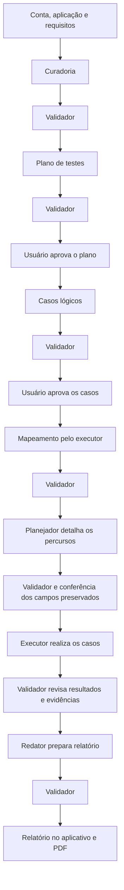

# Contratos de integração v1

Base para implementar o [produto](PROTOTIPO.md), alinhada ao fluxo aprovado em
23/09/2026, com ajuste de entradas e esclarecimentos em 24/09/2026. São contratos
propostos; esta documentação não significa que todas as APIs ou agentes já estejam
implementados. As seções de entregas implementadas delimitam
o comportamento disponível. O [exemplo sintético](exemplos/execucao-demo.json)
apoia os contratos e testes; a interface usa a API e não carrega exemplos.

## Conclusão do fluxo — T9.1

Esta seção registra o contrato do candidato T9.1 e prevalece sobre notas de
funcionalidades futuras dos recortes históricos abaixo. Implementação não substitui
o [aceite registrado](../evidencias/fechamento-sprint/README.md). A validação manual
com modelos reais e o aceite humano serão feitos por Matheus, por orientação dele.

### Entradas, perfil e administração

`POST /api/runs` mantém JSON e aceita `multipart/form-data` com campos `name`,
`applicationName`, `objective`, `text` e partes `files`. O leitor incremental
recusa mais de cinco arquivos ou arquivo acima de 10 MiB antes de acumulá-lo por
inteiro. Servidor valida UTF-8/extensão e PDF com texto; `pdftotext` é executado
com argumentos controlados. Erro preserva o formulário. Não há OCR nem truncamento.

Cada documento conserva seu `id`, `name`, `version`, `text`, `originalId`, formato,
tamanho e digest. `pages: [{page,firstLine,lastLine}]` relaciona PDF às citações
`Lx-Ly`; documentos não são concatenados em fonte indistinta. Os originais são
privados e distintos da extração. Excesso de contexto recusa a preparação pedindo
redução explícita; limites de dez requisitos e trinta casos permanecem.

Perfil permite nome e equipe sem alterar identidade/e-mail ou autenticação.
`POST /api/runs/:id/duplicate` recebe `artifactIds`, gera novos IDs e copia apenas
entradas/configurações não secretas; exige novo acesso e não copia pareceres,
aprovações, tentativas ou resultados. `DELETE /api/runs/:id` recebe
`{confirmed:true}`, exige proprietário, estado encerrado e ausência de trabalho
ativo; remove registro, arquivos e credencial local. Repetição da remoção é segura.

### Análise de alterações e respostas

Intenção `analyze_feedback`, produtor `test-designer`, tarefa `analyze-feedback`;
validador textual em sessão nova. A saída de fase `feedback` é revisionada:

```json
{"impact":"navigation","restartFrom":"mapping","reason":"Só a localização visual foi esclarecida.","requirementIds":["REQ-1"],"caseIds":["CT-1"],"instructions":["Observar novamente o trecho indicado."],"question":null}
```

| Impacto | Retorno | Aprovações |
| --- | --- | --- |
| `requirements` | `curation` ou `planning`, conforme interpretação validada | Novas revisões de plano e casos exigem aprovação humana. |
| `cases` | `case_design` | Nova aprovação humana do conjunto. |
| `navigation` | `mapping` | Preservar lógica/aprovações; observar e validar mapa/percurso afetado. |
| `clarification` | `null` | `instructions: []`; pergunta localizada antes de alterar significado. |

O backend valida formato/IDs e aplica a matriz; não classifica comentários por
heurística. `run.invalidations` registra ID, saída/revisão afetada, motivo, data,
`feedbackRef` e `caseIds`; históricos permanecem. Resultados por caso permitem
preservar conclusões independentes. Cada resposta é imutável, correção incrementa
`revision`; nova resposta é analisada no contexto da pergunta e dos registros
anteriores. `answerRefs` da análise identifica somente as respostas interpretadas.
Esclarecimento de navegação não invalida a aprovação lógica por si só.

### Tentativas, resultados e evidências

`run.executionAttempts[]` é persistido antes da primeira ação, com campos:

```text
id, caseId, approvedCaseRevision:{outputId,revision}, routeDetailRef:{outputId,revision}
startedAt, finishedAt, status:running|completed|interrupted|cancelled
setupObservation, events, observed, verdict, reason, evidenceIds, evidenceGaps
reproducesAttemptId (somente reprodução)
```

Há uma tentativa original e até uma reprodução justificada por caso, incluindo
retomadas. `completed` na tentativa indica término técnico, sem implicar `passed`.
Bloqueio é veredito; interrupções não se repetem automaticamente. Correção da
conclusão usa as mesmas observações e nova revisão; não abre o navegador outra vez.

Cada caso tem um ID estável de saída `execution`, com revisões crescentes. O
helper `latestExecutionOutputs` seleciona por caso; `latestOutput(run,'execution')`
não se aplica. Payload:

```json
{"caseId":"CT-1","attemptId":"attempt-backend","setupObservation":"Preparo observado.","observed":"Resposta observada.","verdict":"inconclusive","reason":"Falta captura do resultado.","evidenceIds":[],"evidenceGaps":["Captura final indisponível."],"question":null,"reproduce":false}
```

O backend preenche IDs, datas e vínculos; o modelo só devolve a conclusão.
`not_run` é derivado da ausência de tentativa/impedimento, não inventado pelo
executor. `passed`/`failed` exigem suporte visual; `blocked` exige impedimento
concreto e pergunta; tentativa sem suporte é `inconclusive`. Rejeição correta de
entrada inválida é `passed`; erro de modelo/captura não prova defeito do alvo.

Cada observação/evento físico carrega `caseId` e `attemptId`. A captura do relatório
tem `id`, `assetId`, caso/tentativa e `capture: original|reproduction`. A rota de
mídia exige sessão/identidade/proprietário/pertencimento e não revela caminho local.
O validador visual recebe cada caso/expectativa, percurso, eventos, manifesto e
imagens efetivas da tentativa (até 24 por revisão). Não valida só amostra dos casos
nem descarta imagens para caber; limite excedido interrompe explicitamente.

### Relatório e encerramento

`POST /api/runs/:id/finish-with-pending` (também `/report`) inicia encerramento
regular somente sem caso independente elegível, com orçamento. `/partial-report`
é explícito e só atende estados `interrupted`/`error`. Nenhum desses caminhos
inicia após cancelamento ou orçamento esgotado.

O backend cria `snapshot` com identificação, modo, escopo/fontes/exclusões,
contagens dos cinco vereditos, cobertura por US/CA, casos esperados/observados,
tentativas, capturas, perguntas/respostas, pendências e referências/pareceres.
Cobertura distingue casos planejados, tentados, com conclusão suficiente e
pendentes; aprovação dos casos não equivale a execução. Critérios sem cobertura
têm justificativa. Uma falha validada não desaparece quando a reprodução passa.

O redator devolve somente `{summary,scope,limitations,conclusion}`; o backend
acrescenta o snapshot imutável em `{snapshot,narrative}`. O validador textual confere
fidelidade a todas as conclusões recebidas; nova interpretação de imagem exige
retorno à validação visual. Conclusão rejeitada não é publicada como achado.
Fallback parcial para versão anteriormente validada fica explícito como histórico
em `scope.current`, `case.current`, `attempt.current` e `references[].current`;
não concede cobertura à revisão posterior ainda sem aprovação.

`run.publishedReport:{outputId,revision}` só aponta para revisão aprovada. Durante
correções, conserva-se a publicação anterior e indica-se material em revisão.
Encerramento regular termina em `completed / done`; parcial preserva estado/fase
de erro/interrupção, inclusive se aprovado. Sem casos, snapshot relata zero casos
sem fabricar cobertura. A impressão usa exclusivamente a revisão publicada, com
imagens autenticadas por `fetch`/Blob carregadas antes de imprimir.

Cancelamento também funciona em `ready` e esperas abertas. Reinício preserva
resultados confirmados, interrompe tentativas ativas e não repete ações. Uma tarefa
ocupa o ambiente; orçamento de 45 minutos ativos é acumulado, sem espera humana.
Permanece o teto de 120 s/chamada, três produções/saída, duas tentativas técnicas
de validação/revisão, cem ações de exploração e cinquenta ações/tentativa.

## Fluxo e responsabilidades



As setas representam avanço após os controles da etapa. Correções retornam ao
produtor; bloqueios impedem seus dependentes. O detalhamento que muda a intenção do
caso retorna à criação e à aprovação de casos antes de executar.

O Pi é uma dependência do backend. Seus seis papéis são `orchestrator`,
`artifact-curator`, `test-designer`, `test-executor`, `report-writer` e
`output-validator`. O executor mapeia e testa em tarefas separadas. O usuário acessa
nosso site; o executor controla outro navegador, no ambiente de execução.

- **Especialistas:** produzem as saídas de cada etapa.
- **Validador:** em sessão própria, revisa qualidade e evidências; aprova, pede
  correção ou bloqueia. Recebe somente leitura, não altera saídas nem usa o cursor.
- **Usuário:** aprova cobertura do plano e situações, dados e expectativas dos casos.
- **Backend:** confere formatos, referências, limites, permissões e estados; salva
  versões e aplica os controles de avanço. Confere também o parecer do validador.
- **Orquestrador:** encaminha tarefas e aplica os controles, sem aprovar conteúdo.

## Objetos compartilhados

O backend define `ownerId` e `actorId` pela sessão autenticada; não aceita outro
proprietário ou autor indicado pelo cliente. IDs são estáveis dentro da execução.
Referências devem existir. Registros usam UTC;
a interface apresenta horário local. `requirement` representa uma história ou requisito;
`rule` representa um comportamento geral ou exemplo pontual identificado por `kind`.
Os nomes internos são mantidos; não exigem um template de US/CA na entrada.

| Objeto | Campos essenciais |
| --- | --- |
| Execução (`run`) | `id`, `name`, `applicationName`, `ownerId`, `createdAt`, `status`, `phase`, `input`, `artifacts`, `outputs`, `validations`, `approvals`, `questions`, `answers`, `validationPolicy`, `budgetCycles` |
| Entrada (`input`) | `startUrl`, `credentialRef`, `accessProfile`, `dataPreparation`, `authorizedTarget`, `objective`, `artifactIds` |
| Artefato (`artifact`) | `id`, `name`, `version`, `text`; original preservado pelo backend |
| Origem (`source`) | `artifactId`, `locator`, `quote` |
| História/requisito (`requirement`) | `id`, `statement`, `rules`, `sources` |
| Comportamento (`rule`) | `id`, `statement`, `sources`; opcionais `kind: rule \| example` e `examples` |
| Exemplo recebido | `id`, `given: string[]`, `when: string[]`, `then: string[]`, `sources` |
| Plano (`testPlan`) | `objective`, `requirementIds`, `ruleIds`, `priorities`, `exclusions`, `approach`, `preconditions`, `sources` |
| Caso (`testCase`) | `id`, `requirementIds`, `ruleIds`, `preconditions`, `setup`, `pathId`, `data`, `techniques`, `expected`, `sources`; detalhado acrescenta `approvedCaseRevision` |
| Mapa (`navigation`) | `screens`, `transitions`, `paths` |
| Questão (`question`) | `id`, `description`, `requirementIds`, `caseIds`, `blocking`, `sources`; opcional `ruleIds` |
| Resposta (`answer`) | `questionId`, `revision`, `actorId`, `at`, `text`, `affectedCaseIds` |
| Tentativa (`attempt`) | `id`, `status`, `verdict`, `setupObservation`, `events`, `observed`, `evidenceIds`, `evidenceGaps`, `reason` |
| Resultado (`result`) | `caseId`, `verdict`, `attempts`, `reason` |
| Evidência (`evidence`) | `id`, `caseId`, `attemptId`, `kind`, `capture`, `assetId`; no protótipo, `kind: "screenshot"` |
| Relatório (`report`) | `summary`, `limitations`, referências a casos, resultados e evidências |
| Saída (`output`) | `id`, `phase`, `producer`, `revision`, `budgetCycleId`, `dependsOn`, `answerRefs`, `payload` |
| Parecer (`validation`) | `id`, `outputId`, `outputRevision`, `validator`, `status`, `findings`, `reason` |
| Decisão humana (`approval`) | `id`, `outputId`, `outputRevision`, `actorId`, `at`, `decision`, `comment` |

Material textual permite iniciar curadoria; ao menos um comportamento esperado
verificável permite planejar seu escopo. Não se exige US formal, CA rotulado ou Gherkin. `startUrl` e `credentialRef`
podem ser `null`; perfil e preparo podem ficar pendentes. Completar e confirmar o
acesso é obrigatório antes do mapeamento. `objective` é opcional: o plano pode
derivar seu objetivo dos requisitos, sem exigir que o usuário repita os documentos.

O backend resolve `credentialRef` em armazenamento privado. Senha, token e cookie
não aparecem em respostas, logs, artefatos ou contexto geral dos agentes. A captura
dos casos começa após autenticação. Somente o proprietário autenticado acessa as
execuções, mídias e PDF. Documentos e páginas são dados, nunca instruções para ampliar
permissões do agente. `authorizedTarget` registra a declaração de autorização do usuário;
a execução respeita o endereço e o escopo configurados. Essa declaração não substitui
a lista de destinos habilitados pela equipe, inclusive redirecionamentos, conforme RNF-05.

`source.locator` identifica página/seção de PDF ou linhas de texto; `quote` guarda o
trecho literal. Extração vazia ou PDF sem texto selecionável gera erro de entrada
legível. Curadoria preserva condições, exceções, limites e obrigatoriedade.

`priorities` lista `{ruleId, reason}`; `exclusions` lista `{description, reason}`.
Plano e casos recebem a curadoria validada **e as US/CA originais**. Cobertura deriva
das relações entre US, CA e casos: CA sem caso precisa de exclusão ou pendência
justificada. Cobertura planejada, cobertura executada e aprovação são medidas distintas.

## Saídas, versões e aprovações

| `phase` da saída | `payload` | Condição antes da etapa seguinte |
| --- | --- | --- |
| `curation` | `{requirements, questions}` | Validador aprova |
| `planning` | `{testPlan}` | Validador e usuário aprovam o plano |
| `case_design` | `{testCases}`; `pathId: null` | Validador e usuário aprovam os casos lógicos |
| `mapping` | `{accessRevision, authentication, map, pending, limitations}` | Acesso confirmado; validador aprova o mapa |
| `route_detail` | `{testCases, pending}` com caminho ou pendência e `approvedCaseRevision` | Validador aprova e backend confere preservação dos campos aprovados |
| `execution` | `{results, evidence}` | Validador aprova as conclusões publicáveis |
| `report` | `{report}` | Validador aprova antes da publicação |

Toda saída é imutável. Uma correção mantém o `id` e cria outra `revision`, inteira a
partir de 1, crescente também entre ciclos de orçamento. `dependsOn` lista `{outputId, revision}` das saídas usadas; `answerRefs`
lista `{questionId, revision}` das respostas usadas; a preparação também inclui
`answerId` para localizar o registro imutável exato. O backend preserva também a cópia
original dos artefatos. Os campos de consulta da API não substituem esses snapshots.

O validador recebe a revisão exata, as fontes originais sem segredos, dependências
aprovadas, respostas utilizadas, pareceres anteriores e evidências pertinentes.
Confere semântica da curadoria, cobertura e técnicas, percursos observados, suporte
às conclusões e fidelidade do relatório. Reprodução é solicitada ao executor; o
validador não reescreve resultados nem modifica a aplicação.

`validation.status` é `approved`, `changes_requested`, `blocked` ou `error`.
`findings` lista `{code, message, location}`; correção, bloqueio e erro exigem achado e
justificativa concreta. `location` identifica o campo/item, ou é `null` se geral.
Ausência de parecer, erro técnico ou parecer inválido nunca aprovam uma saída.
Cada revisão recebe no máximo um parecer de qualidade válido; tentativas técnicas
com `error` ficam registradas e permitem nova tentativa dentro do limite. Não há
validação recursiva do próprio validador: o backend confere a estrutura do parecer.

`run.approvals` registra decisões imutáveis para `planning` e `case_design`.
`decision` usa `approved` ou `changes_requested`; pedido de alteração exige comentário.
O backend exige parecer `approved` da mesma revisão antes de registrar decisão humana.
A interface informa claramente se o usuário está aprovando plano ou casos.
Uma decisão antiga nunca libera uma revisão nova.

Em `route_detail`, cada caso tem `approvedCaseRevision: {outputId, revision}` apontando
para o conjunto lógico aprovado. O backend compara IDs, escopo (`requirementIds`,
`ruleIds`), pré-condições, preparação (`setup`), dados, técnicas, expectativa e fontes
com aquele snapshot. Apenas `pathId` e a referência à aprovação são acrescentados. O modelo retorna
somente `{routes: [{caseId, pathId, reason}]}`; o backend copia os casos
aprovados. Um `pathId: null` exige motivo em `pending: [{caseId, reason}]`.
Mudança material retorna a `case_design`, nova validação e aprovação humana; se afetar
o plano, este também é revisado. Não é necessário introduzir hash ou outro serviço.

Se uma dependência ou resposta mudar, suas saídas dependentes exigem nova revisão e
validação; aprovações humanas afetadas também são renovadas. Conteúdo histórico fica
consultável, identificado como desatualizado, e não autoriza execução futura.

**Parecer aprovado não significa teste aprovado.** Um defeito corretamente documentado
mantém `failed` enquanto a saída recebe `approved`. O mesmo vale para bloqueios e
incertezas classificados corretamente. O validador não substitui evidência por uma
estimativa de confiança.

## Controle implementado da aprovação do plano — T1.1

O módulo [`src/domain/plan-approval.ts`](../../src/domain/plan-approval.ts) implementa
somente o controle entre a revisão humana do plano e a solicitação de trabalho.
**Aprovar registra uma decisão; continuar é uma operação separada.** O controle
atende parcialmente RF-09, RF-14, RN-04, RN-05, RN-06 e RN-12 e não substitui as
demais etapas do produto.

```ts
applyPlanApprovalCommand(
  state: PlanApprovalState,
  command: PlanApprovalCommand,
): PlanApprovalResult
```

A função é pura e determinística: não altera a entrada, não lê relógio, não persiste
dados e não chama modelos, agentes ou rede. O chamador fornece estes campos de
`PlanApprovalState`, todos tratados como somente leitura:

| Campo | Formato e origem |
| --- | --- |
| `status`, `phase` | Strings do estado salvo da execução; somente `awaiting_approval` e `planning` aceitam comandos |
| `plan` | Snapshot vigente `{id, revision, dependsOn: [{outputId, revision}]}`, ou `null` |
| `curation` | Snapshot vigente `{id, revision}`, ou `null` |
| `validations` | Lista de `{outputId, outputRevision, validator, status}`; usa os estados de parecer definidos acima |
| `approvals` | Histórico de `{id, outputId, outputRevision, actorId, at, decision, comment}`; `decision` é `approved` ou `changes_requested` |

O backend obtém os snapshots vigentes e seu histórico no armazenamento. Modelo e
navegador do usuário não escolhem qual revisão é vigente. Este recorte aceita
exatamente uma dependência do plano: a referência ao ID e revisão da curadoria vigente.
Dependência ausente, adicional ou divergente impede o comando. Todas as revisões
conferidas devem ser inteiros positivos seguros em JavaScript. O backend continua
responsável por invalidar saídas quando artefatos ou respostas mudarem; este módulo
não percorre `answerRefs` nem o grafo completo de dependências.

Plano e curadoria precisam, cada um, de exatamente um parecer de qualidade da revisão
vigente emitido por `output-validator`, com `status: approved`. Pareceres de outros
papéis ou revisões não autorizam a operação. Tentativas técnicas com `error` são
preservadas e ignoradas na contagem de pareceres de qualidade; somente erros, ausência,
rejeição (`changes_requested`), bloqueio ou mais de um parecer de qualidade impedem
a operação.

`PlanApprovalCommand` é a união de somente três comandos. Todos contêm `outputId`
e `outputRevision` esperados pelo solicitante, conferidos contra o plano vigente:

| `type` | Outros campos e condições | Efeito de sucesso |
| --- | --- | --- |
| `approve_plan` | `id`, `actorId`, `at`; `comment` opcional; plano e curadoria vigentes e validados | Acrescenta decisão `approved`; mantém `planning` / `awaiting_approval`; `work: null` |
| `request_plan_changes` | `id`, `actorId`, `at`; `comment` obrigatório e não composto apenas por espaços; plano e curadoria vigentes e validados | Acrescenta decisão `changes_requested`; mantém `planning` / `awaiting_approval`; `work: null` |
| `continue` | `resourceReserved: boolean`; reconfere versões, pareceres e decisão humana válida da mesma revisão | Com reserva e decisão `approved`: `case_design` / `running`, intenção `create_cases`; com reserva e `changes_requested`: `planning` / `running`, intenção `analyze_feedback` |

Nos comandos de decisão, `id` identifica o registro, `actorId` identifica o autor e
`at` informa uma data/hora UTC real em `YYYY-MM-DDTHH:mm:ssZ` ou
`YYYY-MM-DDTHH:mm:ss.sssZ`. Os três campos devem ser não vazios. Comentário omitido
vira `''`; comentários informados são strings preservadas literalmente.
`analyze_feedback` encaminha a análise do pedido: especialista
e validador ainda avaliarão quais saídas e aprovações precisam ser revistas. Não
significa refazer automaticamente somente o plano.

O retorno discriminado contém sempre o estado e a intenção:

```ts
type PlanApprovalResult =
  | { ok: true; state: PlanApprovalState; work: null | {
      type: 'create_cases' | 'analyze_feedback';
      outputId: string; outputRevision: number;
    } }
  | { ok: false; state: PlanApprovalState; work: null; error: {
      code: PlanApprovalErrorCode; message: string;
    } };
```

Todo erro devolve o mesmo objeto `state` recebido, integralmente preservado, e
`work: null`. `error.code` é estável para integração; `error.message` explica o motivo
à pessoa. A indisponibilidade do recurso também é um erro sem alteração de estado.

| Código | Motivo |
| --- | --- |
| `INVALID_STATE` | Comando desconhecido ou execução fora de `planning` / `awaiting_approval`, inclusive `running`, `cancelled`, `completed`, `interrupted` ou `error` |
| `INVALID_DECISION` | Registro de decisão novo ou anterior sem identificador, autor ou horário UTC válido, ou comentário que não seja string; uma repetição não confirma uma decisão anterior inválida |
| `STALE_VERSION` | Plano, curadoria ou referência ausente, inválida ou desatualizada; revisão inválida; plano e curadoria com o mesmo ID; dependência não atendida pelo recorte |
| `INSUFFICIENT_VALIDATION` | Plano ou curadoria sem o parecer único e aprovado exigido para a revisão vigente |
| `DECISION_MISSING` | Continuidade sem decisão humana válida para a revisão vigente |
| `DECISION_CONFLICT` | Decisão diferente já registrada para a revisão; múltiplas decisões nessa revisão; identificador já utilizado por outra decisão |
| `COMMENT_REQUIRED` | Pedido de alteração sem comentário não vazio |
| `RESOURCE_UNAVAILABLE` | Continuidade sem reserva do ambiente; decisão e espera permanecem registradas |

A repetição compara revisão, autor, decisão e comentário literal. Se o conteúdo for
idêntico, a decisão anterior for válida e a revisão ainda estiver vigente e validada,
devolve sucesso sem acrescentar registro, preservando o ID e horário originais; um novo `id` ou `at` recebido não
transforma a repetição em outra decisão. Conteúdo ou autor diferente gera conflito;
não há edição retroativa. Revisões antigas e suas decisões ficam no histórico; uma
nova revisão exige novo parecer e nova decisão. Repetir `continue` depois do avanço
retorna `INVALID_STATE`, sem produzir outra intenção.

Se a decisão anterior tiver horário inválido, a repetição retorna `INVALID_DECISION`,
preserva integralmente o registro recebido e mantém `work: null`; não corrige a data
automaticamente. A correção de T3.2 não muda as regras de `continue`.

Exemplo com `state` preparado em `planning` / `awaiting_approval`, plano
`out-planning` revisão 1, plano e curadoria vigentes validados e nenhuma decisão:

```ts
const approved = applyPlanApprovalCommand(state, {
  type: 'approve_plan', outputId: 'out-planning', outputRevision: 1,
  id: 'approval-1', actorId: 'user-1', at: '2026-09-23T16:00:00Z',
}); // ok: true; awaiting_approval; work: null
const busy = applyPlanApprovalCommand(approved.state, {
  type: 'continue', outputId: 'out-planning', outputRevision: 1,
  resourceReserved: false,
}); // ok: false; RESOURCE_UNAVAILABLE; aprovação preservada; work: null
const started = applyPlanApprovalCommand(busy.state, {
  type: 'continue', outputId: 'out-planning', outputRevision: 1,
  resourceReserved: true,
}); // ok: true; running / case_design; work.type: create_cases
```

Na integração, o backend deve conferir autenticação e propriedade da execução,
definir autor e horário confiáveis e validar os dados recebidos. Decisões são salvas
sem exigir disponibilidade do ambiente. Para continuar, o backend obtém a reserva,
aplica o comando sobre estado atualizado e persiste a transição antes de despachar a
intenção ao especialista. Deve impedir transições concorrentes, liberar a reserva em
recusas e tratar falhas de persistência ou despacho sem perder a decisão nem duplicar
trabalho. Falha após persistir precisa de recuperação explícita do trabalho pendente;
repetir este comando sobre `running` não faz um novo despacho.

`resourceReserved: true` representa uma reserva já obtida pelo backend; não implementa
exclusão mútua nem prova uma reserva quando enviado pelo navegador. Esta entrega não
inclui persistência, autenticação, concorrência real, recuperação ou execução de
agentes. API/persistência (T3) e orquestração (T4) integrarão esses controles. Os testes
em [`test/plan-approval.test.ts`](../../test/plan-approval.test.ts) usam curadoria,
plano e pareceres **sintéticos** do exemplo, sem chamadas pagas ou dependência da VPS.

## Persistência da aprovação do plano — T3.1

[`src/storage/runs.ts`](../../src/storage/runs.ts) e
[`src/application/plan-approval.ts`](../../src/application/plan-approval.ts) integram
o domínio de T1.1 ao disco. Cobrem parcialmente RF-08, RF-14, RN-05, RN-06 e RNF-06.
O domínio e seus testes permanecem inalterados.

### Registro físico

Cada execução ocupa `config.dataDir/runs/<runId>.json`; `DATA_DIR` configura a raiz,
que corresponde a `/data` no volume persistente do container:

```ts
type StoredRun = {
  schemaVersion: 1;
  run: RunRecord; // Registro completo, com os campos do contrato e campos adicionais.
  workIntents: WorkIntent[];
};
type WorkIntent = {
  id: string; // UUID gerado pelo backend.
  type: 'create_cases' | 'analyze_feedback';
  outputId: string;
  outputRevision: number;
  createdAt: string; // UTC, YYYY-MM-DDTHH:mm:ss.sssZ.
  status: 'pending' | 'completed' | 'interrupted' | 'cancelled';
  processingId?: string; // Vínculo com o processamento efetivo, acrescentado em T6.1.
  finishedAt?: string;
  reason?: { code: string; message: string };
  interruption?: { reason: 'service_restart'; at: string }; // Forma histórica preservada.
};
```

`run` conserva identificação, proprietário, entradas, artefatos, conteúdo das
saídas, versões, pareceres, aprovações, perguntas, respostas, política, ciclos e
campos adicionais. `input.credentialRef` é string ou `null`; o serviço não resolve
essa referência nem copia segredos para o registro. Conteúdo de documentos e
saídas é dado, não instrução. A leitura confere envelope, identificação, estrutura
dos campos utilizados e intenções; não valida semanticamente todos os payloads.
Não há conversão automática de schema, nem substituição de dados inválidos por
uma execução vazia. As regras de aprovação continuam exclusivamente no domínio.

`RunStore(dataDir)` oferece `initialize()`, `create(run)`, `read(runId)`,
`update(runId, change)` e `recoverInterrupted()`. A criação devolve o envelope
salvo com intenções vazias e recusa um ID existente, mesmo que o arquivo esteja
inválido. A leitura devolve o envelope completo. Não há cache nem descritores
mantidos abertos: outra instância lê os mesmos dados e não é necessário `close()`.
IDs aceitam de 1 a 128 caracteres ASCII alfanuméricos, `_` e `-`, começando por
alfanumérico. Separadores, pontos e tentativas de sair do diretório são recusados
antes da formação de caminhos. Diretórios usam `0700`, arquivos novos `0600`;
a leitura recusa links simbólicos no arquivo da execução.

### Serviço interno

```ts
executePlanCommand(
  store: RunStore, // Inicializado com config.dataDir.
  runId: string,
  request: Readonly<{
    type: 'approve_plan' | 'request_plan_changes' | 'continue';
    outputId: string;
    outputRevision: number;
    comment?: string;
  }>,
  context: Readonly<{ userId: string; resourceReserved?: boolean }>,
): Promise<PlanCommandResult>
```

O solicitante escolhe somente comando, referência esperada e comentário. A
identidade `context.userId` é fornecida pelo backend e precisa corresponder a
`ownerId`; não representa autenticação implementada. Apenas
`context.resourceReserved === true` confirma reserva já obtida pelo chamador
interno. Omissão significa recurso indisponível. UUID e horário UTC da decisão e
da intenção são gerados pelo serviço. Campos extras de autoria, tempo, parecer,
estado ou reserva no request não são usados para construir o comando.

O resultado é `{ok: true, status, phase, approvals, work}`, em que `approvals`
contém o histórico de decisões salvo e `work` é a nova intenção persistida ou
`null`. Não há despacho. Recusas retornam somente
`{ok: false, work: null, error: {code, message}}`, sem execução ou projeção; mensagens
de armazenamento são fixas e não expõem documentos, caminhos ou credenciais.

Dentro da trava compartilhada pelo processo, a operação:

1. Relê o registro do disco e confere o proprietário.
2. Seleciona plano e curadoria por `phase`, exigindo um único ID lógico por saída
   e revisões sem duplicatas. A vigente é a maior revisão do mesmo ID,
   independentemente da ordem do array e de quais revisões foram aprovadas.
   Revisão numérica inválida não é ignorada em favor de uma válida: o domínio
   recebe essa versão e a recusa. Saída ausente vira `null` na projeção.
3. Monta `PlanApprovalState` com versões, estado, pareceres e decisões salvos;
   constrói o comando e chama `applyPlanApprovalCommand`.
4. Em recusa, não grava. Em sucesso, altera somente `run.status`, `run.phase` e
   acrescenta as decisões novas; registra a intenção retornada no mesmo envelope.
   Nunca substitui a execução completa pela projeção `result.state`.
5. Escreve o envelope completo em temporário exclusivo no mesmo diretório,
   sincroniza e fecha o arquivo, renomeia sobre o definitivo, sincroniza o
   diretório e então confirma.
   Falha antes da substituição conserva o arquivo anterior e não confirma trabalho.

Se a renomeação ocorrer mas a sincronização do diretório falhar, o retorno ainda
será erro; o registro pode já estar salvo e deve ser relido. Isso não autoriza
despachar trabalho presumindo sucesso nem repetir a intenção fora deste serviço.

`update<T>` recebe uma função `(record: StoredRun) => {value: T, save: boolean}`
(também pode ser assíncrona). O callback altera o registro recém-lido e indica
`save: true` para persistir; `false` descarta qualquer mudança local. `value` só é
devolvido depois da gravação solicitada. A trava cobre **ler → aplicar → salvar**,
é compartilhada entre instâncias de `RunStore` e também protege a criação.
Todo futuro escritor, inclusive cancelamento, deve usar esse caminho. Callbacks
não podem chamar `update`/`create` recursivamente: a trava não é reentrante.
A implantação pressupõe **um único processo escritor por ambiente**; a trava
não coordena processos e não reserva o navegador.

### Erros, repetição e reinício

Os códigos do domínio listados em T1.1 são preservados. O serviço acrescenta:

| Código | Comportamento |
| --- | --- |
| `INVALID_RUN_ID` | Recusa ID inseguro antes de construir o caminho |
| `RUN_NOT_FOUND` | Registro inexistente |
| `RUN_INACCESSIBLE` | Registro inacessível ou arquivo não regular/link simbólico |
| `RUN_EXISTS` | Criação recusada sem sobrescrever |
| `INVALID_RECORD` | JSON, envelope ou estrutura inválidos; arquivo preservado |
| `STORAGE_FAILURE` | Falha ao concluir a operação de armazenamento; nenhum sucesso confirmado |
| `UNAUTHORIZED` | Contexto sem usuário válido ou usuário diferente do proprietário; nenhum dado da execução devolvido |
| `AMBIGUOUS_RECORD` | Mais de um ID de plano/curadoria ou revisão duplicada nessa saída |

Decisões idênticas repetidas, inclusive concorrentes, mantêm UUID e horário
originais e não regravam o arquivo. Decisões conflitantes recebem
`DECISION_CONFLICT`, sem sobrescrever a vencedora. Duas continuidades concorrentes
produzem um sucesso e um `INVALID_STATE`, com apenas uma intenção salva junto da
transição. Repetir a continuidade após o avanço também é `INVALID_STATE`, conforme
o domínio. Sem reserva, `RESOURCE_UNAVAILABLE` mantém a decisão e a espera, sem
intenção. Aprovar e pedir alteração não exigem reserva.

Antes de devolver o servidor em `createApp`, `recoverInterrupted()` lê os JSONs e
usa `update` para mudar cada execução `running` para `interrupted`. Acrescenta
`{reason: 'service_restart', at: <UTC>}` ao histórico `run.interruptions` e marca
cada intenção `pending` dessa execução como `interrupted`, com o mesmo evento em
`work.interruption`. Intenções já interrompidas, decisões e conteúdo permanecem.
A recuperação retorna a quantidade de execuções alteradas; repeti-la não muda
horários nem acrescenta eventos. Rascunhos, esperas humanas e estados encerrados
ficam intactos. JSON inválido ou falha de recuperação impede disponibilizar o
servidor, sem apagar o registro. A recuperação é por execução: registros já
recuperados continuam válidos se outro arquivo falhar; nova tentativa é segura.
Temporários `.tmp` de uma queda são ignorados, nunca promovidos automaticamente.

Exemplo interno, com uma execução sintética previamente criada em espera e com
plano/curadoria vigentes validados:

```ts
const store = new RunStore(config.dataDir);
await store.initialize();
const reference = { outputId: 'out-planning', outputRevision: 1 };
const context = { userId: 'user-demo' };
const approved = await executePlanCommand(store, 'run-demo-001', {
  type: 'approve_plan', ...reference,
}, context);
if (!approved.ok) throw new Error(approved.error.code);

const reopened = new RunStore(config.dataDir);
await reopened.initialize();
const saved = await reopened.read('run-demo-001'); // Mesma decisão, UUID e horário.
// A orquestração obtém a reserva real antes desta chamada:
const continued = await executePlanCommand(reopened, saved.run.id, {
  type: 'continue', ...reference,
}, { ...context, resourceReserved: true });
if (!continued.ok) throw new Error(continued.error.code);
const pending = (await reopened.read(saved.run.id)).workIntents; // Uma create_cases.
```

Os testes em [`test/plan-approval-storage.test.ts`](../../test/plan-approval-storage.test.ts)
usam arquivos reais temporários e cópia do exemplo sintético; a aplicação não
carrega esse exemplo. Página inicial e healthcheck conservam o comportamento.
**Limites:** sem API, autenticação implementada, reserva real, agendamento, consumo
de intenções, Pi ou execução dos especialistas. T3 e T4 permanecem abertas.
Intenção única não prova execução de agente exatamente uma vez. A orquestração
ainda precisa tratar reserva, recusas, falhas e recuperação explícita do trabalho.

## API autenticada de revisão do plano — T3.2

T3.2 acrescentou as sete operações abaixo a
[`src/http/api.ts`](../../src/http/api.ts), sobre o servidor `node:http`.
[`src/auth.ts`](../../src/auth.ts) fornece a identidade confiável para o serviço
de T3.1. O recorte cobre parcialmente RF-08, RF-10, RF-14, RN-05, RNF-04 e RNF-06.
Criação textual e histórico são acrescentados por T3.3, documentada adiante.
Upload e reserva de navegador continuam pendentes. T4.1 acrescentou a preparação
com agentes; T6.1 acrescenta `/continue` exclusivamente para casos do plano aprovado.

### Operações e entradas

| Método e rota | JSON de entrada | Sucesso |
| --- | --- | --- |
| `POST /api/auth/register` | `{name, email, password, teamName?}` | `201`, `{user}`, inicia sessão |
| `POST /api/auth/login` | `{email, password}` | `200`, `{user}`, inicia nova sessão |
| `POST /api/auth/logout` | `{}` | `204`, sem corpo; invalida sessão e limpa cookie |
| `GET /api/auth/me` | Sem corpo; cookie de sessão | `200`, `{user}` |
| `GET /api/runs/:id` | Sem corpo; cookie de sessão | `200`, consulta pública descrita abaixo |
| `POST /api/runs/:id/approve` | `{outputId, outputRevision}` | `200`, `{status, phase, approvals}` |
| `POST /api/runs/:id/request-changes` | `{outputId, outputRevision, comment}` | `200`, `{status, phase, approvals}` |

`user` contém somente `id`, `name`, `email` e `teamName`. O ID interno é gerado pelo
backend. Nome e equipe têm de 1 a 120 caracteres após remoção de espaços externos;
equipe é opcional. E-mail tem no máximo 254 caracteres e é normalizado com remoção
de espaços externos e conversão para minúsculas, inclusive na configuração.
Senha tem de 15 a 128 caracteres Unicode, sem remoção de espaços ou truncamento.
`outputId` tem de 1 a 128 caracteres e não pode conter apenas espaços;
`outputRevision` é inteiro positivo seguro. `comment` tem de 1 a 4.000 caracteres,
não pode conter apenas espaços e é preservado literalmente.

Todo POST exige `Content-Type: application/json`, corpo JSON objeto e `Origin`
exatamente igual a `APP_ORIGIN`. Origem ausente, `null`, diferente, ou coincidência
apenas de prefixo/sufixo é recusada. São conferidos protocolo, host e porta da origem
completa configurada, sem confiar em `Host`, `X-Forwarded-Host` ou outro cabeçalho
para descobrir a origem permitida. Não há CORS para outras origens.
O limite de corpo é **16 KiB**, conferido também durante recebimento em partes.
JSON inválido, arrays, `null`, tipos incorretos e campos extras são recusados,
inclusive `actorId`, `at`, `status`, `validations` e `resourceReserved`.
Todas as respostas da API, inclusive erros, têm `Cache-Control: no-store`.

### Precondição de conta esperada

Todas as operações de `/api/runs` e `/api/runs/:id`, incluindo histórico,
consulta e decisões, e `POST /api/auth/logout` exigem `X-Expected-User-Id`.
Cadastro, login e `GET /api/auth/me` dispensam esse cabeçalho.
O cliente envia o ID da conta para a qual preparou a operação: um único UUID v4,
no formato dos IDs gerados para as contas, com hífens (`8-4-4-4-12`) e comparação
sem distinguir maiúsculas/minúsculas. Cabeçalhos repetidos, inclusive iguais,
são recusados usando `headersDistinct`; valores
concatenados também são inválidos.

`handleApi` confere essa precondição em um único ponto, depois de autenticar a
requisição e antes de ler ou alterar execuções ou encerrar a sessão:

| Cabeçalho | Resultado |
| --- | --- |
| Ausente, repetido ou fora do formato | `400 / INVALID_EXPECTED_USER_ID` |
| UUID válido diferente do ID autenticado | `409 / ACCOUNT_CHANGED` |
| ID igual ao autenticado | Prossegue com as verificações existentes |

O cabeçalho é **uma precondição, não uma autorização**. `ownerId` e `actorId`
continuam vindo exclusivamente da sessão. Na divergência, a API não acessa
execuções, não encerra a sessão atual e não revela IDs de contas ou dados privados.
Consultar `/auth/me` antes do envio não substitui a precondição: outra aba pode
trocar o cookie entre a consulta e a operação.

### Identidade, senha e sessão

`APP_ORIGIN` é a origem exata usada pelo navegador, com protocolo e porta quando
necessária, sem caminho, credenciais, consulta ou fragmento. HTTPS é aceito; HTTP
é restrito a loopback para uso local ou túnel. Origem inválida impede carregar a
configuração. Origem ausente mantém o healthcheck disponível, mas autenticação
responde `503`, informando a configuração pendente.
`PILOT_ALLOWED_EMAILS` é a lista separada por vírgulas de e-mails habilitados.
Cadastro e login exigem participação na lista; removê-la revoga o acesso da conta.
Lista vazia desabilita acesso por contas; a lista não verifica titularidade de e-mail.

As contas são persistidas em `DATA_DIR/auth/users.json`, envelope
`{schemaVersion: 1, users: [...]}`, com
ID interno, nome, e-mail normalizado, equipe opcional, criação UTC e dados do hash.
Cadastro serializa **ler → verificar unicidade → gravar**, com arquivo temporário,
sincronização e renomeação atômica, diretório `0700` e arquivo `0600`. Cadastros
concorrentes não duplicam e-mail nem removem contas. O armazenamento exige um único
processo escritor por ambiente, como o de execuções.

Senha usa `crypto.scrypt` assíncrono com salt aleatório de 16 bytes, chave de
64 bytes, `N=32768`, `r=8`, `p=3` e `maxmem=64 MiB`. Algoritmo, parâmetros, salt e
hash são salvos; a verificação usa `timingSafeEqual`. Os parâmetros seguem as
[configurações scrypt da OWASP](https://cheatsheetseries.owasp.org/cheatsheets/Password_Storage_Cheat_Sheet.html#scrypt)
e a [API assíncrona do Node.js 24](https://nodejs.org/docs/latest-v24.x/api/crypto.html#cryptoscryptpassword-salt-keylen-options-callback).
Senha, hash e cookie não são registrados em logs nem devolvidos em JSON.

Cada cadastro ou login bem-sucedido gera token aleatório novo de 32 bytes;
identificadores de sessão fornecidos pelo cliente não são adotados. A sessão fica
somente em memória, com validade absoluta de **oito horas**. O cookie `akcit_session`
usa `HttpOnly; SameSite=Lax; Path=/; Max-Age=28800`, sem `Domain`, e `Secure` quando `APP_ORIGIN` usa
HTTPS. Logout invalida a sessão e expira o cookie. Reinício exige novo login e
preserva contas, execuções e decisões. As proteções de cookie e origem seguem as
orientações da OWASP para
[sessões](https://cheatsheetseries.owasp.org/cheatsheets/Session_Management_Cheat_Sheet.html)
e [origem em APIs](https://cheatsheetseries.owasp.org/cheatsheets/Cross-Site_Request_Forgery_Prevention_Cheat_Sheet.html#using-standard-headers-to-verify-origin).

Cadastro e login compartilham limite de **dez tentativas por e-mail** e **trinta
por endereço de conexão em quinze minutos**, com `429` no excesso. O endereço vem
da conexão; `X-Forwarded-For` não é confiável neste recorte. Contadores vencidos
são removidos; o teto é de 10.000 chaves combinando e-mails e endereços. Saturação
recusa novas chaves com `429` até a expiração de contadores. Login incorreto usa mensagem
genérica, sem distinguir e-mail inexistente de senha incorreta.

### Consulta pública e decisão

`getPlanReview(store, runId, {userId})` carrega a execução, confere seu `ownerId`
contra o ID da sessão e reutiliza a seleção de revisões de T3.1. A consulta retorna
somente os campos abaixo; o envelope `StoredRun` nunca é serializado na resposta.

| Campo | Conteúdo público |
| --- | --- |
| `id`, `name`, `applicationName`, `createdAt`, `status`, `phase` | Identificação e estado da execução |
| `plan` | `null` se não há plano; caso contrário `{id, revision, payload: {testPlan}, validations}` da revisão vigente |
| `plan.payload.testPlan` | Somente `objective`, `requirementIds`, `ruleIds`, `priorities`, `exclusions`, `approach`, `preconditions`, `sources` |
| `priorities` | Itens `{ruleId, reason}` |
| `exclusions` | Itens `{description, reason}` |
| `sources` | Itens `{artifactId, locator, quote}` |
| `plan.validations` | Pareceres da revisão vigente do plano, somente `{outputId, outputRevision, validator, status}`; ausência ou erro não significam aprovação |
| `approvals` | Decisões humanas, somente `{id, outputId, outputRevision, actorId, at, decision, comment}` |

São selecionados também os campos internos do plano, fontes, pareceres e decisões.
`credentialRef`, configuração privada do alvo, documentos completos, caminhos,
`workIntents` e propriedades desconhecidas não integram a resposta. Conteúdo do
plano malformado gera conflito de registro, sem expor o registro original.

As duas rotas de decisão constroem somente o request permitido e chamam:

```ts
executePlanCommand(store, runId, request, { userId: session.userId });
```

Autoria vem da sessão; ID e horário da decisão vêm do serviço. As rotas não
fornecem `resourceReserved`. Aprovação e pedido de alteração preservam
`awaiting_approval` / `planning`, sem intenção de trabalho, criação de casos ou
chamada de modelo. T1.1 continua responsável por revisão vigente, pareceres,
comentário, conflito e repetição. Repetição válida conserva ID e horário originais.
Repetição sobre decisão anterior inválida retorna `409 / INVALID_DECISION`,
preserva o registro sem corrigir seu horário e não confirma aprovação.

Execução inexistente e execução de outra conta devolvem o mesmo `404`, código e
mensagem, sem dados da execução. E-mail informado nunca atribui propriedade:
`ownerId` é o ID interno da conta e execuções antigas não são associadas por e-mail.

### Erros HTTP

Erros usam sempre `{ "error": { "code": "CODIGO", "message": "Mensagem legível." } }`.
Não são expostos stack traces, caminhos, segredos ou dados de outra conta.

| HTTP | Situação e códigos |
| --- | --- |
| `400` | Entrada/JSON inválidos (`INVALID_INPUT`, `INVALID_JSON`), comentário obrigatório (`COMMENT_REQUIRED`), ID de execução inválido (`INVALID_RUN_ID`) ou conta esperada ausente, repetida ou inválida (`INVALID_EXPECTED_USER_ID`) |
| `401` | Sessão ausente, inválida ou expirada (`INVALID_SESSION`); login inválido com mensagem genérica (`INVALID_CREDENTIALS`) |
| `403` | Origem recusada (`ORIGIN_REJECTED`) ou cadastro não habilitado (`REGISTRATION_NOT_ALLOWED`) |
| `404` | Execução inexistente ou de outro proprietário (`RUN_NOT_FOUND`); rota não oferecida (`NOT_FOUND`) |
| `405` | Método não oferecido para a rota (`METHOD_NOT_ALLOWED`) |
| `409` | Conta esperada diferente da sessão (`ACCOUNT_CHANGED`); cadastro duplicado (`ACCOUNT_EXISTS`); revisão, estado, parecer ou decisão incompatíveis (`STALE_VERSION`, `INVALID_STATE`, `INSUFFICIENT_VALIDATION`, `DECISION_CONFLICT`, `INVALID_DECISION`); registro inválido/ambíguo (`INVALID_RECORD`, `AMBIGUOUS_RECORD`) |
| `413` | Corpo maior que 16 KiB (`BODY_TOO_LARGE`) |
| `415` | Conteúdo diferente de JSON (`UNSUPPORTED_MEDIA_TYPE`) |
| `429` | Excesso de tentativas de cadastro/login ou saturação de contadores (`TOO_MANY_ATTEMPTS`) |
| `503` | Origem não configurada (`AUTH_NOT_CONFIGURED`) ou armazenamento indisponível (`AUTH_STORAGE_UNAVAILABLE`, `STORAGE_FAILURE`, `RUN_INACCESSIBLE`) |

### Exemplos fictícios e teste HTTP

Configure `APP_ORIGIN=http://127.0.0.1:3000` e habilite `ana@example.invalid`.
Os comandos usam somente dados fictícios. A execução `run-demo-001` representa
um registro previamente criado pelo backend para o ID interno retornado no
cadastro; não há endpoint de preparação ou fixture carregada pela aplicação.

```sh
# Cadastro inicia a sessão e guarda o cookie e a resposta localmente.
qa_demo_dir=$(mktemp -d)
curl -sS -c "$qa_demo_dir/cookies" -o "$qa_demo_dir/account.json" \
  http://127.0.0.1:3000/api/auth/register \
  -H 'Origin: http://127.0.0.1:3000' -H 'Content-Type: application/json' \
  --data '{"name":"Ana Exemplo","email":"ana@example.invalid","password":"Senha ficticia de exemplo 123","teamName":"Equipe Demo"}'

# Em acessos posteriores, o login também emite uma sessão nova.
curl -sS -c "$qa_demo_dir/cookies" -o "$qa_demo_dir/account.json" \
  http://127.0.0.1:3000/api/auth/login \
  -H 'Origin: http://127.0.0.1:3000' -H 'Content-Type: application/json' \
  --data '{"email":"ana@example.invalid","password":"Senha ficticia de exemplo 123"}'

# Capture a conta ao preparar a operação; uma consulta posterior não a substitui.
qa_demo_expected=$(node --input-type=module -e 'import fs from "node:fs"; console.log(JSON.parse(fs.readFileSync(process.argv[1], "utf8")).user.id)' "$qa_demo_dir/account.json")
curl -b "$qa_demo_dir/cookies" http://127.0.0.1:3000/api/auth/me
curl -b "$qa_demo_dir/cookies" http://127.0.0.1:3000/api/runs/run-demo-001 \
  -H "X-Expected-User-Id: $qa_demo_expected"
curl -b "$qa_demo_dir/cookies" http://127.0.0.1:3000/api/runs/run-demo-001/approve \
  -H "X-Expected-User-Id: $qa_demo_expected" \
  -H 'Origin: http://127.0.0.1:3000' -H 'Content-Type: application/json' \
  --data '{"outputId":"out-planning","outputRevision":1}'

# Em outra execução ainda sem decisão, solicitar alteração exige comentário.
curl -b "$qa_demo_dir/cookies" http://127.0.0.1:3000/api/runs/run-demo-002/request-changes \
  -H "X-Expected-User-Id: $qa_demo_expected" \
  -H 'Origin: http://127.0.0.1:3000' -H 'Content-Type: application/json' \
  --data '{"outputId":"out-planning","outputRevision":1,"comment":"Incluir o limite superior da quantidade."}'

# Reconsulta a decisão persistida antes de sair.
curl -b "$qa_demo_dir/cookies" http://127.0.0.1:3000/api/runs/run-demo-001 \
  -H "X-Expected-User-Id: $qa_demo_expected"
curl -i -b "$qa_demo_dir/cookies" -c "$qa_demo_dir/cookies" \
  http://127.0.0.1:3000/api/auth/logout \
  -H "X-Expected-User-Id: $qa_demo_expected" \
  -H 'Origin: http://127.0.0.1:3000' -H 'Content-Type: application/json' --data '{}'
rm -r "$qa_demo_dir"
```

Cadastro/login/me devolvem, por exemplo,
`{"user":{"id":"<id-interno>","name":"Ana Exemplo","email":"ana@example.invalid","teamName":"Equipe Demo"}}`.
Uma aprovação devolve `status: "awaiting_approval"`, `phase: "planning"` e a lista
`approvals` com a decisão `approved`, autor interno e ID/horário gerados pelo serviço.
A consulta posterior contém essa mesma decisão; logout não devolve JSON.

Com Node.js 24 e as dependências do lockfile, reproduza a jornada com
`node --import tsx --test test/authenticated-api.test.ts`. O teste inicia `createApp`
em porta temporária, usa `fetch`, duas contas e diretório temporário real, prepara
execuções apenas por `RunStore` e controla o relógio para expiração. Não reduz os
parâmetros de senha nem chama modelos. A verificação completa é `npm run check`,
`npm test` e `npm run build`.

## Criação e histórico de execuções — T3.3

[`src/application/runs.ts`](../../src/application/runs.ts) recebe a configuração
permitida, constrói o rascunho e consulta o histórico usando `RunStore`. As duas
rotas exigem a sessão e a precondição `X-Expected-User-Id` de T3.2. O proprietário
é sempre o ID interno da conta na sessão; não se aceita `RunRecord` completo,
`ownerId` ou identidade de autoria/propriedade fornecida pelo cliente.
O recorte cobre parcialmente RF-01, RF-08 e RF-11; RNF-04 e RNF-06.

### Criar um rascunho

`POST /api/runs` exige `Origin` exatamente igual a `APP_ORIGIN`,
`Content-Type: application/json`, `X-Expected-User-Id` correspondente à sessão e
um único cabeçalho `Idempotency-Key` com UUID v4.
A rota não aceita parâmetros de consulta na URL. O corpo aceita somente:

```json
{
  "name": "Reservas — primeira execução",
  "applicationName": "Aplicação de reservas",
  "objective": "Verificar as regras de quantidade.",
  "text": "US-01: Como usuário, quero reservar itens.\nCA-01: A quantidade deve ser inteira, entre 1 e 10."
}
```

`name` e `applicationName` são strings obrigatórias, com 1 a 120 caracteres após
remoção dos espaços externos. `objective` é string opcional, com até 2.000
caracteres após essa remoção; ausente ou vazio vira `""`. Os limites de caracteres
contam pontos de código Unicode. `text` é string obrigatória e deve conter algo
além de espaços. **O texto é preservado literalmente após a leitura do JSON**:
`trim()` só verifica se há conteúdo, sem alterar espaços externos, Markdown,
acentos, caracteres ou quebras de linha (`\n`, `\r\n` e `\r`). Não se identificam
nem contam histórias ou critérios pelo formato do texto.

Campos desconhecidos são recusados, incluindo `ownerId`, `id`, `status`, `phase`,
`outputs`, `validations`, `approvals`, `credentialRef` e `fixture`. O limite
existente de **16 KiB é do corpo JSON completo em bytes**, não apenas de `text`;
o excesso retorna `413`, inclusive em envio por partes, sem truncamento ou registro
parcial. JSON malformado, array, `null` ou tipo incorreto também são recusados.

O servidor define `ownerId`, `id`, `createdAt` em UTC, `status: "draft"` e
`phase: "intake"`. Cria um único artefato com ID gerado pelo servidor,
`name: "historias-e-criterios.txt"`, `version: "1"` e o texto literal. A entrada é:

```ts
{
  startUrl: null,
  credentialRef: null,
  accessProfile: null,
  dataPreparation: null,
  authorizedTarget: false,
  objective: /* objetivo normalizado, ou "" */,
  artifactIds: [/* ID do artefato criado */]
}
```

`outputs`, `validations`, `approvals`, `questions`, `answers` e `budgetCycles`
começam vazios. `validationPolicy` usa `{maxValidationRevisions: 3,
maxValidatorAttempts: 2, timeoutMs: 120000}`; nenhum ciclo de orçamento é aberto.
O envelope mantém `workIntents: []`. Falta de URL, credencial, perfil e preparo
é permitida em `intake`. Nenhuma curadoria, plano, aprovação ou intenção é
fabricada. Salvar o rascunho confirma o recebimento do material, **não que suas
US/CA foram reconhecidas ou validadas**. Criar e listar não acessam o aplicativo
alvo, reservam navegador ou chamam modelo.

Criação bem-sucedida responde `201`; repetição idempotente responde `200`. Ambas
incluem `Location: /api/runs/<id>` e somente estes seis campos:

```json
{
  "id": "run-<sha256-de-64-caracteres>",
  "name": "Reservas — primeira execução",
  "applicationName": "Aplicação de reservas",
  "createdAt": "2026-09-23T16:00:00.000Z",
  "status": "draft",
  "phase": "intake"
}
```

ID e horário acima são ilustrativos. A resposta nunca inclui texto original,
proprietário, hashes, credenciais ou metadados internos. `GET /api/runs/:id`
reutiliza a consulta de T3.2: abre o rascunho com `plan: null` e `approvals: []`.
Aprovar esse rascunho retorna `409 / INVALID_STATE`, sem alterar dados.

### Idempotência e persistência

O cabeçalho `Idempotency-Key` é obrigatório, normalizado para minúsculas e recusado
se ausente, inválido ou duplicado, inclusive com valores iguais. Para cada conta:

```ts
id = 'run-' + sha256(JSON.stringify([userId, chaveNormalizada]));
requestHash = sha256(JSON.stringify([name, applicationName, objective, text]));
```

Os hashes são SHA-256 em hexadecimal minúsculo. O segundo usa os nomes e objetivo
normalizados e o texto literal, nessa ordem fixa; a ordem das propriedades do
JSON enviado não interfere. `run.creation` guarda `{requestHash}` internamente,
no mesmo arquivo da execução, sem índice ou arquivo adicional. Quando presente,
esse campo é validado na leitura; registros antigos sem `creation` continuam
legíveis.

`RunStore.createIdempotent(...)` verifica existência e cria dentro da trava já
existente, retornando o registro e se houve criação ou repetição. Reutiliza leitura
e escrita internas; não chama `create()` nem `update()` dentro da trava, que não
é reentrante. `create()` conserva seu comportamento anterior. Confirmação de
sucesso só ocorre após concluir a persistência atômica.

| Situação | Resultado |
| --- | --- |
| Conta ainda não usou a chave | `201`, cria a execução |
| Mesma conta, chave e conteúdo normalizado | `200`, devolve a execução existente, inclusive em concorrência ou após reinício |
| Mesma conta e chave, conteúdo diferente | `409 / IDEMPOTENCY_CONFLICT`, sem alteração |
| Outra conta usa a mesma chave, com sua própria identidade esperada | Execução independente, com outro ID e proprietário |

A comparação usa `creation.requestHash` da criação original, nunca campos que
etapas posteriores possam ter modificado. Repetir conserva IDs, horário, artefatos
e trabalho posterior; não recoloca a execução em `draft` nem apaga resultados.
A confirmação da repetição reflete o estado atual salvo. Se a resposta falhar
depois da substituição do arquivo, o registro pode existir: o cliente repete a
**mesma chave, o mesmo conteúdo e a identidade esperada original**, obtendo a
criação original sem duplicação após autenticar novamente essa conta.

### Consultar o histórico

`GET /api/runs` exige `X-Expected-User-Id`, não aceita corpo e responde `200` com
`{"items": []}` para histórico vazio. Cada item contém somente os mesmos seis
campos públicos da confirmação. A ordenação é por
`createdAt` decrescente e, em empate, `id` decrescente. Há somente dois filtros
opcionais, combináveis:

| Parâmetro | Regra |
| --- | --- |
| `q` | Até 120 pontos de código Unicode antes de remover espaços externos; busca parcial em `name` ou `applicationName`, sem distinguir maiúsculas/minúsculas; vazio não restringe |
| `status` | Exatamente um de `draft`, `running`, `awaiting_approval`, `awaiting_input`, `completed`, `interrupted`, `error`, `cancelled` |

Exemplo: `GET /api/runs?q=reservas&status=draft`. Parâmetros desconhecidos,
duplicados, valores inválidos ou corpo retornam `400 / INVALID_INPUT`. Não se
aceita `ownerId` na URL ou no corpo. Primeiro são selecionados os registros do
proprietário da sessão; só então os filtros são aplicados.

`RunStore.listForOwner(...)` lê sequencialmente os registros existentes com
`read()` e suas verificações de arquivo, ignorando temporários. Para o volume do
piloto não há índice nem cache; indexação fica para quando o volume justificar.
Registro corrompido ou inacessível retorna `503 / STORAGE_FAILURE`, sem lista
parcial silenciosa e sem revelar o arquivo. Vale também para registros que não
passariam pelos filtros: a leitura precisa identificar seu proprietário com
segurança antes de selecioná-los.

### Erros e limites do recorte

As respostas usam o envelope de erro e `Cache-Control: no-store` de T3.2.

| HTTP | Código e situação |
| --- | --- |
| `400` | `INVALID_INPUT`: campos, tipos ou filtros inválidos; `INVALID_JSON`: JSON malformado; `INVALID_IDEMPOTENCY_KEY`: chave ausente, inválida ou duplicada; `INVALID_EXPECTED_USER_ID`: conta esperada ausente, inválida ou duplicada |
| `401` | `INVALID_SESSION`: sessão ausente, inválida ou expirada |
| `403` | `ORIGIN_REJECTED`: origem ausente ou diferente no POST |
| `409` | `IDEMPOTENCY_CONFLICT`: conteúdo diferente para a mesma conta e chave; `ACCOUNT_CHANGED`: conta esperada diferente da sessão, sem acessar execuções |
| `413` | `BODY_TOO_LARGE`: corpo JSON excede 16 KiB |
| `415` | `UNSUPPORTED_MEDIA_TYPE`: conteúdo diferente de JSON |
| `503` | `STORAGE_FAILURE`: falha de leitura, gravação ou registro corrompido/inacessível; sem confirmação falsa ou dados internos |

Com Node.js 24, `node --import tsx --test test/run-intake-api.test.ts` demonstra
**entrar → criar por POST → consultar histórico → abrir → reiniciar → entrar
novamente → reencontrar**, com `createApp`, `fetch`, duas contas e diretório
temporário. O teste principal não prepara a execução por `RunStore.create`.
Estados variados usados para testar filtros são simulações exclusivas dos testes;
a aplicação não carrega exemplos. A suíte cobre texto literal, isolamento,
repetição, concorrência, reinício, rejeições e falhas de armazenamento.

Upload de `.txt`, `.md` e PDF e seus limites maiores, edição, exclusão,
processamento/curadoria e execução dos agentes permanecem pendentes. O limite de
16 KiB corresponde apenas à entrada textual deste card. **RF-01, RF-11 e T3
continuam parcialmente implementados; curadoria e orquestração permanecem abertas.**
A interface deste recorte é documentada em T2.1 a seguir.

## Interface inicial — T2.1

[`src/web/index.html`](../../src/web/index.html),
[`src/web/app.js`](../../src/web/app.js) e
[`src/web/styles.css`](../../src/web/styles.css) implementam as páginas em HTML,
CSS e JavaScript nativos, servidas pelo mesmo processo Node da API. Não há
framework, roteador, servidor de frontend separado ou carga automática de dados
sintéticos. Este recorte faz parte de [T2 #5](https://github.com/mh131105/akcit-qa-agent/issues/5),
que permanece aberta.

### Rotas e relação com as APIs

| Página | Comportamento e API consumida |
| --- | --- |
| `/` | Redireciona para `/execucoes` |
| `/acesso` | Consulta `GET /api/auth/me`; cadastro com nome, e-mail, senha e equipe opcional por `POST /api/auth/register`; entrada por `POST /api/auth/login` |
| `/execucoes` | Histórico real por `GET /api/runs`, com `q` para nome/aplicação e `status` para situação; links para detalhe e nova execução |
| `/execucoes/nova` | Identificação, objetivo opcional e US/CA textuais; “Salvar rascunho” envia `POST /api/runs` com chave idempotente e abre o ID confirmado |
| `/execucoes/:id` | Consulta `GET /api/runs/:id`; quando há plano, exibe sua revisão e permite as decisões elegíveis por `POST /api/runs/:id/approve` e `POST /api/runs/:id/request-changes` |
| Saída da conta | `POST /api/auth/logout` com `{}`; aceita `204` sem tentar ler JSON |

As quatro páginas entregam o mesmo HTML; o endereço determina a página montada.
Links e recarregamento funcionam diretamente. Após cadastro ou login, a pessoa
retorna à página interna solicitada ou ao histórico. A conta do produto é
identificada como distinta do acesso que os agentes usarão na aplicação testada.

O helper HTTP envia `X-Expected-User-Id` nas operações de execuções e logout.
A identidade é capturada quando a operação é preparada; uma tentativa recuperada
usa seu `accountId` original. Consultas posteriores de sessão não substituem essa
identidade. `ACCOUNT_CHANGED` retira os dados privados da tela e conserva a
tentativa para a conta original, sem repetir a operação na conta recém-encontrada
nem encerrar automaticamente a sessão dela.

O servidor permite somente as páginas acima e `/web/app.js` e `/web/styles.css`,
com tipos de conteúdo explícitos. Os arquivos são encontrados a partir do módulo
do servidor, em desenvolvimento e após compilação, independentemente do diretório
do comando. `/api`, `/healthz` e os `404` de caminhos desconhecidos são preservados.
A política de conteúdo permite scripts, estilos e conexões da mesma origem, sem
scripts inline; incorporação em páginas externas permanece bloqueada.

### Entrada, histórico e estado verdadeiro

Nome da execução e aplicação aceitam até 120 pontos de código Unicode; objetivo,
até 2.000. O frontend confere os **bytes UTF-8 do JSON completo serializado**, com
todos os campos, contra 16 KiB. O valor de US/CA segue sem `trim()`, reescrita ou
truncamento. Erros mantêm os valores para correção, e confirmação depende de
resposta bem-sucedida do servidor. A API continua sendo a validação definitiva.

O histórico mostra nome, aplicação, data local, etapa e situação, e distingue
carregamento, primeira lista vazia, filtro sem resultados e falha recuperável.
O detalhe usa somente a projeção pública de T3.2. Um rascunho sem plano informa:
“Material recebido. O processamento ainda não foi iniciado.” Texto original,
board de US/CA, perguntas, percentuais e resultados não são fabricados nem
reconstituídos a partir de exemplos.

Com `plan`, são apresentados objetivo, IDs de requisitos e critérios
referenciados, prioridades e razões, exclusões e razões, abordagem,
pré-condições, fontes, revisão e situação da validação recebida. A consulta não
fornece o texto das US/CA para substituir suas referências.

As ações de revisão usam exatamente `plan.id` e `plan.revision` exibidos. Pedido
de alteração exige comentário não vazio, com limite de 4.000 caracteres. O
frontend oferece as ações conforme o estado público recebido; o servidor ainda
confere estado, curadoria vigente, pareceres, revisão e conflitos. Após uma
decisão, a página consulta novamente o registro e mostra decisão e revisão.
Aprovação mantém a execução em espera: não inicia testes nem cria casos.

### Recuperação da tentativa e erros

Antes do primeiro envio, a página gera um UUID v4 e guarda em `sessionStorage`
o ID interno da conta, a chave e a **string JSON exata** a enviar. Se não for
possível guardar a tentativa, informa a falha e não faz o POST. Durante o envio,
o botão fica desabilitado. Não se armazenam senha, token ou cookie nessa área.

Queda de conexão ou resultado incerto preservam a tentativa, incluindo após
recarregar a página. “Tentar confirmar salvamento” repete a mesma chave e o mesmo
corpo original e `accountId`; o formulário não transforma silenciosamente essa
tentativa em outro rascunho. Falhas conclusivas de preenchimento liberam correção. Sucesso
confirmado remove o registro. Logout só remove a recuperação após receber `204`.

A recuperação dura **na mesma aba e para a mesma conta, até confirmação ou
logout confirmado**; não é backup permanente do formulário. Depois de expiração
da sessão, o conteúdo pendente só reaparece após `GET /api/auth/me` confirmar o mesmo ID de
conta. Outra conta não recebe o formulário da anterior. Fechar a aba ou apagar
seus dados locais pode perder a possibilidade de recuperar a tentativa.
O preenchimento ainda não enviado também pode ser preservado ao sair da página
ou ao retirar a sessão, se o armazenamento local estiver disponível. Essa cópia
não tem chave de envio e não representa uma execução criada; sua preservação
ocorre nesses eventos, sem promessa de salvamento contínuo a cada alteração.

Ao receber `204` do logout, a interface primeiro impede que `rememberForm` ou
`pagehide` regravem o material, interrompe a verificação periódica de sessão e
retira os dados privados; então limpa os registros de recuperação e abre a página
de acesso. Se essa limpeza local falhar, a sessão continua tratada como encerrada
e a interface informa o problema de limpeza, sem reabrir a tela privada ou afirmar
que o logout falhou.

Falha de rede ou `503` no logout preserva chave, corpo original, identificação da
conta e mecanismo de recuperação. A mensagem é: “Não foi possível confirmar a
saída. Sua tentativa de salvamento foi preservada.” Isso não afirma que a sessão
continua ativa: o servidor pode ter encerrado a sessão e perdido apenas a
resposta. Uma confirmação posterior de sessão inválida retira os dados da tela
e mantém a recuperação restrita à conta original.

Antes de enviar uma decisão, a página mantém em memória
`{accountId, runId, outputId, outputRevision, comment}`, com o texto literal,
inclusive espaços. Esse contexto acompanha as reconsultas e “Tentar novamente”:

| Estado consultado | Recuperação do comentário |
| --- | --- |
| Mesma revisão, ainda sem decisão | Restaura o comentário e permite nova ação explícita do usuário |
| A decisão enviada já consta no servidor | Exibe a confirmação persistida e dispensa a cópia pendente |
| Revisão mudou ou há decisão conflitante | Mantém o comentário anterior para leitura/cópia, identificado pela revisão original; não preenche uma revisão nova |
| Consulta falhou | Mantém o contexto para a próxima tentativa de consulta |

A cópia aparece somente para a mesma conta e execução, não gera outro POST
automaticamente e não é persistida. Sua preservação cobre erros e reconstruções
da página atual; não há promessa de recuperação após recarregar ou fechar a aba.

Credenciais inválidas, participante não habilitado, excesso de tentativas,
configuração de origem e indisponibilidade recebem mensagens legíveis. Falhas de
consulta oferecem nova tentativa. Sessão inválida ou expirada remove dados
privados da tela e solicita entrada novamente. Além das respostas da API, a
sessão é conferida a cada 30 segundos enquanto a aba está visível e ao retornar
para a aba; nesse retorno, o conteúdo fica oculto até a conferência. Falha ao
conferir a sessão também retira os dados e solicita entrada. Conflito de decisão ou revisão
desatualizada explica a recusa e atualiza a consulta, sem reaplicar a decisão
automaticamente sobre uma revisão nova. Nenhum erro confirma salvamento ou
avanço.

As chamadas `fetch` usam `/api`, mesma origem e o cookie existente; o navegador
define `Origin`. Proprietário, autoria, aprovação do validador, estado e revisão
vigente continuam definidos no backend. Nomes, comentários, fontes e demais
dados recebidos são renderizados como texto por `textContent`. Formulários têm
rótulos, mensagens junto aos campos, foco visível e estados acessíveis de
carregamento e erro. O layout contempla 1366 px e 390 px.

### Verificação e limites

[`scripts/smoke-web.mjs`](../../scripts/smoke-web.mjs) usa Chromium,
`playwright-core`, servidor real e armazenamento temporário: cadastro/entrada,
histórico vazio, criação, detalhe, recarregamento, logout/login, recuperação de
resposta perdida sem duplicação, isolamento entre contas, texto com aparência
de HTML e decisões persistidas de planos. Planos e pareceres são preparados
**somente no armazenamento temporário do teste**; o teste não comprova geração
por IA. Capturas de desktop e celular são sintéticas. A reprodução está em
[OPERACAO.md](../OPERACAO.md#jornada-pelo-navegador--t21).

Cobertura parcial: RF-01, RF-08, RF-10, RF-11, RF-13 e RF-14; RN-05 e RN-06;
RNF-01, RNF-02, RNF-04 e RNF-06. Upload, edição de conta/execução, exclusão,
duplicação, board de US/CA, perguntas, início dos agentes, curadoria, geração do
plano, casos e relatório não fazem parte de T2.1. T4.1 abaixo acrescenta preparação
e consulta de perguntas; o ajuste de 24/09 descrito abaixo acrescenta resposta e
retomada. Casos e relatório continuam pendentes. Este recorte
não encerra T2 nem comprova os cenários completos de aceitação do produto.

## Preparação do plano com especialistas — T4.1

Recorte implementado de T4 #7, T5 #8, T6 #9 e T10 #14: rascunho textual →
curadoria → validação independente → plano → validação independente → revisão
humana existente. A integração usa Pi **0.87.0**. A credencial local foi configurada;
a demonstração real usa somente US/CA, mantendo notas de avaliação fora da entrada.
A avaliação humana segue pendente; o estado da verificação está em
[evidencias/t4.1](../evidencias/t4.1/README.md).

### Início, repetição e cancelamento

Ambas as operações exigem sessão, `Origin` exata, um único `X-Expected-User-Id`
conferido contra a sessão e propriedade da execução. Recebem somente `{}`, com
`Content-Type: application/json`, sem parâmetros de consulta. Não recebem modelo,
credencial, limites, produtor, estado ou opção de simulação pelo cliente.

| Operação | Resposta e efeito |
| --- | --- |
| `POST /api/runs/:id/start` | Primeiro aceite: `202` com a projeção pública da execução. Persiste processamento, orçamento e `running/curation` antes de despachar; HTTP não aguarda os modelos |
| Repetição de `/start` já aceito | `200`, projeção do mesmo processamento, inclusive após cancelamento, erro ou interrupção; nenhum novo orçamento ou chamada |
| `POST /api/runs/:id/cancel` | `200`, cancelamento persistido. Aceita `draft`, `running`, `awaiting_input` e `awaiting_approval`; repetir `cancelled` é idempotente |

Antes do primeiro aceite, o coordenador confere `draft/intake`, ausência de saídas
e orçamento anterior, originais textuais preservados e suas referências; resolve
os três pares provedor/modelo e confere catálogo/credencial. Obtém reserva exclusiva
do ambiente, reconfere estado sob `RunStore.update()` e persiste o início. Há um
coordenador compartilhado por aplicação e um processo escritor por ambiente, sem
fila. Chamadas aos modelos ocorrem fora da trava de armazenamento.

Credenciais vêm das variáveis privadas por padrão. `PI_AUTH_PATH` permite optar
por um `auth.json` privado do ambiente para OAuth de assinatura, autorizado pelo
`/login` nativo do Pi com `PI_CODING_AGENT_DIR` isolado. O caminho é configuração
interna do servidor; não é aceito pela API nem exposto na consulta. Vazio não
procura credenciais pessoais do Pi/Codex. O SDK renova tokens no arquivo explícito;
essa opção não amplia tools, compartilha conversas ou altera a seleção de modelo.
O procedimento está em [OPERACAO.md](../OPERACAO.md#modelos-e-preparação-do-plano--t41).

| Recusa | HTTP / código |
| --- | --- |
| Outra preparação ocupa o ambiente | `409 / RESOURCE_UNAVAILABLE`; rascunho intacto |
| Par padrão ausente ou substituição incompleta | `503 / MODEL_NOT_CONFIGURED`; sem início |
| Modelo não existe no catálogo | `503 / MODEL_UNAVAILABLE`; sem fallback |
| Credencial não está disponível no ambiente privado | `503 / CREDENTIAL_UNAVAILABLE`; sem início |
| Estado não permite primeiro início/cancelamento | `409 / INVALID_STATE` |
| Material original inválido | `400 / INVALID_INPUT` |
| Execução ausente ou de outra conta | `404 / RUN_NOT_FOUND` |

Erros de sessão, identidade esperada, origem, JSON e armazenamento mantêm os
controles existentes. A API devolve mensagens sanitizadas; exceções brutas do Pi
ou provedor não são expostas. Cancelar persiste primeiro, impede novas chamadas e
aciona `session.abort()` na sessão ativa. Respostas tardias podem completar seu
registro técnico, mas não salvam saída nem avançam a execução. A reserva só é
liberada depois do encerramento da tarefa. Um cancelamento não desfaz registros.

### Conteúdo dos especialistas e fontes

Cada tarefa/tentativa usa sessão Pi nova, skill explícita do arquivo do papel,
originais da execução e nenhuma conversa de outro produtor ou execução. Terminal,
escrita, navegador, extensões, repetição automática e compactação do SDK ficam
desabilitados. A sequência das quatro tarefas é código; a qualidade é julgada pelo
`output-validator`, sem chamada adicional para escolher a próxima etapa.

| Produtor | Conteúdo JSON aceito |
| --- | --- |
| `artifact-curator` | `{requirements: [{id, statement, rules: [{id, statement, sources, kind?, examples?}], sources}], questions: [{id, description, requirementIds, ruleIds?, caseIds: [], blocking, sources}]}` |
| `test-designer` | `{testPlan: {objective, requirementIds, ruleIds, priorities: [{ruleId, reason}], exclusions: [{description, reason}], approach: string[], preconditions: string[], sources}}` |
| `output-validator` | `{status: approved \| changes_requested \| blocked, findings: [{code, message, location: string \| null}], reason}` |

O backend recusa campos extras, inclusive metadados de saída definidos pelo modelo.
IDs têm até 128 caracteres, começam por letra/número e usam letras, números,
`_`, `.`, `:`, `-`. Requisitos, regras, exemplos e perguntas têm IDs únicos na curadoria;
referências precisam existir. Há até dez histórias/requisitos; cenários não contam
automaticamente como histórias distintas. Excesso interrompe sem truncamento.
Cada fonte exige `artifactId` existente, `locator` **`Lx` ou `Lx-Ly`**, com linhas
do `artifact.text` contadas desde 1, e `quote` não vazio, literal, contido nas
linhas indicadas. Cada requisito, regra, exemplo, pergunta e plano precisa de fontes.
O parser limita o JSON serializado a 200 mil caracteres, listas a 300 itens e
textos individuais a 20 mil caracteres. Rejeição estrutural consome tentativa.

`rule.kind` é `rule` (regra geral) ou `example` (comportamento pontual recebido).
Ausência significa `rule` em registros antigos. `examples`, quando presente,
contém `{id, given: string[], when: string[], then: string[], sources}`; listas
preservam ordem, `given` pode ser vazio e `when`/`then` têm ao menos um item.
São exemplos fornecidos, não casos novos gerados na curadoria. Exemplo não autoriza
inferir limite, intervalo ou expectativa para outros dados. Uma proposta fica na
pergunta até receber decisão explícita rastreável. Gherkin não é formato interno
obrigatório nem promessa de parser completo; não há execução por Cucumber.

Pergunta identifica requisitos afetados e, opcionalmente, `ruleIds`. Ausente ou
`[]`, uma pergunta bloqueante impede todo requisito referido; não vazio, bloqueia
somente aquelas regras, que precisam pertencer aos requisitos referidos. O plano
pode selecionar regras independentes da mesma história, mas o parser recusa IDs
bloqueados. Se não há requisito identificável, `requirements: []` exige pergunta
bloqueante com IDs vazios e fonte. Um requisito sem comportamento esperado tem
`rules: []` e pergunta bloqueante; ausência de rótulo CA não implica essa situação.
Exclusões e dúvidas aparecem com justificativa. Esclarecimentos resolvidos saem da
lista ativa, preservados nas revisões anteriores e nos registros de respostas.

Curador preserva condições, valores, exceções e opcionalidade. Planejador recebe
originais **e** a curadoria aprovada; não cria casos detalhados ou navegação
presumida. O validador recebe a saída exata com ID/revisão e documentos pertinentes
em sessão própria. Confere semântica, completude, fontes e cobertura. Justificativa
é sempre obrigatória; correção/bloqueio exige achados. O backend registra falha
técnica como `error`, não delega esse estado ao modelo. Validação estrutural não
prova que um limite ou campo opcional foi preservado. O validador rejeita defeitos
materiais, não variações de redação ou a ausência de uma lista das etapas internas
no plano. A sequência permanece obrigatória no backend.

### Persistência, limites e transições

O backend define ID da saída, `producer`, `revision`, `createdAt`, `budgetCycleId`,
`dependsOn` e `answerRefs`. Salva a revisão antes de validar, salva o parecer antes
de avançar e mantém IDs/histórico nas correções. O plano depende exatamente de
`{outputId, revision}` da curadoria vigente e aprovada, reconferida antes de salvar.
As regras existentes de aprovação humana permanecem: somente plano e dependência
vigentes, com um parecer de qualidade aprovado para cada revisão, autorizam a
decisão. Aprovar registra a decisão e mantém a espera; T6.1 acrescenta `/continue`
como ação separada, descrita abaixo.

`run.preparation` registra `id`, `budgetCycleId`, `startedAt`, `finishedAt`,
`activeRole`, `activity`, `stopReason`, `limits` e `calls`; o ajuste de retomada
acrescenta `accumulatedActiveMs` e `consumedAnswerIds`, opcionais em registros antigos. Cada chamada registra
`id`, `role`, `provider`, `model`, `phase`, `attempt`, `outputRevision`, `startedAt`,
`status`; ao terminar, `finishedAt`, `durationMs` e `errorCode` quando pertinente.
Consumo disponível usa `usage.{input,output,cacheRead,cacheWrite,totalTokens}`;
`estimatedCost` é **estimativa do Pi** para API, não cobrança confirmada; é omitido
para autenticação OAuth de assinatura, pois preço por token do catálogo não
representa essa cobrança. Tokens disponíveis continuam registrados. Métricas
ausentes são omitidas. Não se persistem raciocínio interno ou resposta bruta inválida.
Pareceres acrescentam `id`, `at` e `attempt` aos vínculos/achados do contrato.
Novos metadados são opcionais para compatibilidade com registros anteriores.

O ciclo inicial usa `reason: initial_preparation`, `answerRef: null`,
`affectedCaseIds: []` e os limites aplicados. Até três tentativas de produção por
saída, incluindo revisões e respostas inválidas; até duas tentativas técnicas do
validador por revisão, incluindo a inicial; 120 segundos por chamada e 45 minutos
de processamento ativo acumulado por execução. Resposta seguida de retomada
explícita abre um ciclo limitado de produção, descrito abaixo; não zera o tempo
ativo nem reinicia orçamento automaticamente após erro. Parecer válido
`changes_requested` retorna ao produtor; o coordenador não corrige o conteúdo.

| Evento | Estado persistido |
| --- | --- |
| Início aceito | `running/curation` |
| Curadoria aprovada com requisito elegível | `running/planning` |
| Validação em andamento | Mantém a fase da saída; `activeRole: output-validator` |
| Plano aprovado pelo validador | `awaiting_approval/planning`; libera ambiente |
| Correção solicitada | Permanece na fase, nova revisão dentro do limite |
| Material insuficiente sem independente elegível | `awaiting_input`, perguntas/motivo preservados |
| Limite de histórias/requisitos, revisões, tentativas inválidas de validação ou tempo ativo excedido | `interrupted`, motivo preservado |
| Validador bloqueia saída com material elegível | `interrupted`, sem aprovação ou avanço |
| Falha técnica sem recuperação, inclusive timeout após tentativas permitidas | `error`, motivo preservado |
| Cancelamento confirmado | `cancelled`; nenhum novo trabalho |
| Reinício durante `running` | `interrupted`, chamadas ativas interrompidas e `SERVICE_RESTART`; sem retomada automática |

O timeout cancela a sessão e aguarda seu encerramento; não usa apenas uma corrida
de promessas. Espera humana não consome orçamento ativo. `/start` não retoma
execuções interrompidas/canceladas nem abre ciclo adicional.

### Esclarecimentos e retomada — ajuste de 24/09/2026

São operações implementadas para a preparação, com sessão, proprietário,
`X-Expected-User-Id`, `Origin` e JSON nas mesmas condições das demais mutações.
Não iniciam casos nem substituem `/continue`, implementado em T6.1.

| Operação | Entrada e efeito |
| --- | --- |
| `POST /api/runs/:id/answer` | `{outputId, outputRevision, questionId, text}`. `text` literal não vazio, até 4.000 caracteres Unicode; `200` com projeção pública após salvar |
| `POST /api/runs/:id/resume` | `{}`. `202` após reservar/persistir retomada; `200` se repetida enquanto esse mesmo processamento de retomada está ativo |

`/answer` exige preparação existente, estado `awaiting_input` ou
`awaiting_approval`, fase `curation` ou `planning`, revisão atual da curadoria e
pergunta daquela revisão. A referência é da curadoria, não do plano. Repetir a
mesma referência e texto não duplica resposta; texto diferente para a mesma
pergunta/revisão recebe `409 / ANSWER_CONFLICT`. Referência antiga recebe
`409 / STALE_VERSION`; pergunta inexistente, `404 / QUESTION_NOT_FOUND`.

Cada resposta é imutável:
`{id, revision: 1, outputId, outputRevision, questionId, text, artifactId, actorId, at}`.
O backend define identidade, autor e horário. Guarda-a em `run.answers` e adiciona
um artefato com o texto literal em `run.answerArtifacts`; não altera `run.artifacts`
nem o texto original. Neste recorte não há edição de uma resposta já registrada;
nova dúvida de uma revisão posterior recebe outro registro. O contrato geral de
correção versionada de respostas em outras etapas continua proposto.

Salvar a resposta já muda para `awaiting_input/curation`, com `ANSWERS_PENDING`.
Saídas, pareceres e decisões anteriores permanecem históricas; seu estado deixa
de autorizar aprovação/avanço antes de qualquer chamada ao modelo. Salvar respostas
não inicia inferência. `/resume` exige esse estado e respostas ainda não consumidas;
confere configuração, reserva o ambiente e reconfere as condições ao persistir.
`RESOURCE_UNAVAILABLE` e falha de configuração preservam respostas pendentes.
Canceladas, interrompidas e execuções com erro não são reiniciadas por essa rota.

A retomada percorre curadoria, validação, plano e validação, com mesmos IDs de
saída e revisões crescentes. Os especialistas recebem originais, artefatos das
respostas e registros ligados às perguntas originais. `output.answerRefs` contém
`{answerId, questionId, revision}`; o plano depende da nova revisão da curadoria.
Resolver dúvida requer conteúdo suficiente na resposta, não sua mera existência.
Plano revisto exige nova decisão humana; uma aprovação antiga não é reaproveitada.

O novo ciclo tem `reason: user_answer`, `answerRefs` com IDs das novas respostas,
`answerRef: null`, `affectedCaseIds: []` e limites persistidos. Cada ciclo permite
até três produções por saída e duas tentativas técnicas de validação por revisão;
respostas inválidas consomem tentativa. `preparation.calls` conserva chamadas
anteriores e `consumedAnswerIds` registra respostas incorporadas no início do ciclo.
`accumulatedActiveMs` conserva tempo dos ciclos encerrados: **45 minutos ativos no
total da execução**, excluindo espera humana. Responder novamente não amplia esse
teto; ao esgotá-lo, `/resume` recusa com `409 / ACTIVE_LIMIT`.

### Projeção pública e interface

`GET /api/runs/:id`, `/start`, `/cancel`, `/answer` e `/resume` retornam a
projeção de revisão existente
(`id`, `name`, `applicationName`, `createdAt`, `status`, `phase`, `plan`, `approvals`)
acrescida de:

```ts
progress: { processingId: string | null; activeRole: string | null;
  activity: string | null; startedAt: string | null; finishedAt: string | null };
stopReason: { code: string; message: string } | null;
questions: { id: string; description: string; requirementIds: string[]; ruleIds: string[];
  caseIds: string[]; blocking: boolean; outputId: string | null;
  outputRevision: number | null; answerId: string | null;
  sources: { artifactId: string; locator: string; quote: string }[] }[];
curation: { id: string; revision: number; payload: CurationPayload;
  validations: { outputId: string; outputRevision: number; validator: string; status: string }[] } | null;
answers: { id: string; revision: number; outputId: string; outputRevision: number;
  questionId: string; text: string; artifactId: string; actorId: string; at: string }[];
canResume: boolean;
```

Atividades da preparação são `curating`, `validating_curation`, `planning`,
`validating_planning`; T6.1 acrescenta `case_design` e `validating_case_design`.
A projeção não devolve registro interno, credenciais, prompts, chamadas, orçamento
ou originais completos. `plan` pode existir provisoriamente durante validação;
isso não autoriza decisão. A interface mostra fase, papel/atividade, motivo e
pendências; oferece “Preparar plano” no rascunho e “Cancelar preparação” durante
o trabalho. Consulta a cada dois segundos enquanto `running`, preservando a
identidade capturada pelo helper HTTP. Em `awaiting_approval/planning`, encerra
polling e usa os controles existentes sem reconstruir o comentário. A curadoria
é projetada por lista explícita de campos, incluindo regras e exemplos; nunca é
um repasse do registro privado. Perguntas mostram o escopo e permitem salvar a
resposta; uma ação separada retoma quando `canResume` for verdadeiro. A consulta
mostra respostas salvas e revisões, sem aplicar texto antigo a outra pergunta ou
revisão. Aprovar um plano continua sem iniciar casos.

## Casos lógicos a partir do plano aprovado — T6.1

Este recorte de T6 #9 implementa geração, validação independente, persistência e
consulta. Avança RF-04/RF-09; não conclui T6 nem TELA-06. Casos ficam disponíveis
para revisão; **aprovação humana dos casos e navegação ainda serão implementadas**.

### Continuidade autenticada

`POST /api/runs/:id/continue` recebe exclusivamente
`{outputId: string, outputRevision: number}`, com revisão inteira positiva,
`Content-Type: application/json`, sessão, `Origin` exata e `X-Expected-User-Id`.
A identidade vem da sessão. Campos extras, inclusive `resourceReserved`, modelo,
caminho de skill, identidade ou aprovação, são recusados. Consulta na URL não é aceita.

O coordenador reconfere proprietário, revisão vigente do plano e sua curadoria,
pareceres aprovados, decisão humana `approved` da revisão exata, fontes preservadas,
respostas consideradas e tempo ativo restante **antes de inferir**. Reutiliza
`applyPlanApprovalCommand` e aceita somente a intenção `create_cases`; pedido
humano de alteração não despacha `analyze_feedback` neste recorte.

| Situação | Resposta / efeito |
| --- | --- |
| Primeiro aceite | `202`, projeção pública atualizada; reserva e persistência coordenadas antes de despachar |
| Mesma referência já aceita | `200`, processamento existente, sem nova intenção/chamada, inclusive após encerramento |
| Plano/curadoria desatualizados, sem aprovação ou estado incompatível | `409`, código/motivo legível; nenhuma alteração na execução |
| Ambiente ocupado | `409 / RESOURCE_UNAVAILABLE`; plano aprovado preservado para nova tentativa |
| Outra conta ou execução ausente | `404 / RUN_NOT_FOUND` |
| Corpo inválido ou campos extras | `400 / INVALID_INPUT` |
| Configuração/modelo/credencial indisponível | `503`, códigos existentes da preparação; sem início |

Reserva, reconferência, transição `running/case_design`, processamento e intenção
são coordenados pelo mesmo serviço e gravação serializada. Solicitações concorrentes
não criam dois trabalhos. Falha de persistência não autoriza despacho presumido.
Aprovar plano continua sendo operação separada que não chama especialistas.

### Payload e verificações estruturais

```ts
type CaseValue = string | number | boolean | null;
type TestCasesPayload = {
  testCases: {
    id: string;
    requirementIds: string[];
    ruleIds: string[];
    preconditions: string[];
    setup: string;
    pathId: null;
    data: Record<string, CaseValue>;
    techniques: { name: string; description: string; values: CaseValue[] }[];
    expected: string;
    sources: { artifactId: string; locator: string; quote: string }[];
  }[];
};
```

O parser aceita entre **1 e 30 casos**, IDs únicos, campos exatos e números finitos.
Requisito/regra devem existir, estar relacionados e pertencer ao plano aprovado;
toda regra planejada deve aparecer no conjunto. Fontes seguem o contrato literal
`Lx`/`Lx-Ly`, com artefato preservado. Dados não recebem objetos/listas aninhadas.
`pathId` só aceita `null`; ID da saída, revisão, produtor, datas, dependências e
orçamento pertencem ao backend e não entram no payload do especialista.
Mais de 30 casos causa `CASE_LIMIT`, interrompe e pede redução de escopo, sem corte.

Cobertura por IDs não prova cobertura semântica. O validador recebe originais,
respostas/fontes, curadoria validada, plano validado/aprovado e revisão exata dos
casos. Confere expectativas, condições/exceções, dados versus técnicas declaradas,
cobertura efetiva, generalização de exemplos e navegação inventada. PCE/AVL exigem
justificativa quando cabíveis; não são obrigatórias em todo caso. Vizinhos de
limites seguem o domínio (inteiro, moeda, data). Falta de URL/credencial é pendência
de acesso e não impede casos lógicos para comportamentos claros.

### Skills, revisões, orçamento e recuperação

O backend seleciona tarefas permitidas explicitamente: `test-designer` com
`create-test-plan` no planejamento e `create-test-cases` nos casos. Somente uma skill
é carregada. `artifact-curator/curate-artifacts` e
`output-validator/validate-output` completam a lista fechada. Não há caminho
arbitrário, configuração nova de modelo, ferramentas de navegador ou histórico
compartilhado; cada produção e validação abre sessão Pi independente.

Saídas registram `phase: case_design`, `producer: test-designer`, revisão crescente,
ID estável nas correções, `answerRefs` e dependências exatas de **curadoria e plano**.
Casos correspondentes conservam IDs quando apenas corrigidos. Dependências são
reconferidas antes de salvar a saída e antes de disponibilizá-la como validada.
Parecer se vincula ao ID/revisão; o validador emite e o coordenador aplica.

| Parecer/evento | Resultado |
| --- | --- |
| `approved` | `awaiting_approval/case_design`, conjunto validado consultável, ambiente liberado |
| `changes_requested` | Nova revisão do mesmo conjunto, com saída anterior e achados para o designer |
| `blocked` | `interrupted`, motivo apresentado, sem avanço |
| Parecer inválido/erro técnico | Falha registrada e limites existentes; nunca aprovação por ausência |
| Cancelamento | `cancelled`, aborta processamento; resposta tardia não publica casos nem restaura estado |
| Reinício com trabalho pendente | `interrupted`, preserva revisões/pareceres confirmados, sem reinferência automática |

Continuam três produções por saída/ciclo, duas tentativas técnicas de validação por
revisão, 120 segundos por chamada e **45 minutos ativos acumulados por execução**.
A entrada em casos conserva o tempo anterior e o histórico de chamadas; espera
humana não consome tempo ativo. `PreparationCall.phase` aceita `case_design`.
`PreparationCall` registra o nível de raciocínio efetivamente aplicado (`thinkingLevel: 'off' | 'low' | 'high'`),
junto de papel, fase, provedor e modelo. Chamadas novas persistem o nível aplicado (inclusive no runtime e em falhas onde a chamada iniciou);
registros legados sem esse campo permanecem legíveis e válidos, sem preenchimento retroativo presumido. O raciocínio
interno não é persistido nem publicado.
`WorkIntent` recebe `processingId` e termina com `completed`, `interrupted` ou
`cancelled`, horário e motivo quando pertinente. O leitor aceita esses novos registros
e os antigos `pending`/`interrupted` com `interruption: {reason: service_restart, at}`;
o schema permanece `1`. Falhas não apagam intenções nem saídas confirmadas.

### Projeção pública e página da execução

A consulta acrescenta `canCreateCases: boolean` e `cases: null | {id, revision,
current, dependsOn, answerRefs, payload: TestCasesPayload, validations}`. `current`
indica se as dependências/respostas ainda correspondem às vigentes. Os pareceres do conjunto incluem situação,
motivo e achados vinculados à revisão exata; registros privados não são repassados.
`canCreateCases` reflete elegibilidade da execução; disponibilidade do ambiente é
reconferida no POST. Progresso informa geração/validação dos casos.

O site oferece **Gerar casos de teste**, polling existente durante `running`,
lista expansível com dados, pré-condições, preparação, técnicas, expectativa,
fontes, revisão e validação. Exibe **Casos lógicos — percurso ainda não mapeado.**
Conteúdo aguardando parecer é provisório; interrupções mostram o motivo. A aprovação
humana e a solicitação de alterações foram entregues em T6.2. Conta, origem e renderização como texto
mantêm os controles existentes. Testes simulados e demonstração real estão
separados em [evidencias/t6.1](../evidencias/t6.1/README.md).

## Aprovação humana dos casos — T6.2

Avanço de [T6 #9](https://github.com/mh131105/akcit-qa-agent/issues/9), atendendo a RF-14, RN-04, RN-05, RN-06 e RNF-04/RNF-06.
Implementa a segunda aprovação humana exigida pelo fluxo do produto sobre o conjunto
de casos validado (`awaiting_approval/case_design`), antes de qualquer ação no navegador.

### Pré-condições da decisão

A decisão opera sobre o conjunto de casos como um todo, identificado por seu `outputId`
e `outputRevision` (não caso a caso individualmente). Dentro da transação atômica
de atualização da execução, o backend confere rigorosamente:
1. **Identidade e propriedade:** A execução pertence ao usuário autenticado (sessão ativa, `Origin` exata e `X-Expected-User-Id`).
2. **Estado e fase:** Execução está em `status: 'awaiting_approval'` e `phase: 'case_design'`.
3. **Versão vigente:** O par `outputId` e `outputRevision` indicado corresponde à revisão vigente da saída `case_design`.
4. **Dependências preservadas:** Curadoria, plano de testes aprovado e eventuais esclarecimentos continuam vigentes e suas fontes originais literais continuam íntegras (reconferidas via `caseDependencies`).
5. **Validação independente:** A revisão dos casos possui exatamente um parecer com `status: 'approved'` emitido por `output-validator`. Tentativas com `error` técnico não configuram aprovação.

### Endpoints estendidos

Reaproveita os endpoints existentes de decisão humana, sem acrescentar parâmetro de fase controlado pelo cliente:
- `POST /api/runs/:id/approve`
- `POST /api/runs/:id/request-changes`

O backend identifica automaticamente se a saída indicada pertence ao plano (`planning`)
ou aos casos (`case_design`) a partir dos registros persistidos.

#### Corpo da requisição

Aprovação:
```json
{
  "outputId": "identificador-da-saida-de-casos",
  "outputRevision": 1
}
```

Solicitação de alterações:
```json
{
  "outputId": "identificador-da-saida-de-casos",
  "outputRevision": 1,
  "comment": "Revisar o resultado esperado do caso CT-03."
}
```

Para `request-changes`, o campo `comment` é **obrigatório** e deve conter texto não vazio (espaços em branco isolados são rejeitados). O texto do comentário é preservado na íntegra.

#### Resposta de sucesso (`200 OK`)

Retorna a situação atualizada da execução e a coleção de aprovações:
```json
{
  "ok": true,
  "status": "awaiting_approval",
  "phase": "case_design",
  "approvals": [
    {
      "id": "c5f8b9e2-1234-4567-89ab-cdef01234567",
      "outputId": "identificador-da-saida-de-casos",
      "outputRevision": 1,
      "actorId": "usuario-autenticado",
      "at": "2026-09-24T22:30:00.000Z",
      "decision": "approved",
      "comment": ""
    }
  ]
}
```

### Projeção pública e `canDecideCases`

A consulta individual `GET /api/runs/:id` inclui o campo booleano `canDecideCases`.
Ele é calculado pelo servidor com as mesmas condições necessárias para aceitar a decisão,
orientando a renderização dos controles na interface:
- `true`: Casos vigentes, validados por `output-validator`, dependências vigentes íntegras e sem decisão humana ainda registrada para a revisão atual.
- `false`: Execução em outra fase/status, validação pendente ou decisão já registrada para a revisão vigente.

O envio de `POST` reconfere todas as regras independentemente de `canDecideCases`.

### Tabela de comportamento após decisão

| Situação | Comportamento do sistema |
| --- | --- |
| Casos vigentes e validados, sem decisão | Permite aprovação ou pedido de alteração. `canDecideCases: true`. |
| Aprovação registrada | Mantém `awaiting_approval/case_design`, registra decisão em `run.approvals` e exibe: *“Casos aprovados. O mapeamento ainda não foi iniciado.”* |
| Alteração solicitada | Mantém `awaiting_approval/case_design`, registra decisão com comentário e exibe: *“Alterações solicitadas. Os casos aguardam revisão.”* |
| Repetição de decisão idêntica | Retorna `200 OK` idempotente, preservando o ID, autor, data e comentário originais, sem duplicar o registro. |
| Decisão conflitante para a mesma revisão | Recusa com `409 / DECISION_CONFLICT`, preservando o registro salvo inalterado. |
| Revisão ou dependência desatualizada | Recusa com `409 / STALE_VERSION`, preserva registros e atualiza a consulta. |
| Parecer ausente ou reprovado | Recusa com `409 / INSUFFICIENT_VALIDATION`. |
| Resposta HTTP perdida ou falha de rede | Interface mantém o comentário digitado e orienta a consulta do registro antes de nova tentativa; sem reenvio automático. |

### Limites desta entrega

1. **Sem disparo de ferramentas ou navegação:** A aprovação humana dos casos não inicia o navegador, não agenda trabalho de mapeamento (`mapping`), não reserva recursos e não chama modelos de IA. A interface informa claramente a espera.
2. **Processamento automático de alterações fora de escopo:** O card T6.2 registra o pedido e o comentário do usuário de forma persistente e auditável. O processamento automático dessa alteração (revisão de plano ou casos) necessita de entrega e contratos próprios para análise de dependências e orçamento.
3. **Escopo de `/continue`:** Permanece restrito à geração dos casos a partir do plano aprovado.

### Contratos de etapas futuras e validação visual

Estas regras ficam definidas no contrato agora e serão implementadas junto de cada etapa correspondente:

- **Projetista em `route_detail`:** recebe o mapa estruturado e validado. Usa Pro (`deepseek-v4-pro` com raciocínio `high`) para associar percursos aos casos, preservando os campos já aprovados (IDs, escopo, pré-condições, preparação, dados, técnicas, expectativa e fontes).
- **Executor:** usa Flash (`deepseek-flash` com raciocínio `high`) tanto no mapeamento quanto na execução. As ferramentas realizam cliques e capturas; gravações são capacidade técnica para evolução futura; o modelo decide as ações.
- **Validador visual:** continua sendo o mesmo papel `output-validator`, com sessão independente e perfil Flash/high (`deepseek-flash`). Recebe fontes, saída sob revisão e evidências pertinentes (capturas de tela), não apenas a descrição do executor.
- **Validador textual:** usa Pro/high (`deepseek-v4-pro`). Na revisão do relatório, confere fidelidade aos resultados e referências previamente validados.
- **Conclusão que exige imagem:** deve obrigatoriamente passar pela validação visual. Um parecer textual não pode declarar que examinou uma imagem.
- **Vídeos (evolução futura, decisão de 26/09/2026):** não são requisito do protótipo. Capturas são as evidências exigidas no relatório. Para análise automática pelo validador, utilizam-se capturas ou quadros identificados por instante, sem pressupor suporte nativo a arquivos de vídeo.

A seleção do perfil (textual vs visual) é realizada pelo backend conforme a tarefa e a fase; essa escolha não é delegada ao agente e não há validação recursiva.
As aprovações e transições existentes permanecem estritamente preservadas. As fases futuras continuam desabilitadas até suas entregas: a política documentada não significa que já existam implementação ou evidências de funcionamento.

> **Ressalva factual:** A execução existente comprova a integração técnica da preparação textual; ainda não comprova a qualidade do navegador, do relatório ou da validação visual, nem superioridade entre modelos.

## Configuração do acesso privado ao alvo — T8.1

Implementado em T8.1 para permitir que o usuário configure o acesso ao alvo da execução pelo site (`/execucoes/:id`) e pela rota `PATCH /api/runs/:id`. O acesso é pré-requisito para o futuro mapeamento pelo navegador (T8).

### Contrato da rota `PATCH /api/runs/:id`

Permite configurar ou atualizar exclusivamente os dados de acesso ao alvo de uma execução existente do proprietário autenticado.

- **Método:** `PATCH`
- **Cabeçalhos obrigatórios:** `Cookie` (sessão ativa), `Origin` (validado contra `APP_ORIGIN`), `X-Expected-User-Id` (deve corresponder ao proprietário da execução e à sessão), `Content-Type: application/json`.
- **Corpo da requisição:**

```json
{
  "expectedAccessRevision": 0,
  "startUrl": "https://alvo.exemplo.test",
  "accessProfile": "Operador de reservas",
  "dataPreparation": "Iniciar com a lista de reservas vazia.",
  "authorizedTarget": true,
  "credential": {
    "username": "usuario-teste",
    "password": "senha-de-teste"
  }
}
```

### Regras de negócio e validações

1. **Revisão e controle de concorrência:**
   - A revisão de acesso inicial é `0`, inclusive para execuções antigas criadas antes de T8.1.
   - Cada gravação confirmada com sucesso incrementa a revisão (`accessRevision: currentRevision + 1`).
   - Se `expectedAccessRevision` for divergente da revisão atual salva, a requisição é recusada com `409 / STALE_VERSION` (*"A revisão da configuração de acesso mudou. Consulte a configuração atualizada antes de salvar novamente."*), sem alteração do registro.
2. **Credencial de teste:**
   - Obrigatória no primeiro cadastro de acesso (`body.credential`).
   - Nas atualizações subsequentes (`accessRevision > 0`), a omissão de `credential` preserva a credencial já salva. Se fornecida, deve conter `username` (até 120 caracteres) e `password` (até 500 caracteres); objeto incompleto é recusado com `400 / INVALID_INPUT`.
   - A senha é preservada literalmente (sem `trim`, sem aplicação das políticas de senha de conta do nosso produto).
3. **Armazenamento confidencial (`targetCredential`):**
   - A credencial é armazenada em campo privado `targetCredential` no envelope `StoredRun`, fora do objeto `run`, de seus artefatos e das saídas dos especialistas.
   - `run.input.credentialRef` é uma referência opaca gerada pelo backend (`cred-<uuid>`).
   - A gravação de `run.input`, `run.input.accessRevision` e `targetCredential` ocorre na mesma transação atômica em `RunStore.update`.
   - O arquivo usa permissão `0600` em diretório `0700`. A senha não é hasheada porque precisará ser usada pelo navegador no login do alvo.
4. **Restrição de origens (`TARGET_ALLOWED_ORIGINS`):**
   - O endereço `startUrl` deve pertencer a uma das origens expressamente habilitadas pela equipe em `TARGET_ALLOWED_ORIGINS`.
   - Aceita apenas protocolos `http:` e `https:`.
   - Não aceita credenciais embutidas (`user:pass@host`), nem `query string` ou `fragmento`. Origem desconhecida retorna `403 / TARGET_NOT_ALLOWED`.
5. **Imutabilidade do endereço após início da preparação:**
   - Em estado `draft`, o endereço pode ser alterado livremente para qualquer origem autorizada.
   - Após o início da preparação (`status !== 'draft'`), se `startUrl` ainda for nulo, pode ser preenchido pela primeira vez.
   - Uma vez definido com a preparação iniciada, `startUrl` torna-se imutável (`409 / TARGET_IMMUTABLE`). Trocar de alvo exige criar nova execução.
6. **Estados permitidos para edição:**
   - Permitido em `draft` e em estados de espera humana (`awaiting_approval`, `awaiting_input`) nas fases `planning` e `case_design`.
   - Bloqueado durante processamento ativo (`curation`, etc.), a partir de `mapping` ou em execuções encerradas (`completed`, `cancelled`, `interrupted`) com `409 / INVALID_STATE`.
7. **Projeção pública (`targetAccess` no `GET` e `PATCH`):**
   - Devolve exclusivamente:
     ```json
     {
       "targetAccess": {
         "revision": 1,
         "startUrl": "https://alvo.exemplo.test",
         "accessProfile": "Operador de reservas",
         "dataPreparation": "Iniciar com a lista de reservas vazia.",
         "authorizedTarget": true,
         "hasCredential": true,
         "canEdit": true
       }
     }
     ```
   - O cliente e a interface pública nunca recebem `username`, `password` ou `credentialRef`.
8. **Diferenciação na interface:**
   - Quando não configurado: *"Acesso pendente. Configure o endereço e a conta de teste antes do mapeamento."*
   - Quando configurado: *"Acesso configurado. O login ainda não foi verificado pelo navegador."*
   - Salvar o acesso não realiza chamadas de rede externas, não abre o navegador, não verifica login nem dispara modelos ou transição de etapas. A verificação do login pertence à etapa seguinte (T8).

## Mapeamento visual validado — T8.2

Implementa o RF-03 recortado em T8.2: após as duas aprovações humanas e o acesso
configurado, o executor entra na aplicação, autentica pela interface e percorre as
telas relevantes; o validador visual examina o mapa e as imagens em sessão
independente. **A entrega termina no mapa validado.**

### Continuidade autenticada

`POST /api/runs/:id/continue` aceita, além do corpo de casos, a continuidade dos
casos aprovados para o mapeamento:

```json
{ "outputId": "id-do-conjunto-de-casos", "outputRevision": 1, "expectedAccessRevision": 1 }
```

`expectedAccessRevision` é a revisão exata da configuração de acesso utilizada.
O backend reconfere, antes de reservar e despachar: proprietário autenticado e
identidade esperada; curadoria, plano e casos vigentes com dependências
consistentes (`caseDependencies`); pareceres aprovados e as **duas aprovações
humanas** das versões exatas; ausência de esclarecimento pendente; configuração de
acesso completa com credencial privada correspondente e origem ainda habilitada;
modelos visuais disponíveis; orçamento restante. `canDecideCases` **não** autoriza
mapeamento (fica falsa após a decisão); há verificação própria das condições de
início.

| Situação | Resposta / efeito |
| --- | --- |
| Primeiro aceite | `202`, intenção `create_map` persistida antes do despacho |
| Mesma referência repetida | `200`, consulta o trabalho existente, sem novo navegador |
| Ambiente ocupado | `409 / RESOURCE_UNAVAILABLE`; decisões preservadas |
| Dependências/validações/aprovações ausentes | `409` com código específico |
| Acesso pendente ou origem desabilitada | `409 / ACCESS_NOT_CONFIGURED` ou `403 / TARGET_NOT_ALLOWED` |
| Revisão de acesso divergente | `409 / STALE_VERSION` |

Reutiliza a reserva do coordenador existente: não há segunda trava que permita
preparação textual e mapeamento simultâneos. O orçamento ativo de 45 minutos é o
mesmo acumulado da execução, sem reinício a cada correção; somam-se o teto de **cem
ações de exploração**, três produções/revisões do mapa e duas tentativas técnicas de
validação por revisão, com 120 segundos por chamada de modelo.

**Tempo acumulado:** quando a preparação está encerrada, `accumulatedActiveMs` já
contém o período encerrado (congelado ao terminar) — não é somado de novo;
registros legados sem o campo calculam o período encerrado como compatibilidade.
Durante trabalho ativo, soma-se apenas o período em andamento. Espera humana
nunca entra na conta.

**Chamadas:** cada inferência é persistida com início (`status: running`) e
término, reutilizando `PreparationCall` (papel, modelo, nível, fase, tentativa e
revisão). Saída fora do contrato marca as chamadas da tentativa como `invalid`
com o código da falha; erro, timeout ou cancelamento preservam as chamadas
anteriores e registram a atual (`error`/`cancelled`). Falhas técnicas e de
navegador conservam a causa identificável (a execução termina `error` com o
código original); apenas saída de modelo fora do contrato gera nova revisão, e o
esgotamento real das três revisões termina `interrupted / REVISION_LIMIT`.

**Cancelamento:** o sinal atravessa a inicialização do navegador e as operações
das ferramentas; processos em andamento são encerrados, o navegador é fechado e a
reserva só é liberada depois da limpeza. Capturas não consomem ações de
interação.

### Sessão visual e ferramentas

A sessão Pi é exclusiva do papel `test-executor`, com `customTools` do SDK, imagens
nas mensagens e contagem de **todas** as chamadas de modelo e ações (não apenas a
resposta final). Ferramentas mínimas: `observe_screen` (captura, dimensões e
`observationId`), `pointer` (mover/clicar por coordenadas), `keyboard_scroll`
(teclado/rolagem explícitos) e `fill_credential` (preenchimento por referência
interna, sem revelar o valor). O executor não recebe shell, leitura de código,
chamadas à API do alvo, `evaluate`, seletores DOM nem navegação direta a URLs.
A infraestrutura abre a `startUrl`; as ferramentas validam parâmetros, coordenadas,
cancelamento e limite de ações antes de executar.

`StoredRun.targetCredential` só é resolvida pelo backend. Captura de tela de login
com a credencial digitada visível não é enviada ao modelo nem persistida; uma
credencial também pode aparecer em texto ou em outro campo, e a falha da própria
verificação de privacidade bloqueia a captura (nada é salvo nem enviado).
`fill_credential` exige foco em campo compatível (`FOCUS_MISMATCH` recusa sem
digitar). Capturas não consomem ações de interação: a observação final segura
continua disponível quando os cliques restantes acabam. Imagem e cursor
compartilham a geometria real do display (captura X11); não há deslocamento fixo.
HTTP 200 ou mudança de URL não confirmam login: o mapa registra a **observação
visual** da área autenticada. Destinos são conferidos por `TARGET_ALLOWED_ORIGINS`
antes de cada requisição (incluindo redirecionamentos e recursos); novas abas e
mecanismos não suportados são bloqueados e destino bloqueado produz motivo legível.

### Contrato do mapa

```ts
type NavigationPayload = {
  authentication: { status: 'authenticated'; observationId: string } | { status: 'not_authenticated'; observationId: null };
  map: {
    screens: { id: string; name: string; recognition: string; observationIds: string[] }[];
    transitions: { id: string; from: string; actionId: string; to: string; observationIds: string[] }[];
    paths: { id: string; startScreenId: string; transitionIds: string[] }[];
  };
  pending: { id: string; description: string; affectedCaseIds: string[] }[];
  limitations: string[];
};
```

Identificadores de observações e ações são criados pelas ferramentas; o backend
recusa referências inventadas. Caminhos encadeiam transições reais; pendências
apontam casos aprovados existentes. A saída registra `phase: "mapping"`,
`producer: "test-executor"`, ID/revisão, dependências exatas de curadoria, plano e
casos, a revisão da configuração de acesso utilizada, o mapa, pendências, limitações
e referências às observações. Capturas de mapeamento **não** são tentativas de teste:
não há `caseId` nem `attemptId` no contrato de execução.

### Validação em outra sessão

O papel `output-validator` usa a skill `validate-navigation` com perfil visual
`deepseek-flash` / `high`, em sessão independente, recebendo requisitos originais,
**curadoria, plano e casos aprovados**, a revisão exata do mapa, o registro das
ações relevantes e **as próprias imagens referenciadas**, com manifesto ordenado:

```json
{
  "manifest": {
    "observations": [
      {
        "imageIndex": 0,
        "observationId": "obs-real",
        "assetId": "asset-real",
        "at": "instante-da-captura",
        "width": 1366,
        "height": 768
      }
    ]
  }
}
```

A ordem de `manifest.observations` corresponde exatamente à ordem das imagens
anexadas; `imageIndex` identifica a posição do anexo. Não controla o navegador
nem modifica o mapa. Pareceres: `approved`, `changes_requested` (nova revisão do
mesmo mapa, anterior preservada) ou `blocked`; falha técnica vira `error` e não
aprova. O executor recebe os achados localizados e faz novas observações quando
necessário, dentro dos mesmos limites.

### Condições de avanço verificadas pelo backend

Antes de aceitar o parecer, o backend confere determinísticamente (a avaliação
semântica permanece do validador):

- **Pertença e validade das referências:** observações e ações citadas existem no
  trabalho vigente; referências inventadas recusam a saída.
- **Ações com erro não sustentam transições:** uma transição cuja `actionId` está
  registrada com `outcome: "error"` (ex.: limite de ações esgotado) não libera a
  revisão.
- **Evidências do trabalho vigente:** observações e ações carregam o
  `mappingPreparationId` do trabalho que as criou; evidências anteriores à
  correção do acesso não comprovam a nova autenticação.
- **Contradição de autenticação:** `authentication.status = "not_authenticated"`
  com parecer `approved` é validação inválida (`CONTRADICTORY_APPROVAL`),
  registrada como `error` e contada nas tentativas técnicas existentes.
- O caminho documentado de credencial recusada continua: parecer independente
  `blocked` com achado `AUTHENTICATION_MISSING` → `awaiting_input` com
  `CREDENTIAL_REJECTED` → correção do acesso (nova revisão) → nova tentativa
  explícita, preservando histórico e tempo consumido.

### Estados e transições (com `ready`)

`ready` é acrescentado como "etapa concluída, aguardando continuidade"; `completed`
continua reservado ao relatório final validado.

| Evento | Estado esperado |
| --- | --- |
| Início aceito | `running / mapping` |
| Executor termina; validador trabalha | Continua `running / mapping`, atividade atualizada |
| Validador pede correção | Nova revisão, dentro dos limites |
| Mapa aprovado | `ready / mapping` — "Mapa validado — aguardando detalhamento dos percursos" |
| Falta acesso ou informação indispensável | `awaiting_input / mapping`, com motivo |
| Limite esgotado | `interrupted / mapping` |
| Falha técnica sem recuperação | `error / mapping` |
| Cancelamento | `cancelled`; sem novas ações |
| Reinício durante trabalho | `interrupted`; sem retomada automática |

Para erro de credencial antes de concluir a autenticação (parecer `blocked` com
achado `AUTHENTICATION_MISSING`), a mesma aplicação permite corrigir a credencial
(nova revisão de acesso) e solicitar nova tentativa explícita; o histórico e o tempo
consumido são preservados. Caminhos não encontrados aparecem como pendências com os
casos afetados; a retomada por esclarecimentos de navegação será entregue depois, sem
botão de resposta que ainda não funcione.

### Mídia autenticada

`GET /api/runs/:id/evidence/:assetId` verifica sessão, identidade esperada,
proprietário e pertencimento do `assetId` às observações da execução; entrega
`image/png` sem expor caminhos locais. A interface busca com as proteções existentes
e exibe por `blob:` (CSP ajustada somente em `img-src`), revogando as URLs ao sair.

### Perfis de modelo

| Tarefa | Perfil | Configuração |
| --- | --- | --- |
| Autenticar e mapear visualmente | `test-executor` | `PI_EXECUTOR_PROVIDER/MODEL/THINKING_LEVEL` (`deepseek/deepseek-flash`, raciocínio `high`) |
| Validar mapa e capturas | `output-validator` visual | `PI_VALIDATOR_VISUAL_PROVIDER/MODEL/THINKING_LEVEL` (`deepseek/deepseek-flash`, raciocínio `high`) |
| Validador textual (curadoria/plano/casos) | `output-validator` textual | `PI_VALIDATOR_*` (Pro/high), inalterado |

Sem fallback silencioso de modelo; indisponibilidade recusa o início com motivo.


## Detalhamento de percursos validado — T6.3

A decisão de 26/09/2026 usa capturas no relatório e adia vídeos. T6.3 implementa
somente a associação dos casos aprovados ao mapa validado, sem navegador ou teste.

`POST /api/runs/:id/continue` recebe `{outputId, outputRevision}` do **mapa**.
O coordenador resolve a operação pela fase da saída: plano gera casos; casos com
`expectedAccessRevision` geram mapa; mapa sem esse campo inicia detalhamento.
Sessão, proprietário, `Origin`, `X-Expected-User-Id` e recusa de campos extras
continuam obrigatórios. Primeiro aceite retorna 202; repetição do mesmo mapa e
revisão retorna 200, inclusive após término, sem novas inferências. Reserva única
é compartilhada com as etapas anteriores; ambiente ocupado preserva o mapa.

A elegibilidade exige `ready / mapping`, tempo restante, curadoria/plano/casos
vigentes, as duas aprovações humanas e mapa aprovado com acesso vigente. Confere
referências, fontes, esclarecimentos, origem autorizada e autenticação observada.
A intenção `detail_routes` e estado `running / route_detail` são persistidos
antes de responder. Acesso, fontes, respostas, casos e mapa são reconferidos antes
de salvar a saída, seu parecer e a transição final. Saída desatualizada não libera
continuidade. Não existe retomada de `route_detail` nesta entrega.

Projetista: `detail-test-routes`, mesmo perfil `PI_PLANNER_*` documentado
(`deepseek-v4-pro` / `high`). Entrada: originais/esclarecimentos, curadoria, plano,
casos aprovados/aprovação, mapa aprovado, pendências e achados da revisão anterior.
Resposta estrita:

```json
{"routes":[{"caseId":"CT-01","pathId":"path-existing","reason":null},{"caseId":"CT-02","pathId":null,"reason":"Funcionalidade ausente no mapa observado."}]}
```

Cada caso aparece exatamente uma vez. Caminho preenchido existe no mapa e exige
`reason: null`; ausência exige justificativa concreta de até 4000 caracteres.
O modelo não devolve o conteúdo lógico. O backend constrói e compara
estruturalmente `{testCases, pending}`, copiando os casos originais e acrescentando
`pathId` e `approvedCaseRevision: {outputId, revision}`. `case_design` conserva
`pathId: null`. Não há hash, dependência nova ou terceira aprovação humana.

A saída contém `phase: route_detail`, `producer: test-designer`, `accessRevision`
no envelope da saída, quatro `dependsOn` (curadoria, plano, casos, mapa) e
`answerRefs` das fontes vigentes. Revisões são imutáveis e preservam ID da saída.
O validador `validate-output`, com `PI_VALIDATOR_*` (Pro/high), recebe contexto
próprio e verifica cada associação/pendência, adequação às ações e pré-condições,
abrangência e preservação. Não abre navegador nem reavalia imagens do mapa.

| Parecer/situação | Transição |
| --- | --- |
| `approved`, ao menos um caso com caminho | `ready / route_detail`; pendências dos outros permanecem |
| `approved`, todos sem caminho | `awaiting_input / route_detail`, `ROUTES_PENDING` |
| `blocked` | `awaiting_input / route_detail`, `VALIDATION_BLOCKED` |
| `changes_requested` | Nova produção com achados, até três produções no total |
| Falha técnica de validação | Até duas tentativas por revisão; erro nunca aprova |
| Dependência alterada, limite, cancelamento ou reinício | Interromper/cancelar conforme causa, preservar histórico e impedir publicação tardia |

120 s por chamada, 45 min ativos acumulados desde a preparação, espera humana
fora da soma. A etapa compartilha os mesmos controles de cancelamento/recuperação.

`GET /api/runs/:id` acrescenta `canDetailRoutes` e `routeDetail` (ou null), com
ID/revisão, `current`, `ready`, dependências, casos, pendências e pareceres.
`ready` exige saída vigente, parecer aprovado, estado `ready / route_detail` e
pelo menos um caso associado. Conteúdo provisório/rejeitado/desatualizado mantém
rótulo explícito. O painel apresenta nomes de telas e transições, referência aos
casos aprovados e pendências junto dos casos. Não oferece execução funcional.

## Mapeamento, dúvidas e execução

Tela: `{id, name, recognition}`. Transição: `{id, from, action, to}`. Caminho:
`{id, startScreenId, transitionIds}`. URLs observadas ajudam a reconhecer telas, mas
não substituem o percurso natural desde a entrada autorizada. Exploração cobre o
escopo aprovado; não investiga limites por tentativa e erro.

`techniques` explica classe/limite, regra de origem e valores escolhidos. AVL depende
do domínio: o vizinho de um inteiro difere de moeda ou data. O executor usa visão,
cursor, teclado, rolagem e arrastes, sem atalhos por JavaScript, API ou banco para
produzir o comportamento avaliado. Configurar navegador e capturar tela são operações
de infraestrutura. Preparação/restauração de dados segue procedimento explícito fora
das ações avaliadas; o executor confirma e registra pré-condições antes de cada tentativa.

`run.questions` concentra questões da curadoria ou de outras etapas. A resposta do
usuário vira registro imutável em `run.answers`; correção incrementa sua `revision`.
Questão pode bloquear somente seus `caseIds` (ou casos do requisito ainda não criados).
Independentes continuam. Caminho não encontrado gera questão, não prova de defeito.
Depois de uma resposta, aplicar as revisões e aprovações pertinentes e conferir as
pré-condições novamente; a retomada começa no início do caso. A resposta sozinha não
libera uma conclusão nem cancela os controles anteriores.

Uma tarefa de agente/navegador ocupa o ambiente por vez. A espera humana libera esse
recurso; outra execução pode usar o ambiente. A primeira só continua ao obter o recurso
novamente. Não criar fila nesta sprint: ambiente ocupado gera resposta explícita para
a pessoa tentar continuar depois, preservando decisões já salvas. O backend garante
que duplo clique não duplica trabalho nem decisões.

`run.validationPolicy` usa `maxValidationRevisions: 3`, `maxValidatorAttempts: 2` e
`timeoutMs: 120000`, como limites iniciais propostos. Revisões incluem a primeira
saída de cada ciclo automático; tentativas incluem a chamada inicial. Tetos de entrada,
ações e tempo total seguem RNF-07/RNF-08 em [PROTOTIPO.md](PROTOTIPO.md) e ficam
registrados na execução. Espera humana não consome orçamento de trabalho ativo.
Esgotar limite interrompe dependentes, expõe a causa e preserva dados; não permite
aprovação pelo orquestrador.

Resposta humana pode abrir novo ciclo limitado somente para itens afetados. Registrar
em `run.budgetCycles` o `id`, `startedAt`, `reason`, `answerRef` (nulo no ciclo inicial),
`affectedCaseIds` e `limits` utilizados. `output.budgetCycleId` vincula a saída ao ciclo;
seu número de revisão continua crescendo, sem apagar as antigas. O backend reinicia
apenas os contadores de produção autorizados pelo novo ciclo explícito e mantém o
consumo anterior visível. Na preparação, os 45 minutos ativos são cumulativos por
execução; respostas não zeram esse teto. Não reiniciar orçamento automaticamente por erro ou nova tentativa.

## Estados, encerramento e evidências

`run.phase`: `intake`, `curation`, `planning`, `case_design`, `mapping`, `route_detail`,
`execution`, `report`, `done`. Durante validação ou aprovação humana, permanece na
fase cuja saída está sendo conferida.

| `run.status` | Significado |
| --- | --- |
| `ready` | Etapa validada aguardando continuidade (`mapping` ou `route_detail`); não significa teste executado |
| `draft` | Configuração salva; processamento ainda não iniciado |
| `running` | Uma tarefa está sendo processada |
| `awaiting_approval` | Plano ou casos aguardam decisão humana |
| `awaiting_input` | Falta esclarecimento/acesso sem trabalho independente disponível, ou há resposta registrada aguardando retomada explícita da preparação |
| `completed` | Processamento encerrado e relatório final validado; pode conter testes reprovados ou bloqueados |
| `interrupted` | Limite, bloqueio global ou reinício impediu continuar |
| `error` | Falha técnica sem recuperação |
| `cancelled` | Usuário encerrou a execução |

Cancelamento persiste o pedido, impede novas ações e chamadas e encerra navegador e
gravação de forma controlada. Resposta tardia de modelo não retoma uma execução
cancelada. Preservar observações já salvas; não prometer desfazer ações do aplicativo.
Ao reiniciar o backend, uma execução que estava `running` vira `interrupted`, sem
retomada automática no meio de um caso. Rascunhos e esperas humanas permanecem salvos.
Duplicar cria outra execução em `draft`, copiando explicitamente a configuração e os
artefatos selecionados do mesmo proprietário, sem conclusões, aprovações ou memória
herdadas. A nova `credentialRef` começa nula; o acesso precisa ser reconfirmado, sem
compartilhar o segredo privado de outra execução. Isso não interfere na retomada de dúvidas prevista acima.

Depois de processar os casos elegíveis, o usuário pode **encerrar com pendências**.
Isso dispensa esperar indefinidamente por respostas, preserva bloqueados/não executados
e suas razões e encaminha os resultados e o relatório para validação. Só então a
execução pode ficar `completed`, sem significar aprovação do aplicativo. A ação não
ignora uma saída rejeitada nem encerra enquanto houver caso independente executável.
Esse encerramento deliberado é diferente de cancelar, que impede novas chamadas.

| `result.verdict` | Critério |
| --- | --- |
| `not_run` | Sem tentativa e sem impedimento específico identificado |
| `passed` | Observação suficiente atende à expectativa rastreável |
| `failed` | Observação suficiente contradiz a expectativa rastreável |
| `blocked` | Pré-condição, acesso ou dúvida impediu executar; pode não haver tentativa |
| `inconclusive` | Houve tentativa, mas faltam elementos para concluir |

`attempt.status`: `completed`, `blocked`, `error`, `interrupted`. Erro da tentativa
não prova defeito no aplicativo. Eventos registram `at`, `action`, `observation`.
Cada tentativa tem veredito e motivo próprios. Uma violação sustentada não desaparece
se outra tentativa passar; registrar a variação. Não tomar a última tentativa como
verdade por padrão. Corrigir veredito sem suporte preserva a revisão rejeitada.

**Evidência do protótipo — decisão de 26/09/2026:** screenshots usam
`kind: "screenshot"`, `id`, `caseId`, `attemptId`, `capture: "original" | "reproduction"`
e `assetId`. Identificam a tentativa e acompanham passos, esperado e observado.
Captura do mapeamento não comprova execução. Falta de suporte fica em
`evidenceGaps`; nenhuma aprovação se sustenta apenas na ausência de prova contrária.
Capturas não podem expor credenciais ou informações sensíveis. Reprodução cria
outra tentativa com `reproducesAttemptId`. Interface e PDF mantêm a mesma versão.

**Contrato futuro de vídeo:** `kind: "video"`, `startMs`, `endMs` e `assetId`,
com vínculo a caso/tentativa e captura original/reprodução. Vídeos curtos deixam
de ser requisito de aceite do protótipo; infraestrutura de captura/FFmpeg permanece.

Relatório relaciona US/CA, caso, esperado, observado, parecer e mídia; inclui bloqueados,
inconclusivos e não executados. A página de impressão usa as mesmas capturas representativas e conclusões da versão web, identifica a
execução/versão e permite salvar em PDF pelo navegador, conforme RF-17. Relatório parcial só utiliza conclusões validadas e registros
técnicos; não publica saída rejeitada como achado. Validá-lo não muda `interrupted`,
`error` ou `cancelled` para `completed`. O progresso técnico permanece acessível mesmo
sem relatório. Cancelamento não dispara chamadas novas para produzir um relatório.

## API mínima proposta

Esta seção descreve o contrato completo proposto do produto. Estão disponíveis
as rotas de T3.2, criação/histórico de T3.3, início/cancelamento de T4.1,
resposta/retomada da preparação de 24/09, casos de T6.1, mapa de T8.2 e detalhamento de T6.3, nos
limites documentados acima. A consulta individual entrega plano, casos, progresso,
motivo e perguntas, incluindo `plan: null` e `cases: null` quando ausentes.
As demais operações aguardam a integração correspondente.

Cadastro e entrada permitem obter a sessão; saída a invalida. Todas as operações
de execução abaixo exigem usuário autenticado, `X-Expected-User-Id` e conferência
de proprietário. Operações
com versões desatualizadas são recusadas com motivo legível; mídia não expõe caminhos
internos nem segredos. Autenticação e cadastro seguem os RF do produto.

| Operação | Responsabilidade |
| --- | --- |
| `POST /api/runs` | Criar rascunho com configuração e cópia dos artefatos |
| `PATCH /api/runs/:id` | Implementado em T8.1 para configurar ou atualizar o acesso privado ao alvo (`startUrl`, perfil, preparo, autorização e credencial); não altera artefatos, plano, casos ou estados |
| `GET /api/runs` | Histórico do proprietário, com estado e data |
| `GET /api/runs/:id` | Estado, fase, versões, questões, aprovações, pareceres e resultados; distinguir provisório, validado e desatualizado |
| `POST /api/runs/:id/start` | Conferir entrada textual e iniciar curadoria/plano, se recurso disponível; acesso pode estar pendente |
| `POST /api/runs/:id/approve` | Registrar aprovação para `outputId` e `outputRevision` do plano ou casos; autor vem da sessão |
| `POST /api/runs/:id/request-changes` | Registrar decisão sobre revisão exata e comentário para plano ou casos; análise do pedido de plano aguarda continuidade |
| `POST /api/runs/:id/answer` | Implementado para questão da revisão atual da curadoria; demais etapas aguardam integração |
| `POST /api/runs/:id/resume` | Implementado para reprocessar preparação com respostas novas, reserva e orçamento acumulado |
| `POST /api/runs/:id/continue` | Gera casos (referência do plano), mapa (referência dos casos + `expectedAccessRevision`) ou detalhamento (referência do mapa). Reserva única, idempotência e orçamento acumulado preservados. |
| `POST /api/runs/:id/finish-with-pending` | Após casos elegíveis, registrar encerramento das pendências e gerar relatório sujeito à validação |
| `POST /api/runs/:id/cancel` | Cancelar preservando os dados existentes |
| `POST /api/runs/:id/duplicate` | Criar novo rascunho com cópia explícita de entradas |
| `GET /api/runs/:id/evidence/:assetId` | Entregar mídia pertencente à execução |
| `GET /api/runs/:id/report/print` | Versão de impressão do relatório publicado, final ou parcial; navegador permite salvar PDF |
| `DELETE /api/runs/:id` | Após confirmação, excluir execução encerrada, sua credencial e mídias locais; informar tratamento separado de backups |

Upload e respostas de etapas posteriores à preparação aguardam integração. T4.1
consulta progresso e o ajuste de 24/09 permite responder e retomar a preparação;
aprovar persiste a decisão humana sem iniciar casos; T6.1 permite solicitar
a continuidade depois, pelo botão **Gerar casos de teste**; T6.2 permite aprovar
ou solicitar alterações sobre o conjunto de casos validado, mantendo a espera e sem iniciar mapeamento.
Se o recurso estiver ocupado, o usuário não deverá perder sua resposta ou
aprovação. As revisões humanas de plano e casos mantêm a espera após a decisão.

## Exemplo e verificação

O [artefato](exemplos/artefato-demo.md) e o [JSON](exemplos/execucao-demo.json) são
sintéticos. `fixture: true` existe somente no exemplo e o backend não o aceita
como execução real. A interface de T2.1 não carrega esse JSON. Não há mídia ou
chamadas de modelo no exemplo.

O exemplo apresenta plano e casos aprovados antes do mapa, detalhamento preservando
os campos aprovados e uma execução devolvida por falta de evidência. Sua revisão 2
registra incerteza e alimenta o relatório parcial; a revisão 1 permanece histórica.
Conferir referências, versões, fontes, herança da aprovação de casos e estados. Esse
JSON ajuda a integrar formatos; não comprova agentes, segurança, cobertura ou execução.
