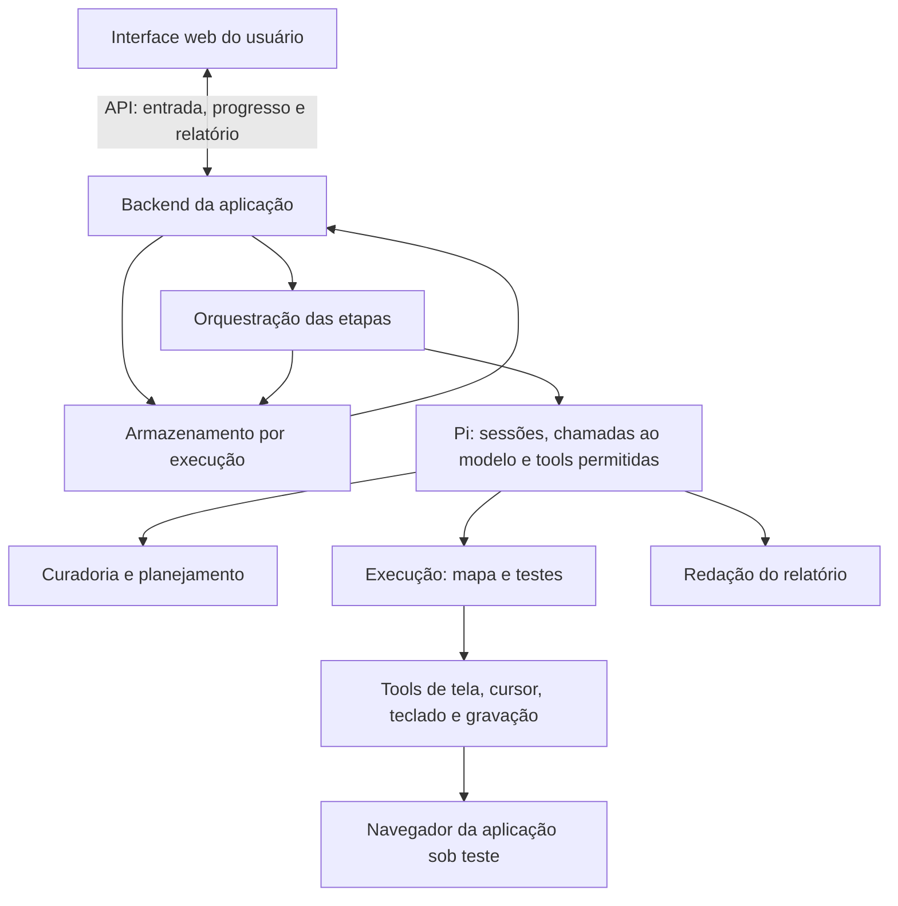

# Contratos de integração v0

Proposta compartilhada entre as quatro frentes. Os nomes abaixo são a base para a
implementação, ainda não são endpoints disponíveis. O responsável pelo backend
deve transformá-los em tipos e validação de entrada, usando o mesmo exemplo da interface.

## Fluxo e responsabilidades

O Pi é uma dependência do backend. O usuário acessa o site da equipe; o executor
controla outro navegador, dentro do ambiente de execução. A aplicação determina a
ordem das etapas, valida os dados e persiste resultados. O modelo decide ações dentro
da tarefa delegada e das tools permitidas. Não cabe a um prompt decidir se um JSON
inválido pode avançar para a próxima etapa.

O especialista de execução faz a exploração e, depois, os testes, em tarefas separadas.
O orquestrador entrega ao planejador o mapa obtido na exploração. Não é necessário
adicionar um sexto papel para implementar essas duas fases.

## Objetos compartilhados

IDs são estáveis dentro da execução. Referências cruzadas devem existir. Usar UTC
nos registros e horário local na interface. Campos adicionais precisam ser acordados
com quem os consome; não esconder regras novas em texto livre.

| Objeto | Campos essenciais | Produz → consome |
| --- | --- | --- |
| Entrada (`input`) | `startUrl`, `credentialRef`, `objective`, `artifactIds` | Interface/API → orquestração |
| Artefato (`artifact`) | `id`, `name`, `version`, `text`; arquivo original preservado pelo backend | Ingestão → curadoria |
| Origem (`source`) | `artifactId`, `locator`, `quote` | Curadoria → planejamento/relatório |
| Requisito (`requirement`) | `id`, `statement`, `rules`, `sources` | Curadoria → explorador/planejador |
| Regra (`rule`) | `id`, `statement`, `sources` | Curadoria → planejador |
| Questão (`question`) | `id`, `description`, `requirementIds`, `blocking`, `sources` | Curadoria → orquestração/interface |
| Mapa (`navigation`) | `screens`, `transitions`, `paths` | Explorador → planejador/executor |
| Caso (`testCase`) | `id`, `requirementIds`, `ruleIds`, `preconditions`, `setup`, `pathId`, `data`, `techniques`, `expected`, `sources` | Planejador → executor/relatório |
| Tentativa (`attempt`) | `id`, `status`, `verdict`, `setupObservation`, `events`, `observed`, `evidenceIds`, `evidenceGaps`, `reason` | Executor → armazenamento/relatório |
| Resultado (`result`) | `caseId`, `verdict`, `attempts`, `reason` | Executor → relatório |
| Evidência (`evidence`) | `id`, `caseId`, `attemptId`, `kind`, `capture`, `assetId`, intervalo do vídeo quando aplicável | Captura → relatório |
| Relatório (`report`) | `summary`, `limitations`, referências a casos/resultados/evidências | Redação + API → interface |

`credentialRef` é um identificador privado que o backend resolve. Não contém senha,
token ou cookie. A interface de configuração pode enviar o segredo ao backend por
um canal autorizado; respostas, logs, artefatos de curadoria e exemplos não o expõem.
O executor recebe somente o acesso necessário. Gravar os vídeos dos casos depois
da autenticação, evitando capturar o preenchimento de segredos.

Uma `source.locator` pode indicar página e seção de PDF ou linhas de texto.
`source.quote` preserva o trecho literal. O backend mantém a versão original para
que um revisor confira a interpretação. Extração vazia ou documento sem texto exige
uma mensagem clara; não produzir uma normalização fictícia.

Cada tela tem `id`, `name` e uma descrição observável (`recognition`). Cada transição
tem `id`, `from`, `action` e `to`. Um caminho tem `id`, `startScreenId` e uma lista
ordenada `transitionIds`. A URL observada pode ajudar a identificar a tela, mas
não substitui o percurso. O mapa cobre as telas relevantes ao escopo, com orçamento
de ações e tempo. Limitações de exploração aparecem no relatório.

`techniques` explica a classe ou o limite e os valores escolhidos. Para AVL, guardar
qual regra define o limite e qual domínio permite o passo adotado. Em um inteiro,
1 abaixo de 10 é 9; em moeda ou data essa escolha depende do requisito. Não usar
AVL em todo campo sem justificativa.

`testCase.setup` descreve a preparação/restauração acordada para o alvo. Antes de
cada tentativa, conferir as pré-condições e registrar em `setupObservation` se a
preparação ocorreu. Um caso anterior pode ter alterado os dados. Se não for possível
estabelecer o estado necessário, bloquear o caso. O procedimento de reset é apoio
do ambiente, executado fora das ações do agente que avaliam o comportamento do app.

## Estado da execução e veredito do caso

`run.status`: `queued`, `running`, `completed`, `interrupted`, `error`.
`run.phase`: `intake`, `curation`, `mapping`, `planning`, `execution`, `report`, `done`.
Uma execução `completed` pode conter casos reprovados, bloqueados ou inconclusivos;
o estado informa que o processamento e o relatório terminaram.

| `result.verdict` | Texto ao usuário | Condição |
| --- | --- | --- |
| `not_run` | Não executado | Não houve tentativa nem impedimento específico identificado antes do encerramento |
| `passed` | Aprovado | Observação suficiente atende à expectativa rastreável |
| `failed` | Reprovado | Observação suficiente contradiz a expectativa rastreável |
| `blocked` | Bloqueado | Pré-condição, acesso ou dúvida impeditiva não resolvida impediu a execução; pode não haver tentativa |
| `inconclusive` | Inconclusivo | Houve tentativa, mas falta informação para sustentar o veredito |

`attempt.status`: `completed`, `blocked`, `error`, `interrupted`. Uma tentativa com
`completed` pode revelar um defeito do aplicativo; `error` descreve falha da tentativa,
não prova defeito. Guardar a razão e o que se conseguiu observar. Se o vídeo faltar,
registrar `evidenceGaps`; só emitir aprovação/reprovação quando outras evidências
forem suficientes para sustentar a conclusão. Na demonstração, vídeo é obrigatório
para os casos executados que atendem ao critério de pronto.

Eventos têm `at`, `action` e `observation`. Vídeos usam `kind: "video"`,
`capture: "original" | "reproduction"`, `startMs` e `endMs` referentes ao arquivo
identificado por `assetId`. Um corte salvo em arquivo separado começa em zero.
A reprodução ganha outra tentativa e aponta para a tentativa original por
`reproducesAttemptId`. O relatório não substitui silenciosamente a evidência anterior.

Cada tentativa guarda seu `verdict` e a razão. Se uma tentativa mostra uma violação
com evidência suficiente, manter `failed` no resultado consolidado mesmo que uma
reprodução posterior passe; explicar em `result.reason` que o comportamento variou.
Sem violação sustentada, aplicar os critérios da tabela ao conjunto de observações
e explicar divergências. Não adotar a última tentativa como verdade por padrão.

## API mínima proposta

| Operação | Contrato |
| --- | --- |
| `POST /api/runs` | Recebe entrada e cria `runId`; captura uma cópia das entradas utilizadas |
| `GET /api/runs/:id` | Retorna estado, fase, questões, plano, resultados e relatório disponíveis |
| `GET /api/runs/:id/evidence/:assetId` | Entrega mídia pertencente à execução, com o controle de acesso do app |

O envio de arquivos e de acesso privado pode fazer parte do formulário inicial.
Frontend e backend definem juntos a codificação desse envio na tarefa T1; os
objetos internos acima permanecem iguais. Polling simples é suficiente para progresso.
O backend deve recusar uma segunda execução ativa de forma explícita na base D-02.

Não prometer retomada automática no meio de um caso. Em reinício, marcar a execução
ativa como interrompida e preservar o que já foi salvo. A equipe pode iniciar uma nova
execução. Salvar transições e tentativas evita depender do histórico interno do Pi.

## Exemplo e verificação

O [artefato sintético](exemplos/artefato-demo.md) e o
[JSON compartilhado](exemplos/execucao-demo.json) ilustram os objetos. O envelope
`fixture: true` é exclusivo do exemplo. A interface deve identificá-lo como simulação;
o backend de execução não deve aceitá-lo como resultado real.

O exemplo é pequeno: não contém a suíte completa de AVL, binários de mídia ou uma
execução real. A tarefa de planejamento deve gerar os demais valores pertinentes.
Ao implementar, validar campos obrigatórios, enumerações, IDs, referências, limites
de etapas e transições de estado. Saída inválida do modelo exige correção limitada
ou erro explícito; não encaminhar dados quebrados ao próximo especialista.
