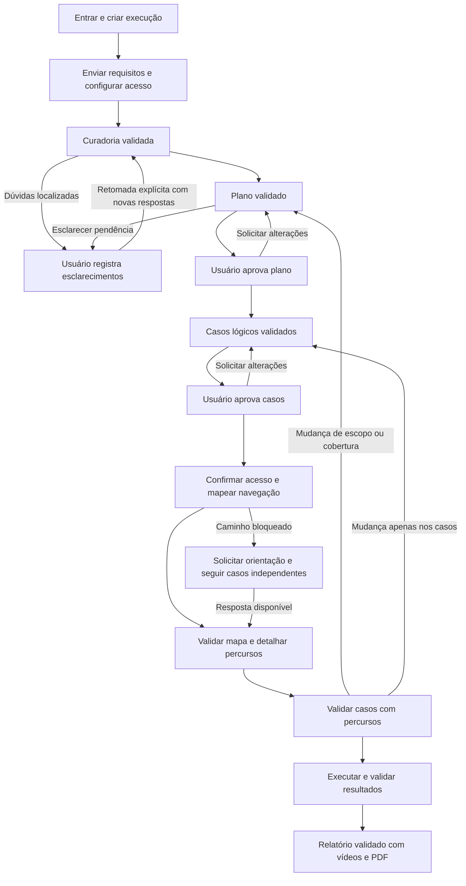

# Especificação do protótipo

Versão 1.1 · 24/09/2026 · Entrega: 26/09 às 17h, horário de Manaus.

Este documento define o que implementar e como aceitar a entrega. O fluxo e os seis
agentes refletem as decisões da equipe. As telas, os limites operacionais e os critérios
abaixo formam a base técnica proposta pelo CTO. Ainda não são funcionalidades entregues.

## 1. Produto e limite da entrega

O usuário envia comportamentos esperados em histórias de usuário (US), critérios
de aceite (CA), requisitos funcionais, prosa ou Gherkin, aprova o plano e os casos,
acompanha testes pela interface da aplicação e recebe resultados com
vídeos e exportação para PDF. O público inicial são times com documentação organizada.

A unidade de trabalho é uma **execução**. Ela tem nome, aplicação, entradas, versões,
aprovações, tentativas e relatório próprios. O histórico pertence à conta do usuário.
O nome da aplicação serve para organizar a lista; não haverá um cadastro separado de
projetos nem memória automática entre execuções.

**Dentro da entrega:** cadastro/login simples, histórico, criação de execução, board de
US/CA, duas aprovações humanas, seis agentes, navegação visual, dúvidas localizadas,
vídeos e capturas, relatório web e PDF, cancelamento e recuperação do material salvo.

**Fora desta sprint:** organizações com membros e permissões, convites, SSO, cobrança,
integração com Jira/GitHub, OCR, planilhas, aplicativo móvel, editor de fluxogramas,
chat geral, testes de carga, de segurança e de usabilidade, concorrência de navegadores e memória
entre sprints. Recuperação de conta será assistida pelo operador no piloto. O cadastro
será restrito aos participantes habilitados pela equipe; a liberação pública fica fora.

<!-- ponytail: um piloto com um proprietário por execução e um trabalho de agente por vez; colaboração e filas distribuídas só quando houver uso que justifique. -->

### Decisão de entrada e curadoria · 24/09/2026

Esta revisão substitui a exigência anterior de uma US formal com CA. O formato
canônico continua sendo o contrato interno de requisitos, regras, exemplos e
perguntas; Gherkin é uma entrada opcional. A ausência de Gherkin não transfere a
criação dos cenários ao usuário: o `test-designer` os elaborará na etapa de casos,
após a aprovação do plano. Essa etapa ainda depende de implementação.

| Material recebido | Tratamento |
| --- | --- |
| US/CA, RF ou prosa com comportamento claro | Normalizar e planejar sem exigir reescrita ou rótulos formais |
| Cenários Gherkin simples ou exemplos manuais | Preservar contexto, ação e resultados; manter o alcance pontual dos exemplos |
| História vaga ou resultado ausente | Perguntar pela decisão necessária; propostas não são regras confirmadas |
| Fontes contraditórias | Localizar o conflito, pedir decisão e conservar os originais |
| Parte clara e parte ambígua da mesma história | Bloquear só as regras dependentes e avançar com as independentes |
| Somente URL/acesso | Solicitar o comportamento esperado; observar a interface não define conformidade |

O recorte atual recebe texto colado, sem upload, parser completo de `.feature`
ou executor Cucumber. Construções Gherkin complexas devem conservar contexto e
associação dos exemplos ou gerar dúvida específica, nunca ser ignoradas em silêncio.
A transformação deve preservar condições, ações, resultados, valores, exceções e
fontes; não exige JSON ou redação idênticos para entradas equivalentes.

O plano apresenta cobertura, prioridades e limitações de forma proporcional ao
material. O validador aceita paráfrases fiéis e planos concisos; a omissão de uma
recitação das etapas internas não é defeito. Estados e aprovações continuam
controlados pelo backend. Resultados e limitações da avaliação desta mudança:
[ajuste de entradas](../evidencias/ajuste-entradas/README.md).

## 2. Jornada e responsabilidades

Neste documento, US/CA também designa requisitos e comportamentos equivalentes
normalizados de outros formatos; não impõe um template à entrada.

O **curador** normaliza mantendo o significado. O **planejador** produz plano, casos
lógicos e seu detalhamento após o mapa. O **executor** explora, executa e captura
as evidências. O **redator** organiza o relatório. O **validador** revisa cada entrega.
O **orquestrador** encaminha o trabalho e aplica os pareceres; não julga a qualidade.

O backend verifica estrutura, acesso, versões e transições. A aprovação do usuário
confirma intenção e escopo; o parecer do validador confere a saída do agente. Nenhum
deles substitui o outro. Os detalhes dos dados estão em [CONTRATOS.md](CONTRATOS.md).

## 3. Requisitos funcionais

Os IDs RF-01 a RF-09 foram preservados e detalhados. Todos os requisitos desta seção
fazem parte da entrega; os critérios são verificações a realizar na implementação.

| ID | O sistema deve | Critério de aceitação |
| --- | --- | --- |
| RF-01 | Criar uma execução com nome, identificação da aplicação, objetivo opcional e artefatos. URL, conta/perfil de teste e preparo podem ser completados depois, mas são obrigatórios antes da exploração. Aceitar texto, `.txt`, `.md` e PDF com texto selecionável. | Preservar formulário em erro; listar arquivos recebidos e recusados; informar formato/tamanho inválido ou PDF sem texto. Capturar a versão das entradas antes da curadoria. |
| RF-02 | Extrair requisitos, regras e exemplos recebidos; normalizar conteúdo com fonte, trecho e localização; listar dúvidas. | Pelo menos um comportamento esperado verificável permite planejar seu escopo, sem exigir formato de US, rótulo CA ou Gherkin. Condições, ações, resultados, limites e exceções permanecem fiéis; exemplos não viram regras gerais. Informação ausente gera pergunta, nunca regra inventada. |
| RF-03 | Confirmar acesso e mapear telas e transições relevantes depois da aprovação dos casos lógicos. | Registrar percurso observado desde a entrada, incluindo ações de navegação. Caminho não localizado gera pedido de orientação e bloqueio dos casos afetados. |
| RF-04 | Elaborar casos usando plano aprovado e requisitos originais; depois acrescentar os percursos observados. | Cada caso contém referência ao comportamento normalizado, fonte, pré-condições, dados, técnica e expectativa. PCE/AVL têm justificativa. Antes do mapa, percurso pode estar pendente; antes de executar, deve estar definido e validado. |
| RF-05 | Executar casos pela interface, conferindo o estado inicial e usando visão, cursor, teclado, rolagem e arrastes reais. | Repetir o percurso natural; registrar ações, observações e tentativas. Sem execução direta de lógica do aplicativo por API, banco ou JavaScript para substituir a interação. |
| RF-06 | Gravar a execução e associar vídeos curtos e capturas a cada caso/tentativa. | Mostrar ação e resultado, incluindo sucessos. Vídeo reproduz no relatório e captura serve ao PDF. Falha de gravação aparece; reprodução posterior ganha outra tentativa. |
| RF-07 | Apresentar relatório padronizado com esperado, observado, veredito, US/CA, fontes, evidências, cobertura e limitações. | Incluir aprovados, reprovados, bloqueados, inconclusivos e não executados. Conclusões publicadas vêm de saídas validadas; relatório parcial mantém a indicação de interrupção. |
| RF-08 | Salvar entradas, versões, decisões, perguntas, tentativas e mídias ao longo da execução. | Atualizar a página mantém o estado. Reiniciar o serviço preserva registros confirmados e marca trabalho ativo como interrompido; não retoma uma ação de navegador automaticamente. |
| RF-09 | Submeter curadoria, plano, casos, mapa, detalhamento, resultados e relatório ao validador independente. | Parecer identifica versão e motivo. Aprovação libera dependentes; correção volta ao autor; bloqueio/erro não liberam avanço. Orquestrador não sobrepõe o parecer. |
| RF-10 | Oferecer cadastro básico, entrada, saída e edição de nome e nome opcional da equipe no primeiro acesso. | Conta do produto usa nome, e-mail e senha. Sessão protege execuções e mídias. Mostrar que a conta usada pelo agente no aplicativo é um acesso distinto. |
| RF-11 | Listar execuções da conta, com nome, aplicação, data, etapa e situação; permitir reabrir e excluir uma execução encerrada. | Lista vazia orienta a criar a primeira execução; busca e filtro funcionam. Exclusão pede confirmação e remove seus dados conforme RNF-12. Uma conta não consulta execuções de outra. |
| RF-12 | Exibir um board simples com histórias, critérios e cobertura. | Expandir uma US mostra seus CA, fontes, casos associados e pendências. Exibir critérios sem caso e sua justificativa. Não exigir arrastar cartões ou configurar colunas. |
| RF-13 | Gerar um plano distinto dos casos: objetivo, cobertura por CA, prioridades, exclusões justificadas, abordagem e pré-condições conhecidas. | Mostrar plano validado para revisão humana. Artefatos necessários mas ausentes ficam identificados; o plano não depende de conhecer os cliques da interface. |
| RF-14 | Permitir aprovar ou pedir alterações no plano e no conjunto de casos. | Aprovação registra usuário, data e versão exata. Alteração exige comentário. O próximo passo aguarda parecer válido e aprovação correspondente; clique repetido não duplica a decisão. |
| RF-15 | Mostrar questões com motivo, itens afetados e campo de resposta; retomar trabalho após esclarecimento. | Usuário pode indicar percurso, confirmar ausência ou complementar regra. Preservar pergunta/resposta e autor; revisar os itens afetados e retomar no início do caso. Independentes continuam. |
| RF-16 | Mostrar progresso real, próxima ação, cancelamento, encerramento com pendências e criação de nova execução a partir das entradas anteriores. | Cancelar impede novas ações e preserva registros. Sem casos independentes elegíveis, usuário pode encerrar com pendências e receber relatório revisado. Duplicar copia entradas selecionadas, confirma acesso e cria novos IDs/aprovações, sem herdar conclusões. |
| RF-17 | Exportar a versão publicada do relatório em PDF. | A ação “Salvar em PDF” abre uma versão de impressão com capturas no lugar dos vídeos, fontes, resultados e limitações. O PDF salvo é legível, paginado e corresponde à versão exibida. |

## 4. Regras de negócio

| ID | Regra |
| --- | --- |
| RN-01 | Para planejar, a entrada mínima é um comportamento esperado verificável. Aceitar US/CA, requisitos funcionais, prosa e Gherkin textual sem formato obrigatório. Material insuficiente pode ser recebido para curadoria e esclarecimento; não autoriza fabricar expectativas. A cobertura se limita aos comportamentos sustentados pelas fontes e selecionados. |
| RN-02 | Curadoria preserva significado e origem, distinguindo regras gerais, exemplos recebidos e dúvidas. Exemplo isolado não estabelece domínio ou limite geral. Proposta de regra fica em pergunta e exige decisão explícita com fonte antes de sustentar expectativa. A interface revela navegação e resultado observado; não estabelece o comportamento esperado. |
| RN-03 | Cada caso aponta para pelo menos um CA e uma expectativa rastreável. PCE/AVL se aplicam apenas quando o domínio e as regras permitem; limites ausentes não são inventados. |
| RN-04 | Plano e casos são entregas distintas do planejador. Casos recebem o plano aprovado e os artefatos/US/CA de origem. Mapeamento ocorre depois das duas aprovações humanas. |
| RN-05 | Aprovação humana só é aceita sobre versão aprovada pelo validador e ainda vigente. Ausência de decisão ou decisão antiga não libera trabalho dependente. |
| RN-06 | Correções criam versões e preservam histórico. Mudar escopo/cobertura retorna à aprovação do plano e dos casos afetados. Mudar apenas pré-condições, dados, técnica, expectativa ou fonte relevante retorna à aprovação dos casos afetados. Acrescentar somente percurso exige nova validação técnica, mantendo vínculo com o conteúdo já aprovado. |
| RN-07 | Esclarecimentos e correções podem ocorrer na mesma execução; validar novamente os dependentes afetados. Trocar a aplicação ou substituir o conjunto original de artefatos após começar requer nova execução. |
| RN-08 | Dúvidas e impedimentos bloqueiam apenas dependentes. Bloqueio global de acesso impede todos os casos daquele acesso. Resposta humana não é prova de defeito: o executor precisa observar comportamento e o validador revisar a conclusão. |
| RN-09 | `Aprovado` e `Reprovado` exigem suporte suficiente. Pré-condição ausente é `Bloqueado`; tentativa sem conclusão sustentada é `Inconclusivo`; ausência de tentativa sem impedimento específico é `Não executado`. |
| RN-10 | Parecer do validador e veredito do caso são distintos. Um defeito bem documentado pode ter saída validada e teste reprovado. Falha do agente ou da captura não prova defeito do aplicativo. |
| RN-11 | Tentativas e evidências anteriores permanecem. Reprodução bem-sucedida não apaga falha anterior sustentada; diferenças ficam explícitas no resultado consolidado. |
| RN-12 | Uma tarefa de agente/navegador trabalha por vez no ambiente. Espera por usuário libera o recurso; dados persistidos mantêm o contexto. Ao retomar, disputar o recurso novamente e conferir pré-condições. |
| RN-13 | Encerrar processamento não significa que o aplicativo passou. Relatório final exige revisão do validador. Erro/interrupção podem gerar relatório parcial quando a revisão for possível. Cancelamento impede chamadas novas e exibe o material já validado; sem relatório validado, mantém progresso e resultados disponíveis. |
| RN-14 | CA planejado é aquele com caso associado; CA executado tem ao menos um caso efetivamente tentado. Mostrar também CA parcialmente cobertos, casos pendentes e exclusões. Percentual de casos aprovados não representa cobertura de requisitos. |
| RN-15 | Histórico serve à consulta. Uma nova execução usa entradas confirmadas para ela; conclusões antigas não entram automaticamente no contexto dos agentes. |

## 5. Requisitos não funcionais

Valores numéricos abaixo são **limites e metas iniciais de aceitação**, não medições
nem promessas de capacidade comprovada. São conferidos no ambiente de demonstração.

| ID | Requisito e critério de verificação |
| --- | --- |
| RNF-01 | **Uso claro.** Cada etapa mostra situação e uma ação principal. Campos têm rótulo, obrigatoriedade e erro junto ao campo; mensagens indicam como resolver. Ações indisponíveis explicam o motivo. Sem percentual de progresso estimado pelo modelo. |
| RNF-02 | **Acessibilidade e apresentação.** Fluxo principal utilizável por teclado, com foco visível, rótulos e estados compreensíveis sem depender só de cor. Conferir em desktop de 1366 px e leitura em 390 px; tabelas podem rolar horizontalmente em áreas delimitadas. |
| RNF-03 | **Resposta da interface.** Mostrar retorno visual ao envio em até 1 s e progresso persistido em até 5 s durante conexão normal. Consultas de histórico/metadados respondem em até 2 s em 20 consultas no ambiente de demonstração. Tempo de modelo, upload e vídeo é indicado separadamente. |
| RNF-04 | **Acesso e segredos.** Conferir autorização no servidor para cada execução, arquivo e mídia; senha protegida por hash próprio para senhas, sessão protegida e invalidada no logout. Credencial do alvo fica em armazenamento privado, fora de logs, respostas, fontes e prompts gerais; vídeos começam após autenticação. Testar com duas contas e um segredo fictício identificável. |
| RNF-05 | **Isolamento do piloto.** Navegar somente em destinos habilitados pela equipe, incluindo redirecionamentos e destinos privados autorizados para desenvolvimento. Bloquear acesso a serviços internos não autorizados. Conteúdo de páginas/arquivos não amplia tools ou permissões. Exposição pública exige HTTPS; acesso local pode usar o túnel existente. |
| RNF-06 | **Integridade e recuperação.** Validar contratos e referências no servidor e salvar decisões/resultados antes de avançar. Envios repetidos não duplicam execuções, decisões ou tentativas. Queda mantém os registros confirmados; trabalho incompleto aparece como interrompido, nunca concluído. |
| RNF-07 | **Limites de entrada e execução.** Até 5 arquivos de 10 MiB cada, 10 histórias/requisitos selecionados e 30 casos por execução. Excesso pede redução de escopo, sem truncar conteúdo silenciosamente. Uma tarefa ativa por ambiente; segunda solicitação recebe “ambiente ocupado” e pode tentar depois. |
| RNF-08 | **Limites do agente.** Até 3 revisões automáticas por saída, 2 tentativas técnicas de validação por revisão, 120 s por chamada de modelo, 100 ações na exploração e 50 por tentativa de caso. Orçamento ativo de 45 min por execução, sem contar espera humana. Ao atingir limite, salvar motivo e interromper dependentes; sem aprovação por padrão. Resposta humana seguida de retomada explícita pode abrir novo ciclo limitado de produção para os itens afetados; o tempo ativo acumulado continua limitado a 45 min na execução, sem zerar o consumo anterior. |
| RNF-09 | **Evidência utilizável.** Vídeos e capturas identificam caso/tentativa; vídeo de demonstração mostra preparação imediata, ação e resultado em até 60 s por trecho. Caso mais longo pode ter vários trechos. Falta de captura aparece. PDF inclui texto selecionável, paginação, capturas legíveis e nenhum controle de reprodução sem função. |
| RNF-10 | **Observação e reprodutibilidade.** Registrar horário, versão do app, papel/modelo usado, duração, chamadas, ações e consumo/custo quando disponível, sem inventar valores ausentes. Erros têm identificação que permita localizar a execução. Modelos configurados por papel no backend, sem tela avançada de configuração. |
| RNF-11 | **Operação simples.** Reutilizar Node, Pi, navegador e publicação existentes. Persistência por execução e arquivos de mídia bastam; não introduzir microserviços ou fila distribuída. Após validação em dev, promover a mesma imagem para prod. Realizar backup e recuperação de uma execução sintética antes da entrega. |
| RNF-12 | **Ciclo dos dados no piloto.** Manter entradas, decisões e evidências até exclusão explícita; nenhuma limpeza automática silenciosa. O proprietário pode excluir uma execução encerrada com confirmação, apagando também sua credencial e mídias locais. Informar que backups existentes exigem limpeza operacional separada. |

## 6. Telas e comportamento esperado

São **sete vistas e quatro endereços principais**. Visão geral, plano, casos e resultados
compartilham uma página de execução com abas, sem quatro aplicações ou fluxos separados.

| Tela | Conteúdo e ação principal | Estados indispensáveis |
| --- | --- | --- |
| TELA-01 · Acesso | Alternar cadastro/entrada; nome, e-mail e senha, nome de equipe opcional no primeiro acesso. Entrar leva ao histórico. | Conta não habilitada, credencial inválida, envio em andamento e sessão expirada. Link de ajuda para recuperação assistida. |
| TELA-02 · Minhas execuções | Lista com busca e filtro; nome, aplicação, data e situação. “Nova execução”; menu para duplicar ou excluir uma encerrada. | Lista vazia com orientação; carregando; erro recuperável; exclusão com nome da execução e confirmação. |
| TELA-03 · Nova execução | Formulário em duas partes na mesma página: requisitos e identificação; depois ambiente/acesso/preparo. “Preparar plano”. URL e acesso podem ser completados antes da exploração. | Arquivo inválido, extração sem texto, campo obrigatório, limite excedido e salvamento. Preservar o que foi preenchido. |
| TELA-04 · Execução / Visão geral | Cabeçalho com etapa, situação e próxima ação. Board de US/CA; perguntas e respostas; resumo do acesso; cancelar. Sem trabalho independente elegível, oferecer “Encerrar com pendências”. | Curando, revisando, aguardando usuário, acesso bloqueado, ambiente ocupado e execução interrompida. Mostrar próxima ação útil. |
| TELA-05 · Execução / Plano | Objetivo, CA incluídos/excluídos, prioridades, abordagem, pré-condições, origens e versão. “Aprovar plano” ou “Solicitar alterações”. | Em elaboração, em validação, correção, versão antiga e aguardando aprovação. Mostrar mudanças solicitadas e resultado da revisão. |
| TELA-06 · Execução / Casos | Lista e detalhe lateral com CA, pré-condições, dados, técnica e expectativa; após mapa, percurso observado no mesmo detalhe. Aprovar conjunto ou pedir alterações. | Caso lógico, percurso pendente, versão aprovada, reaprovação necessária, bloqueado e em execução. Pendência liga à pergunta correspondente. |
| TELA-07 · Execução / Resultados | Contagens reais, cobertura por CA, limitações e lista de casos; detalhe com esperado/observado, tentativas, vídeo e captura. “Salvar em PDF”. | Relatório em revisão, parcial, final, mídia indisponível e ausência de testes executados. Sem conclusão não validada apresentada como definitiva. |

Endereços sugeridos: `/acesso`, `/execucoes`, `/execucoes/nova` e `/execucoes/:id`.
As abas conservam contexto e podem ser reabertas por link. A navegação de entrada é:
**acesso → histórico → nova execução → visão geral → plano → casos → resultados**.
A etapa atual orienta a ação principal, mas o usuário pode consultar as anteriores.

O acabamento vem de consistência: mesmos rótulos, espaçamentos, botões e estados;
confirmação de salvamento; instruções curtas; prévia dos arquivos; decisão humana
visível; recuperação de erro sem perder trabalho. Uma lista expansível resolve o
board. Perguntas com campo de resposta resolvem os esclarecimentos. O layout de
impressão do navegador resolve a exportação inicial em PDF.

## 7. Aceitação da entrega completa

Executar os cenários abaixo no alvo controlado, com modelo, navegador e armazenamento
reais. Resultados simulados ajudam a construir as telas, mas não encerram a entrega.

| Cenário | Evidência exigida | Requisitos cobertos |
| --- | --- | --- |
| A-01 · Entrar, enviar e organizar | Conta criada/entrada; execução salva; US/CA e origens no board; rejeição de arquivo sem suporte preserva formulário | RF-01, RF-02, RF-10, RF-11, RF-12; RNF-01, RNF-02, RNF-07 |
| A-02 · Revisar planejamento | Plano e casos separados; pedido de alteração, nova versão e duas aprovações; tentativa com decisão antiga recusada | RF-04, RF-09, RF-13, RF-14; RN-02 a RN-06 |
| A-03 · Explorar e testar | Mapa observado; caminho anexado; casos válidos/inválidos e limites justificados; caso correto e defeito conhecido com vídeos | RF-03, RF-04, RF-05, RF-06; RN-03, RN-09 a RN-11; RNF-09 |
| A-04 · Esclarecer bloqueio | Uma rota bloqueada, outra independente executada, resposta registrada e retomada após revisão; em outro cenário, encerramento com pendências gera relatório | RF-15, RF-16; RN-07, RN-08, RN-12 |
| A-05 · Recusar saída ruim | Condição perdida ou veredito sem suporte devolvido pelo validador; erro/timeout e limites sem avanço indevido | RF-09; RN-05, RN-10; RNF-08 |
| A-06 · Encerrar e recuperar | Cancelamento sem novas ações; reinício sem perda dos resultados confirmados; duplicação sem herdar aprovações; exclusão completa | RF-08, RF-16; RN-13, RN-15; RNF-06, RNF-12 |
| A-07 · Conferir relatório | Web e PDF com mesma versão; vídeos/capturas; cinco vereditos; relatório parcial; CA sem cobertura identificado | RF-07, RF-17; RN-01, RN-14; RNF-09 |
| A-08 · Verificar operação | Segunda conta sem acesso aos dados da primeira; segredo ausente de logs/mídia; destino não autorizado bloqueado; medições de resposta; logs e backup restaurado | RNF-03, RNF-04, RNF-05, RNF-10, RNF-11 |

Registrar a versão testada, evidências e limitações nas tarefas. Todos os critérios
aplicáveis precisam de evidência; checks de infraestrutura não provam o comportamento
do produto. Usar [SPRINT.md](../SPRINT.md) para responsabilidades e dependências.
